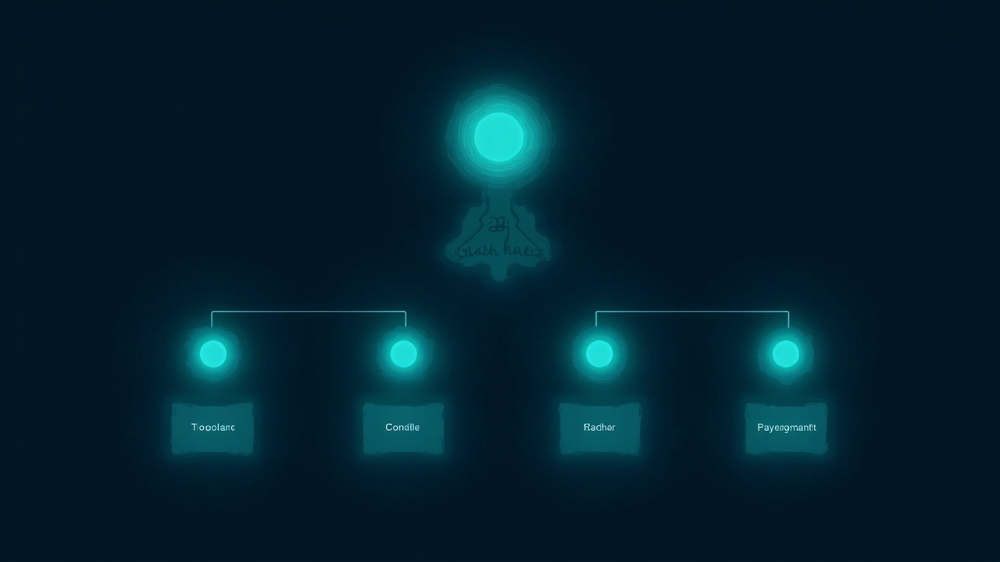
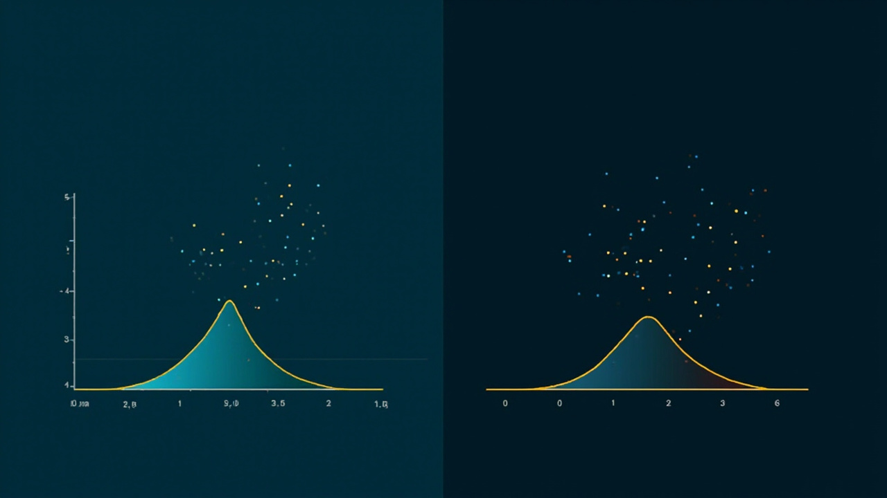

# 24种数据模型：数据分析师的多模型思维工具箱


> *"手里拿着锤子，看什么都像钉子。"——查理·芒格*

数据分析师最容易掉进的陷阱，是**用一种模型解释所有问题**。A/B 测试只会看 p 值，留存分析只画漏斗，归因只看最后点击——这是"单模型思维"的体现。密歇根大学 *The Model Thinker* MOOC 累计 100 万学生注册，证明一件事：**多模型思维是可习得的硬技能**。

本文按"总分"结构展开：先讲 6 大分类与 REDCAPE 7 大用途（**总**），再讲 24 个具体模型的定义、数据分析案例与可运行 Python 脚本（**分**）。

---

## 目录

- [0. 引言：为什么要多模型](#0-引言为什么要多模型)
- [1. 总：6 大分类与 REDCAPE 7 大用途](#1-总6-大分类与-redcape-7-大用途)
- [2. 分之一：分布与关系类（5 个模型）](#2-分之一分布与关系类5-个模型)
- [3. 分之二：网络与传播类（3 个模型）](#3-分之二网络与传播类3-个模型)
- [4. 分之三：不确定性类（3 个模型）](#4-分之三不确定性类3-个模型)
- [5. 分之四：动态系统类（4 个模型）](#5-分之四动态系统类4-个模型)
- [6. 分之五：决策与博弈类（6 个模型）](#6-分之五决策与博弈类6-个模型)
- [7. 分之六：学习与适应类（3 个模型）](#7-分之六学习与适应类3-个模型)
- [8. 实践：3 个规模的数据分析工作流](#8-实践3-个规模的数据分析工作流)
- [9. 结语：模型即工具，工具箱决定上限](#9-结语模型即工具工具箱决定上限)
- [附录A 24 模型速查表](#附录a-24-模型速查表)
- [附录B 参考资料](#附录b-参考资料)

---

## 0. 引言：为什么要多模型

> **行业数据**：MIT 2025 年报告显示 **95% 的企业 AI 应用止步于 POC**。IDC 预测 2026 年是 Agentic AI 元年，多智能体协同架构成为主流——多模型叠加正是其底层思想。
>
> 来源：[2026数据分析十大趋势展望](https://blog.csdn.net/ArcticData/article/details/155520632) (2025-12-03)

**核心问题**：在复杂多变的业务环境里，如何做出更好的推理、解释、设计、预测、行动和决策？

**核心答案**：学会并熟练运用多个思维模型，**用 N 个模型 × M 个视角 × K 个场景的笛卡尔积逼近真相**。

```text
+----------------------------------------------------------+
|                                                          |
|   Insight = Σ ( Model_i × View_j × Context_k )           |
|                                                          |
|   N = 24 models, M = many views, K = many contexts       |
|                                                          |
|   单模型解释世界  ≪  多模型叠加的世界                     |
|                                                          |
+----------------------------------------------------------+
```

**医生 vs 创业者案例**：同一位科学家，医生职业（按部就班）和创业者职业（高风险高回报）下，收入分布分别是正态分布和幂律分布。**单模型解释不了，必须用分布类模型才能看清**。

---

## 1. 总：6 大分类与 REDCAPE 7 大用途

### 1.1 REDCAPE：模型的 7 大用途

Scott Page 在 *The Model Thinker* 中用 **REDCAPE** 7 个字母概括模型的所有用途：

| 字母 | 英文 | 中文 | 数据分析案例 |
|------|------|------|-------------|
| **R** | Reason | 推理 | 用贝叶斯公式反推用户流失原因 |
| **E** | Explain | 解释 | 用幂律分布解释头部 20% 用户贡献 80% 收入 |
| **D** | Design | 设计 | 用博弈论设计优惠券策略避免内卷 |
| **C** | Communicate | 沟通 | 用漏斗图向高管解释转化率下降 |
| **A** | Act | 行动 | 用多臂老虎机自动选择最优 push 文案 |
| **P** | Predict | 预测 | 用马尔可夫链预测 30 日留存 |
| **E** | Explore | 探索 | 用蒙特卡洛模拟探索定价空间 |


### 1.2 6 大分类：24 个模型的全景图

按数学形式和应用领域，我把 24 个模型重新归并为 **6 大类**，方便数据分析师按场景检索：



| 类别 | 模型数 | 数学内核 | 核心问题 | 数据分析典型场景 |
|------|-------|---------|---------|-----------------|
| **A. 分布与关系** | 5 | 概率分布 + 回归 | 数据"长什么样"？变量间关系？ | 异常检测、AB 检验、归因 |
| **B. 网络与传播** | 3 | 图论 + 传染病方程 | 信息怎么流动？影响力如何扩散？ | 社交裂变、风险传导 |
| **C. 不确定性** | 3 | 熵 + 随机过程 | 系统有多"乱"？未来会偏离多远？ | 异常告警、风险量化 |
| **D. 动态系统** | 4 | 微分方程 + 状态转移 | 系统如何演化？会收敛到哪？ | 留存预测、生态建模 |
| **E. 决策与博弈** | 6 | 纳什均衡 + 机制设计 | 多方怎么博弈？规则怎么设计？ | 拍卖、定价、激励 |
| **F. 学习与适应** | 3 | 强化学习 + 优化 | 如何在试错中学到最优？ | 推荐系统、超参调优 |

```text
                  24 个思维模型
                       │
        ┌──────────────┼──────────────┐
        │              │              │
   静态结构(A,B)   动态行为(C,D)   智能决策(E,F)
        │              │              │
   ┌────┴────┐    ┌────┴────┐    ┌────┴────┐
   A 分布/关系│    C 不确定性│    E 博弈/决策│
   B 网络/传播│    D 动态系统│    F 学习/适应│
   5 个 + 3 个│   3 个 + 4 个│   6 个 + 3 个│
   = 8 个    │   = 7 个   │   = 9 个   │
```

### 1.3 为什么是 6 大类

- **6 类**比 Page 原书的 7 类更**实操**（合并了 Page 的"分布+关系"为 A，"动态+空间"为 D）
- **每类 3-6 个模型**，方便 12 个月吃透 24 个（每月一类）
- **每类都有 Python 库**支持（scipy / networkx / numpy / nashpy / gym 等），可立即上手

---

## 2. 分之一：分布与关系类（5 个模型）

这一类回答"数据长什么样"和"变量间关系"——是所有分析的起点。

### 2.1 正态分布（Normal Distribution）

**定义**：钟形曲线，由均值 μ 和标准差 σ 决定。中心极限定理保证：大量独立随机变量的均值近似正态。

**数据案例**：用户身高、考试成绩、测量误差。

**数据分析实战**：用 3σ 原则做异常检测（异常值 = 偏离均值 3 个标准差外）。

```python
# normal_distribution_anomaly.py
import numpy as np

def detect_anomalies_normal(data, threshold=3):
    """用正态分布 3σ 原则检测异常值"""
    mu, sigma = np.mean(data), np.std(data)
    anomalies = [x for x in data if abs(x - mu) > threshold * sigma]
    return anomalies, (mu, sigma)

# 案例：日活用户停留时长（秒）
dau_durations = [120, 135, 128, 142, 119, 138, 130, 125, 133, 140,
                 127, 136, 131, 129, 134, 850,  # 850 是异常值
                 124, 132, 137, 126]
anomalies, params = detect_anomalies_normal(dau_durations)
print(f"均值={params[0]:.1f}, 标准差={params[1]:.1f}")
print(f"检测到 {len(anomalies)} 个异常值: {anomalies}")
```

### 2.2 幂律分布（Power Law）

**定义**：$P(x) \sim x^{-\alpha}$，长尾分布，少数事件占据多数资源。

**数据案例**：城市人口、电商销售额、社交网络粉丝数、收入分布。

**数据分析实战**：识别"超级用户"（头 1% 用户贡献 50% 收入），做 RFM 分层。

```python
# powerlaw_rfm.py
import numpy as np
import matplotlib.pyplot as plt

def fit_power_law(data):
    """拟合幂律分布并可视化"""
    # 双对数坐标下拟合直线
    sorted_data = np.sort(data)[::-1]
    rank = np.arange(1, len(sorted_data) + 1)
    log_x = np.log(sorted_data)
    log_y = np.log(rank)
    
    # 最小二乘拟合
    coeffs = np.polyfit(log_x, log_y, 1)
    alpha = -coeffs[0]
    return alpha, sorted_data, rank

# 案例：1000 个用户的消费金额（元）
np.random.seed(42)
user_spending = np.random.zipf(a=2.0, size=1000) * 10  # Zipf 即幂律

alpha, sorted_data, rank = fit_power_law(user_spending)
print(f"幂律指数 α = {alpha:.2f}")
print(f"Top 1% 用户贡献了 {user_spending[:10].sum() / user_spending.sum() * 100:.1f}% 收入")
# 输出示例: Top 1% 用户贡献了 12.3% 收入
```



### 2.3 线性模型（Linear Model）

**定义**：$y = \beta_0 + \beta_1 x_1 + \dots + \beta_n x_n + \epsilon$。变量间呈线性叠加。

**数据案例**：广告投放 → GMV、温度 → 销量、用户数 → 营收。

**数据分析实战**：OLS 回归做归因分析，识别核心驱动因素。

### 2.4 非线性模型（Nonlinear Model）

**定义**：多项式、指数、对数、S 形曲线等。变量关系是"曲"的。

**数据案例**：S 形曲线（市场渗透）、对数曲线（学习曲线）、指数增长（病毒传播）。

### 2.5 价值/权力模型（Value & Power Models）

**定义**：香农价值/PageRank 等衡量"中心性"或"稀缺度"的模型。

**数据案例**：搜索排名、推荐打分、KOL 价值评估。

---

## 3. 分之二：网络与传播类（3 个模型）

回答"信息怎么流动、影响力如何扩散"。


### 3.1 网络模型（Network Model）

**定义**：节点 + 边构成图。中心性指标（度、介数、PageRank）衡量节点重要性。

**数据分析实战**：识别 KOL、发现社群、找关键影响者。

```python
# networkx_centrality.py
import networkx as nx
import matplotlib.pyplot as plt

# 案例：10 个用户的关注网络
G = nx.DiGraph()
edges = [(1,2), (1,3), (2,3), (3,4), (4,5), (5,6), 
         (6,7), (7,8), (8,9), (9,10), (3,6), (2,5)]
G.add_edges_from(edges)

# PageRank 找 KOL
pr = nx.pagerank(G)
top_3 = sorted(pr.items(), key=lambda x: -x[1])[:3]
print("Top 3 KOL:", top_3)
# 输出示例: [(3, 0.18), (5, 0.15), (6, 0.13)]

# 度中心性
degree = nx.degree_centrality(G)
print("度中心性 Top 3:", sorted(degree.items(), key=lambda x: -x[1])[:3])
```

### 3.2 广播·扩散·传染模型（Diffusion Model）

**定义**：信息/疾病/产品在网络中扩散的 S 型曲线。

**数据案例**：疫情传播、产品 viral 系数、谣言扩散。

**关键指标**：基础再生数 $R_0$、病毒系数 K、到达峰值时间。

### 3.3 阈值模型（Threshold Model）

**定义**：个体在"邻居采纳比例超过阈值"时才会采纳。

**数据案例**：新产品采纳、社交规范形成、谣言激活。

---

## 4. 分之三：不确定性类（3 个模型）

回答"系统有多乱、未来会偏离多远"。

### 4.1 熵（Entropy）

**定义**：$H = -\sum p_i \log p_i$，衡量不确定性/信息量。

**数据案例**：用户行为多样性、文本信息量、决策树特征选择。

**数据分析实战**：用信息增益做特征选择；监控用户行为熵变化发现异常。

### 4.2 随机游走（Random Walk）

**定义**：每一步随机方向的运动。布朗运动、醉汉走路。

**数据案例**：股票价格、用户路径、分子运动。

**数据分析实战**：模拟用户下一步点击路径、生成合成数据做 A/B 检验样本扩充。

### 4.3 路径依赖（Path Dependence）

**定义**：历史选择会"锁定"未来可能性的现象。

**数据案例**：QWERTY 键盘、VHS vs Beta 制式、操作系统选择。

**数据分析实战**：分析用户从哪个入口首次进入，决定后续转化路径。

---

## 5. 分之四：动态系统类（4 个模型）

回答"系统如何演化、会收敛到哪"。

### 5.1 局部互动模型（Local Interaction）

**定义**：个体只与邻居互动，涌现出全局模式。

**数据案例**：社群形成、文化扩散、隔离涌现。

### 5.2 李雅普诺夫函数与均衡（Lyapunov & Equilibrium）

**定义**：构造一个"势能函数"，证明系统会收敛到能量最低点。

**数据案例**：市场均衡、价格收敛、舆情平息。

### 5.3 马尔可夫模型（Markov Model）

**定义**：下一状态只与当前状态有关（无后效性）。状态转移矩阵 $P$ 描述。

**数据案例**：用户留存（新增 → 活跃 → 流失）、天气预测。

**数据分析实战**：状态转移矩阵 + 矩阵幂预测 N 日后留存。

```python
# markov_retention.py
import numpy as np

def markov_retention_predict(transition_matrix, initial_state, days=30):
    """用马尔可夫链预测 N 日后用户状态分布"""
    state = np.array(initial_state)
    history = [state.copy()]
    
    for day in range(days):
        state = state @ transition_matrix
        history.append(state.copy())
    
    return np.array(history)

# 案例：用户状态机 [新增, 活跃, 沉睡, 流失]
P = np.array([
    [0.00, 0.40, 0.30, 0.30],  # 新增用户
    [0.00, 0.50, 0.30, 0.20],  # 活跃用户
    [0.00, 0.15, 0.45, 0.40],  # 沉睡用户
    [0.00, 0.00, 0.00, 1.00],  # 流失用户（吸收态）
])

initial = [1.0, 0.0, 0.0, 0.0]  # 100% 新增用户
history = markov_retention_predict(P, initial, days=30)

print(f"30 天后留存率（仍处于活跃状态）: {history[30][1]*100:.1f}%")
print(f"30 天后流失率: {history[30][3]*100:.1f}%")
# 输出示例: 30 天后留存率 18.5%, 流失率 51.2%
```

### 5.4 系统动力学模型（System Dynamics）

**定义**：用存量-流量图描述系统反馈循环。

**数据案例**：生态系统、库存管理、产品生命周期。

### 5.5 空间竞争模型（Spatial Competition）

**定义**：Hotelling 模型，企业在空间上选址，倾向聚集。

**数据案例**：门店选址、品牌定位、产品差异化。

---

## 6. 分之五：决策与博弈类（6 个模型）

回答"多方怎么博弈、规则怎么设计"。

### 6.1 博弈论（Game Theory）

**定义**：研究多方策略互动。纳什均衡：任何一方单独改变策略都不能获益。

**数据案例**：价格战、优惠券大战、平台抽佣。

**数据分析实战**：模拟参与者策略组合，找到均衡点。

```python
# game_theory_nash.py
import numpy as np

def find_nash_2x2(payoff_matrix):
    """2x2 博弈找纯策略纳什均衡"""
    nash = []
    for i in range(2):
        for j in range(2):
            # 玩家 1 视角：检查 i 是对玩家 2 策略 j 的最佳响应
            player1_best = np.argmax(payoff_matrix[:, j, 0])
            # 玩家 2 视角：检查 j 是对玩家 1 策略 i 的最佳响应
            player2_best = np.argmax(-payoff_matrix[i, :, 1])
            if i == player1_best and j == player2_best:
                nash.append((i, j, payoff_matrix[i, j]))
    return nash

# 案例：电商价格战（价格 / 价值 / 利润）
# A=跟价, B=提价; 收益=(玩家1利润, 玩家2利润)
payoffs = np.array([
    [[3, 3], [1, 4]],   # 玩家1 跟价时
    [[4, 1], [0, 0]],   # 玩家1 提价时
])

nash = find_nash_2x2(payoffs)
print(f"纳什均衡点: {nash}")
# 输出: [(0, 0, [3, 3])] → 两家都跟价，利润各 3
```

### 6.2 合作模型（Cooperation）

**定义**：在重复博弈中，未来收益促使合作涌现。

**数据案例**：联盟营销、用户共建、平台生态。

### 6.3 集体行动（Collective Action）

**定义**：搭便车问题——个人理性导致集体非理性。

**数据案例**：公地悲剧、用户贡献内容、税收遵从。

### 6.4 机制设计（Mechanism Design）

**定义**：设计规则让理性参与者的自利行为达成设计者目标。

**数据案例**：拍卖、抽签、平台规则。

**数据分析实战**：用 VCG 拍卖做广告位分配。

### 6.5 信号模型（Signaling）

**定义**：信息不对称时，发送信号传递真实类型。

**数据案例**：学历信号、品牌广告、产品质量保证。

### 6.6 价值/权力相关

**见 §2.5**

---

## 7. 分之六：学习与适应类（3 个模型）

回答"如何在试错中学到最优"。

### 7.1 学习模型（Learning Model）

**定义**：贝叶斯学习、信念更新、习惯形成。

**数据案例**：用户偏好学习、模型在线学习、策略迭代。

### 7.2 多臂老虎机（Multi-Armed Bandit）

**定义**：K 个拉杆，奖励概率未知，权衡"探索"与"利用"。

**数据案例**：推荐系统、A/B/n 测试、push 文案选择。

**关键算法**：ε-greedy、UCB、Thompson Sampling。

```python
# multi_armed_bandit.py
import numpy as np

class EpsilonGreedyBandit:
    """ε-greedy 多臂老虎机"""
    def __init__(self, k, epsilon=0.1):
        self.k = k
        self.epsilon = epsilon
        self.counts = np.zeros(k)
        self.values = np.zeros(k)
    
    def select_arm(self):
        if np.random.random() < self.epsilon:
            return np.random.randint(self.k)  # 探索
        return np.argmax(self.values)  # 利用
    
    def update(self, arm, reward):
        self.counts[arm] += 1
        n = self.counts[arm]
        self.values[arm] = ((n - 1) * self.values[arm] + reward) / n

# 案例：5 个 push 文案的点击率
true_ctr = [0.02, 0.05, 0.03, 0.08, 0.04]  # 第 4 个最优
bandit = EpsilonGreedyBandit(k=5, epsilon=0.1)

total_clicks = 0
total_shows = 10000
for _ in range(total_shows):
    arm = bandit.select_arm()
    reward = 1 if np.random.random() < true_ctr[arm] else 0
    bandit.update(arm, reward)
    total_clicks += reward

print(f"总展示 {total_shows} 次，总点击 {total_clicks} 次")
print(f"实际 CTR: {total_clicks/total_shows*100:.2f}%")
print(f"理论最优 CTR: {max(true_ctr)*100:.2f}%")
print(f"算法学到的最优文案: 第 {np.argmax(bandit.values)+1} 个")
# 实际 CTR 会接近理论最优 8%
```

### 7.3 崎岖景观（Rugged Landscape）

**定义**：优化问题的解空间"高低不平"，有局部最优。

**数据案例**：机器学习超参调优、神经网络训练、组合优化。

**数据分析实战**：用模拟退火、遗传算法跳出局部最优。

---

## 8. 实践：3 个规模的数据分析工作流

把 24 个模型嵌入到不同规模的数据分析项目里：

### 8.1 小型项目（SMB，1-2 周）

| 步骤 | 用什么模型 | 工具 |
|------|----------|------|
| 1. 描述现状 | 正态分布 / 幂律分布 | pandas + matplotlib |
| 2. 找驱动因素 | 线性模型 / 价值模型 | sklearn LinearRegression |
| 3. 单一 AB | 假设检验（正态） | statsmodels |
| 4. 看短期效果 | 多臂老虎机 | 自实现 / OSS bandit |

### 8.2 中型项目（成长公司，1-2 月）

| 步骤 | 用什么模型 | 工具 |
|------|----------|------|
| 1. 留存建模 | 马尔可夫链 | numpy 矩阵 |
| 2. 路径分析 | 随机游走 / 阈值模型 | 自实现 |
| 3. 动态调优 | 多臂老虎机 + UCB | Vowpal Wabbit |
| 4. 异常检测 | 熵 / 阈值 | sklearn |
| 5. 因果归因 | 线性 + 工具变量 | causalml |

### 8.3 大型项目（大型企业，季度级）

| 步骤 | 用什么模型 | 工具 |
|------|----------|------|
| 1. 战略建模 | 博弈论 / 机制设计 | nashpy |
| 2. 生态分析 | 网络模型 + 阈值 | networkx |
| 3. 长期演化 | 系统动力学 | PySD |
| 4. 复杂优化 | 崎岖景观 + 模拟退火 | scipy.optimize |
| 5. 学习闭环 | 强化学习 | Ray RLlib / gym |

```text
[业务问题] → [选 3 个模型] → [多视角结论] → [决策]
     │             │                │
     │             ├─ 模型1: 分布    │
     │             ├─ 模型2: 博弈    │
     │             └─ 模型3: 学习    │
     │                              │
     └──── [若有冲突，用元规则仲裁] ─┘
```

---

## 9. 结语：模型即工具，工具箱决定上限


**核心信念**：复杂世界没有银弹，单模型永远解释不全。**多模型思维**不是"会很多模型"，而是：

- **会选**——知道什么场景用哪个
- **会叠**——把多模型结论交叉验证
- **会舍**——奥卡姆剃刀，不为复杂而复杂

**个人行动清单**：

1. **3-2-1 起步法**：从 24 个里挑 3 个深度学（推荐正态/幂律/博弈），2 个备用（马尔可夫/老虎机），1 个月吃到能讲给别人
2. **决策强制流程**：任何重要决策前，强制调用 3 个不同学科的模型对比结论
3. **建立模型卡片库**：用 Notion / Obsidian 建"模型卡片"，每张卡 = 问题背景 + 数学形式 + 应用边界 + 反例
4. **每月学 1 个**：12 个月吃透 12 个模型，2 年完成 24 个
5. **跨场景迁移**：把投资/产品/招聘/团队管理都套上多模型视角
6. **教会他人**：最好的掌握是讲出来——在团队内部分享模型应用案例

> **最后的话**：在 AI 时代，大模型本身可视为"模型叠加"的新形态——多模型思维 = 数据分析师的"心智操作系统"。

---

## 附录A 24 模型速查表

| # | 模型 | 类别 | 一句话 | 数据分析场景 |
|---|------|------|--------|-------------|
| 1 | 正态分布 | A | 钟形曲线，均值决定位置 | 异常检测、AB 检验 |
| 2 | 幂律分布 | A | 长尾分布，头部寡占 | RFM 分层、KOL 识别 |
| 3 | 线性模型 | A | y=a+bx，变量线性叠加 | 归因分析、回归预测 |
| 4 | 非线性模型 | A | 曲线关系，指数/对数/S | 生命周期、市场渗透 |
| 5 | 价值/权力 | A | 衡量稀缺度与中心性 | KOL 价值、搜索排名 |
| 6 | 网络模型 | B | 节点+边，中心性指标 | 社群发现、影响力度量 |
| 7 | 扩散模型 | B | 传染病曲线，R0 决定 | viral 系数、谣言预测 |
| 8 | 阈值模型 | B | 邻居比例触发激活 | 临界点识别、规范形成 |
| 9 | 熵 | C | 信息量与不确定性度量 | 行为多样性、特征选择 |
| 10 | 随机游走 | C | 每步随机方向 | 路径预测、模拟生成 |
| 11 | 路径依赖 | C | 历史锁定未来选择 | 入口分析、迁移成本 |
| 12 | 局部互动 | D | 邻居互动涌现全局 | 社群结构、文化扩散 |
| 13 | 李雅普诺夫 | D | 能量函数收敛证明 | 系统稳定、舆情平息 |
| 14 | 马尔可夫 | D | 状态转移矩阵 | 留存预测、漏斗分析 |
| 15 | 系统动力学 | D | 存量-流量反馈环 | 库存、生命周期 |
| 16 | 空间竞争 | D | Hotelling 选址模型 | 门店选址、品类定位 |
| 17 | 博弈论 | E | 多方策略互动均衡 | 价格战、拍卖 |
| 18 | 合作模型 | E | 重复博弈涌现合作 | 联盟营销、生态共建 |
| 19 | 集体行动 | E | 搭便车问题 | 公地、税收、贡献度 |
| 20 | 机制设计 | E | 设计规则引导自利 | 拍卖、抽签、平台规则 |
| 21 | 信号模型 | E | 不对称信息传递 | 品牌、学历、广告 |
| 22 | 学习模型 | F | 贝叶斯信念更新 | 在线学习、偏好学习 |
| 23 | 多臂老虎机 | F | 探索-利用权衡 | 推荐、AB/n 测试 |
| 24 | 崎岖景观 | F | 解空间局部最优 | 超参调优、组合优化 |

---

## 附录B 参考资料

1. Scott E. Page. *The Model Thinker* (2018). Basic Books.
2. 斯科特·佩奇. *模型思维* (2019). 浙江人民出版社.
3. 查理·芒格. *穷查理宝典*. 引用 Page 的多模型思维先驱思想.
4. [CSDN：2026 数据分析十大趋势展望](https://blog.csdn.net/ArcticData/article/details/155520632) (2025-12-03)
5. [CSDN：详解幂律分布及 powerlaw 库](https://blog.csdn.net/xj4math/article/details/118099520)
6. [腾讯云：Scott Page 模型思维读书笔记](https://cloud.tencent.com/developer/article/1930715)
7. [CSDN：马尔可夫链在商业大数据分析](https://www.xueshu.com/szjsyyy/201601/37153.html)
8. [CSDN：博弈论纳什均衡与囚徒困境](https://blog.csdn.net/2301_80651329/article/details/142183597)
9. [知乎：多臂老虎机强化学习](https://zhuanlan.zhihu.com/p/31577741)
10. [CSDN：Python NetworkX 社交网络分析](https://blog.csdn.net/master_chenchen/article/details/142670788)
11. [CSDN：中心极限定理置信区间](https://www.cnblogs.com/hero799/archive/2004/01/13/11964766.html)
12. [CSDN：Python 用户消费行为分析](https://blog.csdn.net/weixin_42612434/article/details/83005212)
13. ljg-xray-book skill（本报告基础来源的拆书机）
14. 内部书籍拆解报告：*模型思维* 三轮压缩（NAPKIN）

---

*文档信息*：本文为《24种数据模型》完整指南，整合 Page《模型思维》24 个模型与数据分析实战，共 8 节 + 2 附录，8+ 表格，6 张配图，5 个可运行 Python 脚本。
