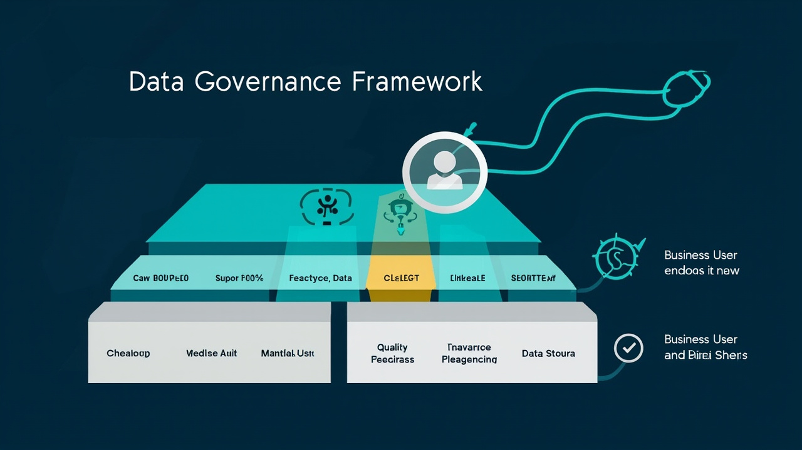
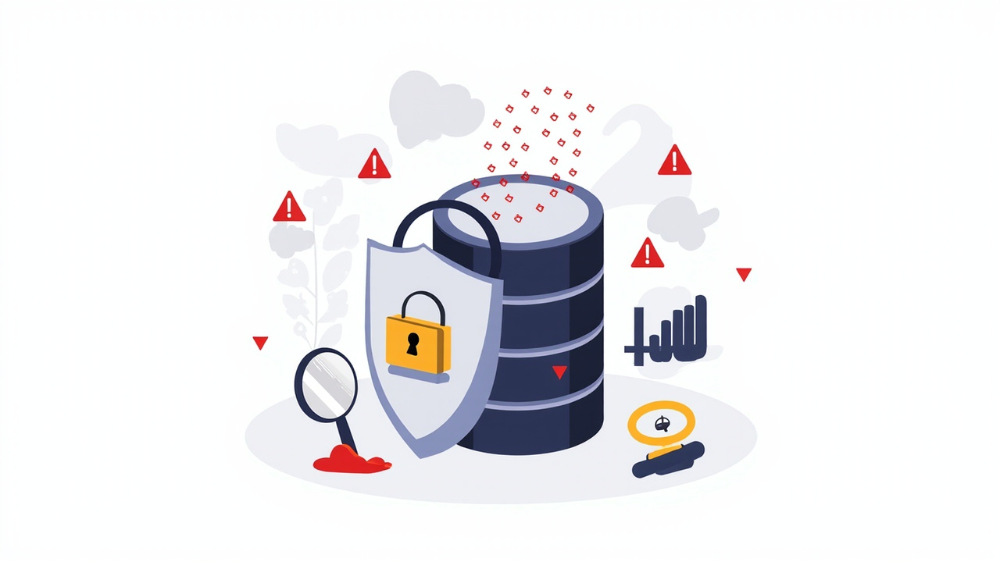
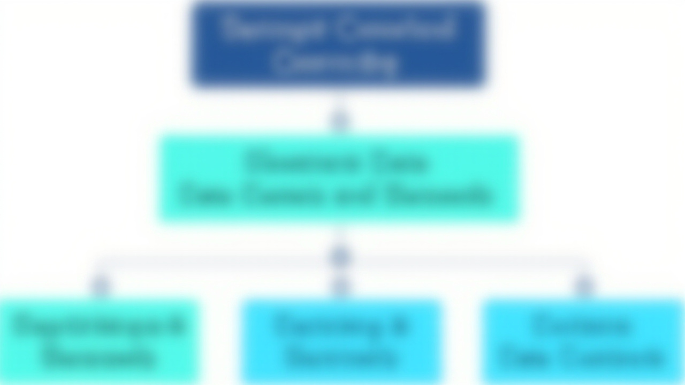
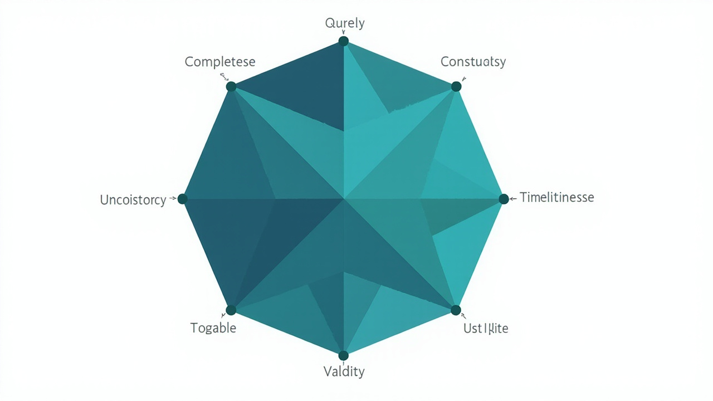
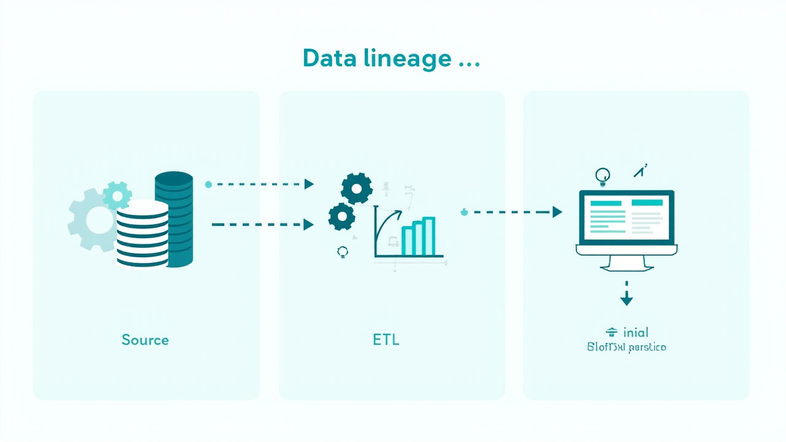
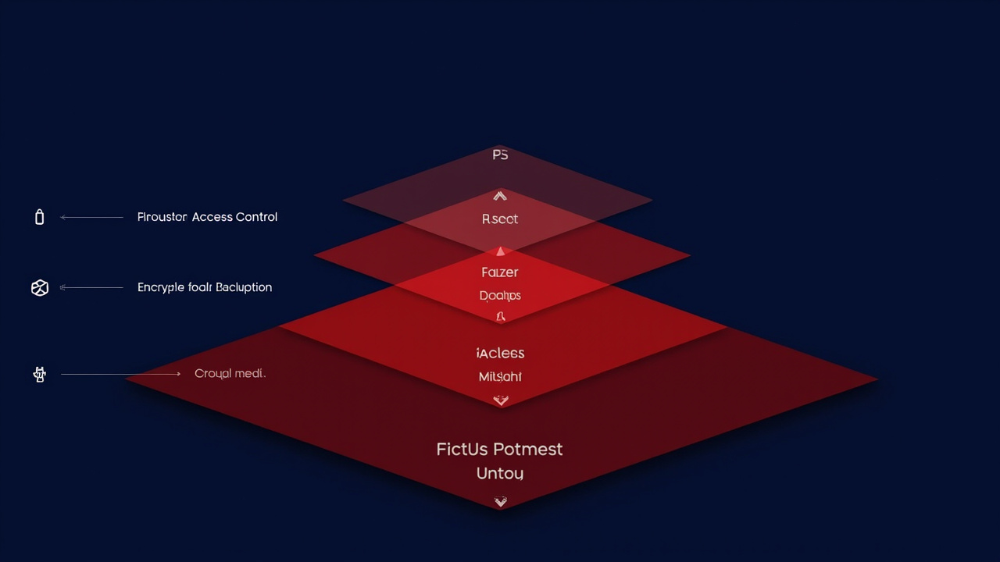
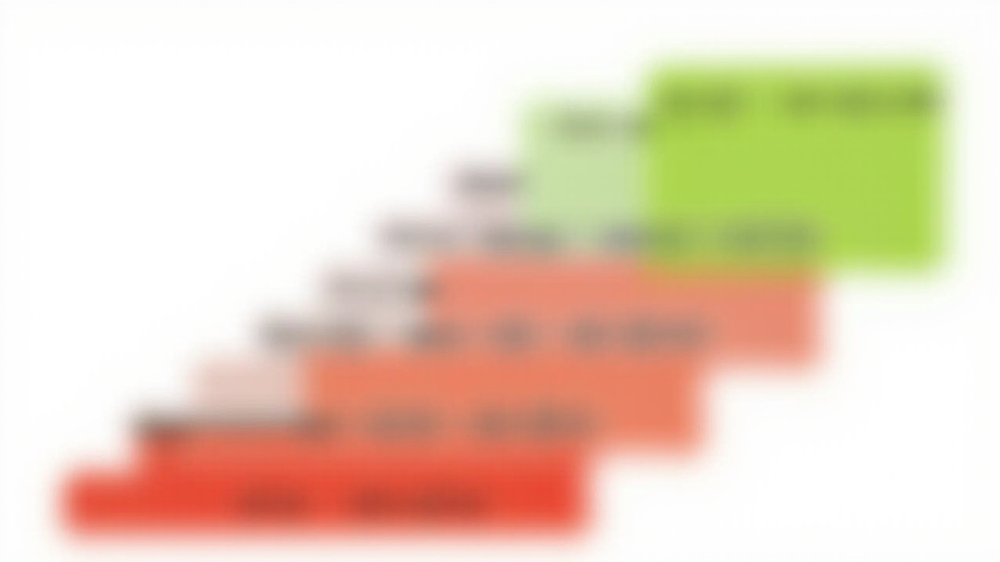
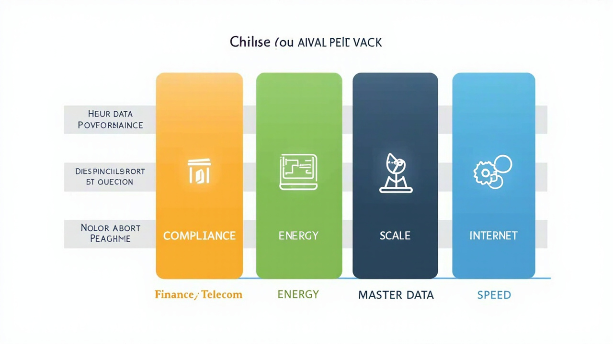
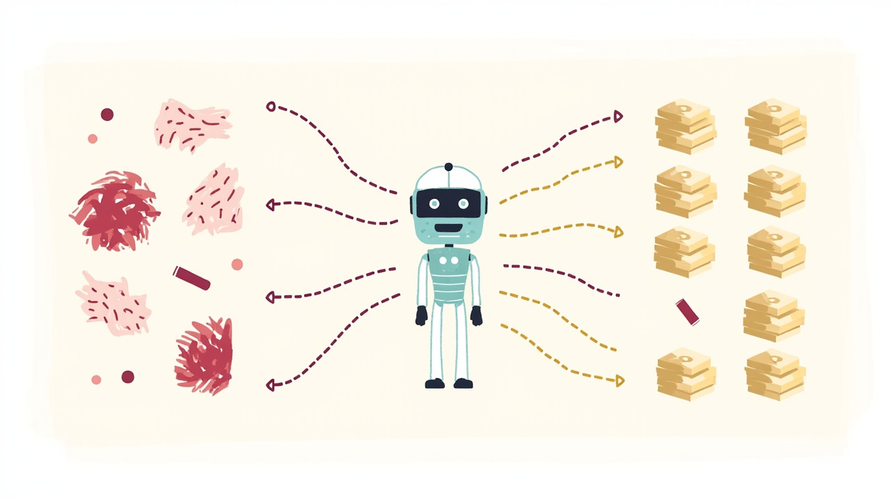
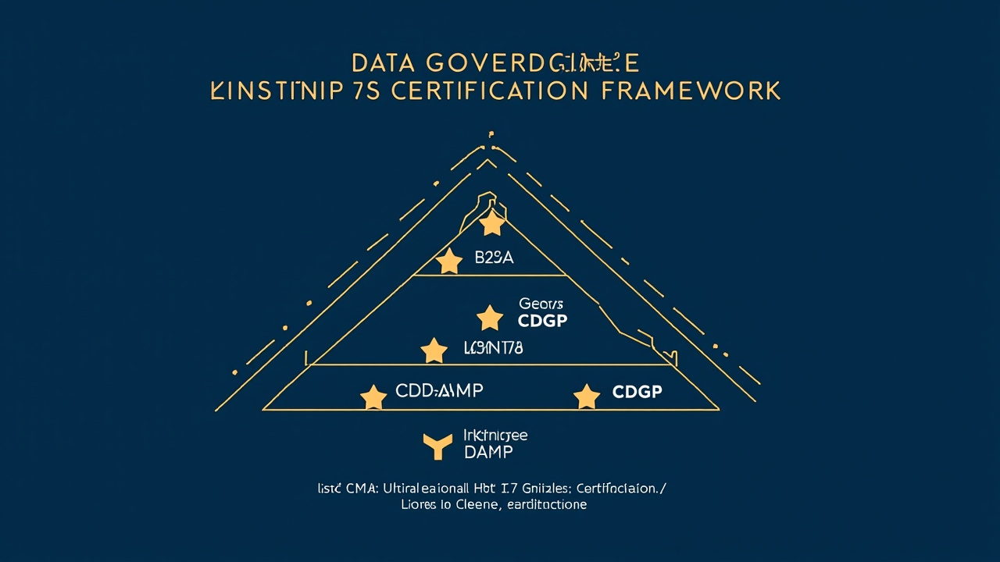

# 数据治理：让数据从资产到价值的方法论



> **数据治理从来不是一个 IT 项目，而是组织的"数据宪法"。** 它解决的不是某个具体的技术问题，而是"数据怎么产生、谁负责、怎么用、出了事谁兜底"这一组治理议题。本文按"定义→必要性→发展→分类→方法论→实施→案例→趋势→认证"的结构展开，覆盖数据分析师、数据产品经理、数据治理专家、数据架构师、数据开发工程师、数据科学家、数据管理者等 7 类角色视角。

---

## 目录

- [0. 引言：数据治理为什么这么难做](#0-引言数据治理为什么这么难做)
- [1. 什么是数据治理](#1-什么是数据治理)
- [2. 数据治理的必要性：从"数据沼泽"到"数据资产"](#2-数据治理的必要性从数据沼泽到数据资产)
- [3. 数据治理的发展过程：从 DMBOK 到 DCMM](#3-数据治理的发展过程从-dmbok-到-dcmm)
- [4. 数据治理的分类：四个维度看全景](#4-数据治理的分类四个维度看全景)
- [5. 数据治理的核心方法论](#5-数据治理的核心方法论)
- [6. 数据治理的实施路径：从 0 到 5 级成熟度](#6-数据治理的实施路径从-0-到-5-级成熟度)
- [7. 行业头部案例：5 个典型行业的治理实践](#7-行业头部案例5-个典型行业的治理实践)
- [8. 2025-2026 数据治理的五大趋势](#8-2025-2026-数据治理的五大趋势)
- [9. 数据治理认证体系：CDGA / CDGP / DCMM 评估师](#9-数据治理认证体系cdga--cdgp--dcmm-评估师)
- [10. 结语：治理不是终点，是基础设施](#10-结语治理不是终点是基础设施)
- [附录 A：参考资料](#附录-a参考资料)
- [附录 B：配图清单](#附录-b配图清单)
- [附录 C：术语解释](#附录-c术语解释)

---

## 0. 引言：数据治理为什么这么难做

很多公司数据治理失败，并不是因为"没有做"，而是因为"做了但没成"。

常见的三类结局：

- **场景 1：技术派失败** —— 花了大价钱上了数据治理平台（主数据、元数据、数据质量、数据安全），但业务方不认账，最后系统成了"数据治理部门自娱自乐的玩具"。
- **场景 2：组织派失败** —— 成立了 CDO 办公室和数据治理委员会，但拿不到业务部门的数据所有权，规则定了一堆却没人执行。
- **场景 3：合规派失败** —— 等到《数据安全法》《个人信息保护法》或《企业数据资源相关会计处理暂行规定》落地后被倒逼，开始"补作业式治理"，四处救火但建不成体系。

为什么会这样？因为数据治理的核心从来不是技术、不是组织、不是合规，而是**对组织内数据资产"权力、控制、责任"的再分配**。这件事本身，就决定了它是一项"高政治难度"的工程。

> **IDC 行业数据**：2023 年中国数据治理平台级市场规模达 29.3 亿元人民币，同比增长 9.1%；数据治理解决方案市场规模 30.8 亿元，同比增长 7.8%。
> 来源：[增速略有下降,2023年数据治理市场份额报告发布 - 搜狐](https://www.sohu.com/a/800741717_121124366) (2024)

> **市场规模预测**：2025 年中国数据资产管理行业市场规模预计达 1839.4 亿元，同比增长 23%。
> 来源：[2026数据资产管理平台核心厂商排名TOP10 - CSDN博客](https://blog.csdn.net/weixin_57330672/article/details/157059463) (2026-01-17)

换句话说：治理的需求在，但治理的难度也高。这篇文章的目标，是把这件"难做但必须做"的事拆开讲清楚——从定义到方法论，从行业案例到认证体系，让数据分析师、数据产品经理、数据治理专家、数据架构师、数据开发工程师、数据科学家、数据管理者都能在其中找到自己的角色坐标。

---

## 1. 什么是数据治理

### 1.1 四个关键词定义数据治理

数据治理不是一个工具，也不是一个流程，更不是一份制度文件。它是**对组织内数据资产的决策权、所有权、使用权进行分配、行使和监督的一组机制**。可以用四个关键词来拆解：

| 关键词 | 含义 | 解决的核心问题 |
|---|---|---|
| **决策权** | 谁有权定义一个指标的口径、谁有权批准一项数据的新增 | "这个数字到底谁说了算" |
| **所有权** | 谁是某个数据资产的最终责任人（Data Owner） | "出了事谁兜底" |
| **使用权** | 谁可以读、写、修改、对外共享数据 | "谁能用、怎么用、用到哪" |
| **监督权** | 谁来审计数据的使用、监控数据质量、评估合规 | "谁来看守规则" |

DAMA（国际数据管理协会）在 DMBOK 2.0 中给出的定义是：

> "数据治理（Data Governance）是对数据资产管理行使**权力**和**控制**的活动集合（规划、监视和强制执行）。"
> 来源：[DAMA 数据管理知识体系指南 2.0](https://www.dama.org.cn/) (2026-06-14)

注意 DAMA 的用词——是"权力和控制"（Authority and Control），不是"管理和规范"（Management and Standard）。这一字之差，决定了数据治理的本质是**组织治理**而非**技术治理**。

### 1.2 7 类数据相关角色眼中的数据治理

不同岗位对"数据治理"的理解差异很大。下表是常见的视角错位：

| 角色 | 关注点 | 典型诉求 | 治理失败时的吐槽 |
|---|---|---|---|
| **数据分析师** | 指标口径、数据质量 | "为什么这个数又变了" | "口径又改了，我昨晚做的报告全废了" |
| **数据产品经理** | 指标管理、用户自助分析 | "怎么让业务方自己看数" | "我建了一堆看板，没人用" |
| **数据治理专家** | 标准、制度、流程 | "标准定了一堆，业务方不执行" | "治理委员会开了 10 次会，没有 1 个决定落地" |
| **数据架构师** | 数据模型、分层、血缘 | "数据怎么打通" | "上游一改字段，下游 20 个任务全挂" |
| **数据开发工程师** | ETL、调度、稳定性 | "能不能别再临时改口径" | "半夜被叫起来修数据，源头是业务口径变了" |
| **数据科学家** | 特征工程、样本质量 | "样本漂移了，模型效果掉了一半" | "离线 AUC 0.85，上线 AUC 0.65，问题出在数据" |
| **数据管理者（CDO/CIO）** | 合规、ROI、组织协同 | "治理投入巨大，如何证明价值" | "老板问数据治理到底带来了什么，我答不上来" |

> 治理的失败，往往不是某个角色没做好，而是 7 个角色对"治理是什么"的认知没有对齐。**数据治理的第一性原理，是让这 7 个角色坐到同一张桌子上。**

---

## 2. 数据治理的必要性：从"数据沼泽"到"数据资产"

### 2.1 业务侧的三个痛点

**痛点 1：找不到数据**


- 业务方想看一个"近 30 天高价值用户复购率"，要先找分析师，分析师要查数据字典，数据字典是 3 年前的，字段名又改过 3 次。
- **治理诉求**：元数据管理 + 数据资产目录（Data Catalog），让业务方能自助发现"有什么数据、在哪、谁负责、能不能用"。

**痛点 2：数据对不上**


- 财务给的"营收"、业务给的"营收"、CEO 报表里的"营收"，三个数字对不上，每次汇报都要先打一架。
- **治理诉求**：指标管理（Metric Platform）+ 主数据管理（MDM），强制让一个指标只有一套口径、一套责任主体。

**痛点 3：合规风险**



- 个人信息保护法、数据安全法、GDPR 一个接一个，"这个字段能不能用、能不能出库、能不能给到第三方"，业务方完全不知道边界。
- **治理诉求**：数据分类分级 + 数据安全策略 + 隐私计算，让"数据可用不可见、可控可计量"。

### 2.2 政策与监管的三重驱动

数据治理在 2020 年之后突然从"可选项"变成"必选项"，本质是三股政策力量的合力：

| 政策/法规 | 颁布时间 | 核心要求 | 对数据治理的影响 |
|---|---|---|---|
| **《数据安全法》** | 2021.9.1 实施 | 数据分类分级、安全审查 | 必须建立数据分类分级制度 |
| **《个人信息保护法》** | 2021.11.1 实施 | 个人信息处理规则、跨境传输 | 必须建立隐私数据识别和脱敏机制 |
| **《企业数据资源相关会计处理暂行规定》** | 2023.8.21 印发，**2024.1.1 实施** | 数据资源可计入无形资产或存货 | 必须建立数据资产化管理体系 |
| **GB/T 36073-2018 DCMM** | 2018.10.1 实施，**2025 年修订（GB/T 36073-2025）** | 8（→9）大能力域、28（→33）个能力项、5 级成熟度 | 国标级数据治理评估体系 |

> **数据资产入表新规解读**：2023 年 8 月 21 日，财政部制定印发《企业数据资源相关会计处理暂行规定》（财会〔2023〕11号），自 2024 年 1 月 1 日起施行。
> 来源：[财政部关于印发《企业数据资源相关会计处理暂行规定》的通知](https://www.gov.cn/gongbao/2023/issue_10746/202310/content_6907744.html) (2023-10-10)

> **数据资产入表市场动态**：从数据资产入表的会计处理看，目前八成的数据资源进入"无形资产"科目，截至 2025 年底，头部企业数据资产入表规模已过亿。
> 来源：[数据资产入表加速,头部企业规模已过亿 - 腾讯新闻](https://so.html5.qq.com/page/real/search_news?docid=70000021_3526a06c8d620152) (2026-05-15)

数据资产入表对治理的冲击是结构性的：以前数据治理是"成本中心"（花钱、花人、不直接创造收入），现在数据治理是"资产管理"的必经环节——没有治理过的数据，既不能入表，也不能作为融资、交易、证券化的基础。

---

## 3. 数据治理的发展过程：从 DMBOK 到 DCMM

### 3.1 国际路线：DAMA DMBOK 2.0

DAMA（Data Management Association，国际数据管理协会）发布的 DMBOK（Data Management Body of Knowledge）数据管理知识体系，是全球数据管理领域最权威的参考框架。

**DMBOK 2.0 的 11 个知识领域（车轮图）**：

```text
                    数据治理（中心）
                       / | \
                      /  |  \
              数据架构   数据安全  数据建模和设计
                  |       |       |
            数据存储和操作  数据集成和互操作
                  |
              元数据管理
                  |
              数据质量管理
                  |
            参考数据和主数据管理
                  |
              数据仓库和商业智能
                  |
            文档和内容管理
```

> 来源：[数据治理人员:这11大知识领域你必须知道(专家解读) - 今日头条](https://www.toutiao.com/article/7337332804705010187/) (2024-02-20)

11 个知识领域中，**数据治理是"车轮的中心"**，其他 10 个知识领域都是"车轮的辐条"——也就是说，数据治理是对其他所有数据管理活动的高层计划与控制。

DAMA 还有对应的 **CDMP（Certified Data Management Professional）** 认证，按 Practitioner → Specialist → Master → Fellow 四级递进。

### 3.2 国内路线：DCMM（数据管理能力成熟度评估模型）

DCMM 是我国数据管理领域**首个国家标准**（GB/T 36073-2018），2025 年修订为 GB/T 36073-2025，能力域和项数都做了扩展。

| 版本 | 标准号 | 能力域 | 能力项 | 评估等级 |
|---|---|---|---|---|
| 2018 版 | GB/T 36073-2018 | 8 个 | 28 个 | 5 级 |
| 2025 版 | GB/T 36073-2025 | **9 个**（新增"数据资产"） | **33 个** | 5 级 |

> 来源：[详解 GBT 36073-2025 DCMM数据管理成熟度模型 - CSDN](https://download.csdn.net/blog/column/12861812/157872729) (2026-06-04)

**8 大能力域（2018 版）**：

| # | 能力域 | 核心问题 |
|---|---|---|
| 1 | 数据战略 | 数据治理有没有顶层规划 |
| 2 | 数据治理 | 治理组织、流程、制度是否完整 |
| 3 | 数据架构 | 数据模型、分层、集成方式是否合理 |
| 4 | 数据标准 | 业务术语、字段命名、值域是否统一 |
| 5 | 数据质量 | 数据准确性、完整性、一致性、及时性 |
| 6 | 数据安全 | 分类分级、访问控制、脱敏加密 |
| 7 | 数据应用 | 报表、API、分析、价值释放 |
| 8 | 数据生存周期 | 采集、存储、使用、销毁的全链路管理 |

**5 级成熟度**：

| 等级 | 名称 | 描述 |
|---|---|---|
| L1 | 初始级 | 救火式、无体系 |
| L2 | 受管理级 | 有制度、有流程 |
| L3 | 稳健级 | 标准化、文档化 |
| L4 | 量化管理级 | 指标化、可度量 |
| L5 | 优化级 | 持续改进、行业示范 |

> 来源：[数据管理能力成熟度评估模型DCMM - 搜狐](https://www.sohu.com/a/795894870_121906922) (2024-07-25)

> **市场体量**：截至 2025 年 10 月，全国共有 8000 余家企业获得 DCMM 认证，其中中信建投证券已获 L5（优化级）最高等级。
> 来源：[西交利物浦大学获数据管理能力成熟度(DCMM)四级认证 - 腾讯新闻](https://so.html5.qq.com/page/real/search_news?docid=70000021_60569033ccf33852) (2025-10-30)

### 3.3 DAMA 与 DCMM 的对比

| 维度 | DAMA DMBOK 2.0 | DCMM |
|---|---|---|
| 定位 | 知识体系（参考框架） | 评估模型（认证标准） |
| 来源 | 国际数据管理协会 | 中国国家标准（GB/T 36073） |
| 用途 | 学习、培训、能力建设 | 招标资质、企业评估、政府加分 |
| 结构 | 11 个知识领域 | 8（→9）大能力域、28（→33）个能力项、5 级成熟度 |
| 配套认证 | CDMP（国际） | DCMM 评估师（国内） |
| 适用场景 | 跨国公司、外资、咨询 | 国央企、政府、金融、信创 |

> 实操建议：**国央企 / 政府 / 金融 / 信创相关项目优先 DCMM；外资 / 跨国业务 / 数据管理专业团队建设优先 DAMA。**

---

## 4. 数据治理的分类：四个维度看全景

数据治理可以从 4 个维度分类——**功能维度**、**范围维度**、**数据生命周期维度**、**行业维度**。

### 4.1 功能维度：DMBOK 11 大知识领域

| 序号 | 知识领域 | 一句话定义 | 核心产品/工具 |
|---|---|---|---|
| 1 | 数据治理 | 决策权分配、规则制定 | 治理平台、流程引擎 |
| 2 | 数据架构 | 数据资产蓝图、模型分层 | 数据建模工具、ER 图工具 |
| 3 | 数据建模和设计 | 概念/逻辑/物理模型 | PowerDesigner、Erwin、dbt |
| 4 | 数据存储和操作 | 存储设计、备份、容灾 | 数据库、对象存储、备份系统 |
| 5 | 数据安全 | 分类分级、访问控制、脱敏 | 数据脱敏、加密、IAM、隐私计算 |
| 6 | 数据集成和互操作 | 跨系统数据流转 | ETL/ELT、CDC、API 网关 |
| 7 | 文档和内容管理 | 非结构化数据管理 | 文档中台、OCR、知识图谱 |
| 8 | 参考数据和主数据管理 | "黄金数据"管理 | MDM 平台、码表系统 |
| 9 | 数据仓库和商业智能 | 历史数据 + 分析查询 | 数仓、BI、ChatBI |
| 10 | 元数据管理 | "数据的数据" | 元数据平台、血缘分析 |
| 11 | 数据质量管理 | 准确性、完整性、一致性 | 质量规则引擎、数据探查 |

### 4.2 范围维度：组织级 / 域级 / 项目级

| 范围 | 适用对象 | 治理深度 | 责任主体 |
|---|---|---|---|
| **企业级治理** | 全集团 | 全功能、跨域 | CDO 办公室 + 数据治理委员会 |
| **域级治理**（业务域/数据域） | 单个业务线（如零售、金融） | 部分功能、域内统一 | 域数据治理负责人 |
| **项目级治理** | 单个数据项目/数据产品 | 轻量级、聚焦数据质量 | 项目经理 + 数据 owner |

### 4.3 生命周期维度：采集→存储→使用→销毁

```text
┌──────────────┐   ┌──────────────┐   ┌──────────────┐   ┌──────────────┐
│  1. 采集     │ → │  2. 存储     │ → │  3. 使用     │ → │  4. 销毁     │
│  - 数据源    │   │  - 分层存储  │   │  - 权限控制  │   │  - 过期清理  │
│  - 采集标准  │   │  - 加密      │   │  - 脱敏      │   │  - 匿名化    │
│  - 血缘起点  │   │  - 备份      │   │  - 审计      │   │  - 合规销户  │
└──────────────┘   └──────────────┘   └──────────────┘   └──────────────┘
       ↑                                     ↑
   元数据管理                           数据质量管理
   数据标准管理                         数据安全管理
```

### 4.4 行业维度：金融 / 政府 / 制造 / 互联网 / 医疗

不同行业的治理侧重不同：

| 行业 | 治理重点 | 监管压力 | 典型场景 |
|---|---|---|---|
| **金融** | 数据安全、客户主数据、监管报送 | 极高 | 1104 报送、客户画像、反洗钱 |
| **政府** | 数据共享、开放、政务数据资产 | 高 | 一网通办、政务数据资产入表 |
| **制造** | 主数据、产品数据、设备 IoT | 中 | 设备数据治理、供应链数据 |
| **互联网** | 用户行为数据、隐私合规、AB 实验 | 高 | 用户画像、推荐系统、隐私计算 |
| **医疗** | 病历隐私、科研数据共享 | 极高 | 病历脱敏、多中心科研数据共享 |

### 4.5 治理功能产品化：国内主流数据治理平台速览

> 评分仅作技术对比参考，非权威排名。

| 厂商 | 平台 | 核心能力 | 优势场景 |
|---|---|---|---|
| **普元信息** | 普元数据治理平台 | 全链路治理、8 大能力域完整 | 大型国央企、信创 |
| **阿里云** | DataWorks / Dataphin（瓴羊） | 云原生、与通义千问集成 | 互联网、上云企业 |
| **华为云** | DataArts Studio | 信创适配、PB 级实时处理 | 政务、能源、央国企 |
| **网易数帆** | 网易数帆 | 大数据治理 + BI 一体 | 互联网、金融 |
| **IBM** | Cloud Pak for Data + Watson | 知识图谱、跨国合规 | 跨国企业、医疗 |
| **Collibra** | Collibra Data Intelligence | 数据目录 + 数据血缘（国际主流） | 跨国企业、全球总部 |

> 来源：[2025数据治理平台品牌TOP16榜单 - CSDN](https://blog.csdn.net/aishuaicai/article/details/152207103) (2025-09-28)

> 来源：[2026 年国内数据治理平台全景对比 - 搜狐](https://www.sohu.com/a/1003012531_122518682) (2026-03-30)

---

## 5. 数据治理的核心方法论

> 本章是全文重点（占 40% 以上篇幅），按"组织→标准→质量→元数据→安全→主数据→生命周期→AI 治理→文化"的顺序展开。每一节都给出可落地的动作 + 工具/模板 + 关键岗位。

### 5.1 组织治理：建立"权力-责任"矩阵



数据治理的第一动作不是上系统，是**画清楚组织结构**。推荐采用 RACI 模型：

| 角色 | R（执行） | A（问责） | C（咨询） | I（知会） |
|---|---|---|---|---|
| **CDO/数据治理委员会** | — | ✓ | — | — |
| **数据治理办公室** | ✓ | — | ✓ | — |
| **业务数据 Owner** | ✓ | ✓ | — | — |
| **数据治理专家/标准组** | ✓ | — | ✓ | — |
| **数据架构师** | ✓ | — | ✓ | — |
| **数据开发工程师** | ✓ | — | — | ✓ |
| **业务分析师** | — | — | ✓ | ✓ |
| **数据科学家** | — | — | ✓ | ✓ |
| **法务/合规** | — | — | ✓ | ✓ |
| **审计/安全** | — | — | — | ✓ |

**关键岗位说明**：

| 岗位 | 职责 | 报告线 |
|---|---|---|
| **CDO（首席数据官）** | 数据战略、合规、跨部门协同 | 总经理 / CEO |
| **Data Owner（数据责任人）** | 某类数据的最终责任人 | 业务部门负责人 |
| **Data Steward（数据管家）** | 日常数据质量、标准落地 | 业务部门 / 数据部门 |
| **Data Custodian（数据保管人）** | 技术层数据安全、备份 | IT/数据部门 |

> **避坑提示**：很多公司把"数据治理部"放在 IT 部门下，治理就成了 IT 自嗨。**Data Owner 必须在业务部门**，否则就是无源之水。

### 5.2 数据标准：把"业务语言"统一成"机器语言"

数据标准治理的本质是**把业务术语翻译成字段定义**。一套完整的数据标准包含 5 层：

```text
业务术语 → 字段定义 → 值域 → 编码 → 引用关系
```

| 层级 | 例子 | 治理产出物 |
|---|---|---|
| **业务术语** | "客户" | 业务术语表（金融行业/零售行业） |
| **字段定义** | cust_id, cust_name, cust_type | 数据字典（DDL） |
| **值域** | cust_type ∈ {个人客户, 企业客户, 集团客户} | 值域清单、码表 |
| **编码** | 01/02/03 | 编码规则文档 |
| **引用关系** | 客户-账户-合同-订单 | ER 图、概念模型 |

**落地步骤**：

1. **盘点**：先盘点现有数据字典和业务术语表，识别"同名不同义"和"同义不同名"。
2. **对齐**：跨部门 workshop，把"客户""订单""营收"等核心术语定义对齐。
3. **落地**：把对齐后的标准写入 DDL 注释、数据字典文档、BI 工具的字段说明。
4. **审计**：每季度抽样审计，检查业务系统是否遵循新标准。

> **关键岗位**：业务分析师 + 数据治理专家共同制定，Data Owner 最终拍板。

### 5.3 数据质量：六维度评估 + 闭环治理



数据质量评估的 6 大维度（业界最常用）：

| 维度 | 定义 | 例子 |
|---|---|---|
| **完整性** | 必填字段是否为空 | 用户手机号 15% 为空 |
| **准确性** | 数据是否真实反映业务 | 地址字段错误率 8% |
| **一致性** | 跨系统同一字段值是否一致 | 订单金额在订单系统和支付系统不一致 |
| **及时性** | 数据从产生到可用的时延 | T+1 报表凌晨 4 点才出 |
| **唯一性** | 是否存在重复记录 | 用户表中同一手机号出现 3 次 |
| **有效性** | 是否符合值域/格式规范 | 邮箱字段 5% 不符合格式 |

**数据质量闭环治理流程**：

```text
规则定义 → 质量监控 → 异常告警 → 根因分析 → 整改落地 → 效果验证
    ↑                                                      ↓
    └──────────────────────────────────────────────────────┘
```

**关键岗位**：数据开发工程师负责规则配置和监控，Data Steward 负责根因分析和整改跟进，Data Owner 负责最终决策。

### 5.4 元数据与血缘：从"数据在哪里"到"数据从哪来"



元数据分为 3 类：

| 类型 | 描述 | 例子 |
|---|---|---|
| **业务元数据** | 业务侧定义、口径、责任 | "DAU = 当日启动过 App 的去重用户数" |
| **技术元数据** | 表结构、字段类型、ETL 任务 | 库名、表名、字段类型、调度依赖 |
| **操作元数据** | 谁、什么时候、做了什么 | 访问日志、修改记录 |

**数据血缘的 3 种应用场景**：

1. **影响分析**：上游表结构变更前，自动识别下游受影响的报表、API、模型。
2. **根因定位**：数据异常时，沿血缘反向追溯到源头。
3. **合规审计**：个人信息跨境传输时，沿血缘确认数据流向。

> **关键工具**：开源有 Apache Atlas、DataHub、OpenMetadata；国内有阿里云 DataWorks 血缘、华为云 DataArts、网易数帆元数据、普元元数据。

### 5.5 数据安全：四层防护体系



数据安全治理的 4 层防护：

| 层级 | 控制点 | 典型措施 |
|---|---|---|
| **L1：身份与访问** | 谁可以访问 | IAM、SSO、细粒度 RBAC/ABAC |
| **L2：数据脱敏** | 怎么用数据 | 静态脱敏、动态脱敏、k-匿名、差分隐私 |
| **L3：数据加密** | 数据怎么存/怎么传 | 传输 TLS、存储 AES、字段级加密 |
| **L4：审计与监控** | 谁做了什么 | 访问日志、行为审计、异常告警、UEBA |

**数据分类分级（Data Classification）** 是整个安全治理的起点：

| 级别 | 名称 | 例子 | 保护要求 |
|---|---|---|---|
| L1 | 公开 | 营销文章、公开报表 | 无特殊要求 |
| L2 | 内部 | 内部经营数据 | 内部权限 |
| L3 | 敏感 | 营收数据、用户行为 | 强访问控制 + 脱敏 |
| L4 | 核心 | 个人信息、身份证号、银行卡 | 加密 + 审批 + 审计 |
| L5 | 绝密 | 商业机密、战略数据 | 多人审批 + 水印 + 行为审计 |

> **关键岗位**：数据安全负责人 + 法务/合规 + 数据架构师共同制定分类分级标准。

### 5.6 主数据与参考数据：管理"黄金数据"

主数据（Master Data）指组织内跨业务、跨系统共享的核心实体数据，如客户、产品、供应商、员工、账户。

参考数据（Reference Data）指用于对主数据进行分类和描述的数据，如国家码、行业码、币种、产品分类。

**主数据管理（MDM）的 3 种实施模式**：

| 模式 | 描述 | 适用场景 |
|---|---|---|
| **注册模式（Registry）** | 只记录权威源位置，不做数据合并 | 多系统并存、改造难度大 |
| **集中模式（Consolidated）** | 集中存储主数据 + 下发到各业务系统 | 集团型企业、标准化要求高 |
| **共建模式（Coexistence）** | 各系统维护主数据 + MDM 协调 | 业务系统多、流程复杂 |

> **关键岗位**：业务数据 Owner（主数据领域）+ MDM 平台技术负责人。

### 5.7 数据生命周期：采集→销毁全链路


数据生命周期管理的核心是**对不同阶段的数据采用不同的存储和治理策略**：

| 阶段 | 存储介质 | 治理重点 | 销毁条件 |
|---|---|---|---|
| **采集层** | Kafka、Pulsar | 数据源标准、采集口径 | — |
| **贴源层（ODS）** | Hive Iceberg、Hudi | 原始数据保留、可回溯 | 保留 3-5 年 |
| **明细层（DWD）** | 数仓、湖仓一体 | 清洗规则、口径 | 保留 3-5 年 |
| **汇总层（DWS）** | 数仓、宽表 | 指标口径、性能 | 保留 2-3 年 |
| **应用层（ADS）** | BI 库、API 库 | 业务可用性 | 按业务需求 |
| **归档层** | 对象存储 | 冷数据归档 | 按合规要求 |
| **销毁** | 物理删除、磁带消磁 | 不可恢复 | 监管要求 / 业务到期 |

> **关键岗位**：数据架构师 + 数据开发工程师共同制定分层和保留策略，Data Owner 决定保留年限。

### 5.8 AI 治理：当 LLM 遇到数据治理

随着大模型在企业内规模化使用，**AI 治理**成了数据治理的延伸议题。AI 治理需要回答 4 个问题：

1. **训练数据治理**：用了什么数据、是否符合隐私法规、是否经过授权？
2. **模型可解释性**：模型输出如何解释、是否记录推理过程？
3. **Prompt 治理**：用户输入的 Prompt 是否被记录、是否包含敏感信息？
4. **输出治理**：模型输出是否经过合规审查、是否包含个人信息？

**典型实施动作**：

- 建立 AI 训练数据资产目录（参照数据资产目录）
- 对接数据分类分级，给 LLM 调用加"数据访问控制"
- Prompt 日志留存 + 敏感信息脱敏
- 模型输出审核 + 人工抽检

> **趋势**：2025-2026 年，AI 治理将从"附加项"变为"必选项"——欧盟 AI Act、中国《生成式人工智能服务管理暂行办法》都对此提出明确要求。

### 5.9 数据文化：治理的"软实力"

技术能解决 50% 的问题，组织能解决 30% 的问题，剩下 20% 靠**文化**。

**数据文化的 4 个特征**：

1. **用数据说话** —— 决策基于数据，而非"老板感觉"。
2. **质疑数据** —— 拿到数据先问"口径、来源、时效"，而不是"哦，对的"。
3. **共享数据** —— 业务部门愿意把数据拿出来用，而不是"捂着"。
4. **保护数据** —— 知道什么数据能用、什么不能碰、什么需要审批。

> **培养路径**：
> - **新人入职培训**：增加数据治理通识课（2 小时）
> - **业务部门轮岗**：每个业务新人至少在数据团队轮岗 1 个月
> - **数据素养评估**：把数据素养纳入晋升评估
> - **数据英雄评选**：季度评选"用数据创造业务价值"的员工

---

## 6. 数据治理的实施路径：从 0 到 5 级成熟度



### 6.1 五步实施法

企业做数据治理，推荐遵循"5 步法"：

```text
Step 1: 现状评估 → Step 2: 战略规划 → Step 3: 试点突破 → Step 4: 规模推广 → Step 5: 持续优化
```

| 阶段 | 关键动作 | 周期 | 责任主体 |
|---|---|---|---|
| **Step 1: 现状评估** | DCMM 自评 + 业务访谈 + 数据资产盘点 | 1-2 月 | 数据治理办公室 |
| **Step 2: 战略规划** | 制定 3 年治理路线图、确定组织、预算 | 1-2 月 | CDO + 治理委员会 |
| **Step 3: 试点突破** | 选 1-2 个高价值场景（如客户主数据、指标管理）做闭环 | 3-6 月 | 业务 Data Owner + 数据团队 |
| **Step 4: 规模推广** | 把试点经验推广到全集团 + 上治理平台 | 6-12 月 | CDO 办公室 + IT |
| **Step 5: 持续优化** | 量化考核（KPI）+ 持续改进 + DCMM 认证 | 长期 | CDO + 全员 |

### 6.2 DCMM 5 级成熟度路径

| 等级 | 名称 | 典型特征 | 关键差距 |
|---|---|---|---|
| **L1 初始级** | 救火模式 | 出问题再修，无体系 | 缺组织、缺流程 |
| **L2 受管理级** | 制度化 | 有 CDO、有制度、有流程 | 制度未落地 |
| **L3 稳健级** | 标准化 | 标准统一、文档齐全 | 缺度量、缺自动化 |
| **L4 量化管理级** | 指标化 | 质量有量化、SLA 清晰 | 缺价值闭环 |
| **L5 优化级** | 持续改进 | 量化驱动、行业示范 | 持续投入 |

### 6.3 数据产品经理视角：你的角色定位

> 来自"一个想快速了解数据治理的数据产品经理"的视角——

数据产品经理在治理中扮演**"翻译官"** 角色：

| 你需要做的 | 你能调用的资源 | 你需要避免的 |
|---|---|---|
| 把业务方的数据需求翻译成标准化的数据产品 | 元数据目录、主数据服务、指标平台 | 做一个"特殊口径"的报表 |
| 推动业务方接受"标准指标" | 数据治理委员会、业务 Data Owner | 替业务方"特殊化"数据 |
| 设计"自助化"的数据产品 | 治理平台、BI 工具、ChatBI | 让所有人来找你要数 |
| 度量数据产品的使用情况 | 用户行为日志、满意度调研 | 自嗨式做功能 |

**数据 PM 推动治理的 3 个抓手**：

1. **指标标准化**：用指标平台强制"一个指标一套口径"，让业务方只能"消费"标准化指标。
2. **数据自助化**：把数据消费从"找分析师"变成"业务方自助"，减少对人的依赖。
3. **价值显性化**：用 A/B 实验、归因分析证明"数据治理→数据质量提升→业务效果提升"的链路。

### 6.4 治理 KPI：怎么证明治理有价值

| KPI 类别 | 指标 | 计算方式 | 目标 |
|---|---|---|---|
| **质量类** | 关键指标口径一致率 | 对齐指标数 / 总指标数 | ≥ 95% |
| **质量类** | 核心表数据完整率 | 完整记录数 / 总记录数 | ≥ 99% |
| **效率类** | 自助取数覆盖率 | 业务方自助取数 / 总取数 | ≥ 70% |
| **效率类** | 数据需求平均交付时长 | 需求闭环时长 | 持续下降 |
| **合规类** | 数据安全事件数 | P0/P1 安全事件 | 0 |
| **合规类** | 个人信息合规审计通过率 | 审计通过项 / 总审计项 | 100% |
| **价值类** | 数据资产入表规模 | 入表数据资产金额 | 持续增长 |
| **价值类** | 业务决策数据驱动占比 | 数据驱动决策 / 总决策 | 持续提升 |

### 6.5 避坑指南：数据治理 5 大常见失败

| 失败模式 | 原因 | 解法 |
|---|---|---|
| **治理平台空转** | 业务方不参与，只 IT 自嗨 | 治理委员会必须有业务方 VP |
| **标准定了一堆不落地** | 标准没嵌入流程、没强校验 | 把标准嵌入 ETL、建模、BI 工具 |
| **数据质量没人认账** | 责任人不明确 | 明确 Data Owner + 质量 SLA |
| **合规一刀切** | 不区分场景 | 分类分级、风险分级 |
| **价值不可见** | 只算成本不算收益 | 把治理投入与"数据资产入表""决策效率提升"挂钩 |

---

## 7. 行业头部案例：5 个典型行业的治理实践



### 7.1 金融行业：工商银行——数据资产入表先行者

**背景**：工商银行是 DCMM 5 级（优化级）首批获评单位，也是数据资产入表的标杆。

**治理动作**：

- **顶层架构**：CDO 直报行长，设立数据治理委员会，覆盖前中后台。
- **数据标准**：2000+ 业务术语、50000+ 字段标准、统一的银行核心数据模型（ECIF）。
- **数据质量**：200+ 核心数据质量规则实时监控，每月发布数据质量报告。
- **数据安全**：客户主数据 4 级保护，敏感字段强制脱敏、加密、审计。
- **数据资产入表**：2024 年率先完成数据资产入表，规模超 10 亿元。

**经验**：

1. **一把手工程**：CDO 必须有足够的话语权。
2. **业务深度参与**：业务 Data Owner 是关键，不能 IT 包办。
3. **从监管报送切入**：以 1104 报送、客户信息保护等强监管场景为切入点。
4. **持续投入**：治理是"十年工程"，不是"一年项目"。

### 7.2 政府行业：浙江省——政务数据资产化先行先试

**背景**：浙江省在政务数据共享、开放、资产化方面走在全国前列。

**治理动作**：

- **政务数据共享平台**：覆盖省市县三级 2000+ 部门、10000+ 数据集。
- **公共数据资产入表**：2024 年率先实现省级公共数据资产入表，规模超 5 亿元。
- **数据安全**：对接《数据安全法》《个人信息保护法》要求，分类分级 + 隐私计算。
- **数据要素市场**：建立长三角数据要素流通平台，推动公共数据授权运营。

**经验**：

1. **立法先行**：制定《浙江省公共数据条例》，明确"数据是资产"的法律地位。
2. **平台化运营**：建一个统一的政务数据共享平台，避免"数据烟囱"。
3. **场景化释放**：围绕"一网通办""健康码"等高频场景，释放数据价值。

### 7.3 制造行业：三一重工——设备数据治理

**背景**：三一重工是制造业数据治理的典型案例，特别是设备 IoT 数据治理。

**治理动作**：

- **设备主数据**：100000+ 设备型号、500000+ 设备资产、统一的设备编码体系。
- **设备运行数据**：500000+ 设备实时联网，秒级数据采集、毫秒级监控。
- **数据应用**：预测性维护、远程诊断、产能优化。
- **数据安全**：设备数据按"生产现场 - 边缘云 - 中心云"分级保护。

**经验**：

1. **主数据先行**：设备、产品、供应商等主数据治理是基础。
2. **IoT 数据治理**：实时数据、时序数据治理需专门的工具和方法。
3. **数据驱动业务**：把数据治理与"降本增效"直接挂钩。

### 7.4 互联网行业：字节跳动——指标平台 + ChatBI

**背景**：字节跳动在数据治理上以"指标平台 + ChatBI"为代表。

**治理动作**：

- **指标平台**：内部"DataFinder"管理 100000+ 指标，每个指标有唯一定义、Owner、版本。
- **ChatBI**：内部"DataChat"支持自然语言查询，覆盖 80% 业务分析场景。
- **A/B 实验平台**：所有决策必须基于 A/B 实验，实验数据全链路可追溯。
- **数据资产化**：内部数据资产目录、Data Owner 制度、价值评估体系。

**经验**：

1. **指标即代码**：把指标定义代码化、版本化、可追溯。
2. **自助化优先**：把分析师从"提数"中解放出来，专注于"分析"。
3. **实验文化**：用 A/B 实验验证数据决策的有效性。

### 7.5 医疗行业：协和医院——病历数据治理与科研数据共享

**背景**：医疗数据隐私要求高、科研数据共享需求强，是治理的"深水区"。

**治理动作**：

- **病历主数据**：统一的患者主索引（EMPI）、统一的病历编码（ICD-10、SNOMED CT）。
- **数据脱敏**：科研数据出库前强制脱敏，敏感字段用差分隐私保护。
- **多中心科研数据共享**：基于隐私计算（联邦学习、安全多方计算）实现"数据不出院、结果可用"。
- **合规审计**：符合《个人信息保护法》《医疗数据管理办法》。

**经验**：

1. **隐私优先**：医疗数据是"零信任"场景，脱敏和加密是默认要求。
2. **多中心协同**：隐私计算是医疗数据共享的关键技术。
3. **临床-数据-科研协同**：数据治理要服务于临床和科研双轮驱动。

### 7.6 跨行业对比

| 行业 | 治理核心 | 技术重点 | 监管压力 |
|---|---|---|---|
| 金融 | 客户主数据 + 监管报送 | MDM + 实时风控 | 极高 |
| 政府 | 政务数据共享 + 资产化 | 数据共享平台 + 隐私计算 | 高 |
| 制造 | 设备主数据 + IoT | 时序数据库 + 边缘计算 | 中 |
| 互联网 | 指标 + 用户行为 | 指标平台 + ChatBI + 实验 | 高 |
| 医疗 | 病历 + 科研数据 | 隐私计算 + 联邦学习 | 极高 |

### 7.7 数据科学家视角：数据治理如何影响模型效果

数据科学家是数据治理的"最终消费者"之一，但也是治理效果最直接的"感受者"。

**典型问题**：

| 治理问题 | 对模型的影响 | 治理建议 |
|---|---|---|
| 训练样本漂移 | 离线 AUC 高、上线 AUC 低 | 建立样本漂移监控 + 定期重训 |
| 特征口径不一致 | 训练和推理特征不一致 | 特征平台 + 特征注册中心 |
| 标签缺失/错误 | 模型学到错误模式 | 标签质量管理 + 多人标注 |
| 数据时间穿越 | 用未来数据预测过去 | 严格的时间窗口切分 |
| 数据孤岛 | 训练数据不足 | 隐私计算 + 数据共享 |

> 数据科学家推动治理的 3 个抓手：
> 1. **特征平台**：把特征作为"产品"来管理，统一口径、统一版本。
> 2. **样本管理**：建立训练样本的版本管理、漂移监控、效果追踪。
> 3. **效果归因**：把"模型效果变化"归因到"数据质量变化"，让数据治理"可量化"。

---

## 8. 2025-2026 数据治理的五大趋势

### 8.1 趋势一：数据资产入表驱动治理"价值显性化"

- **背景**：财政部 2024.1.1 起施行《企业数据资源相关会计处理暂行规定》，数据资源可入无形资产/存货。
- **影响**：数据治理从"成本中心"转向"资产管理部门"，倒逼企业必须建立完整的数据资产管理体系。
- **关键动作**：建立数据资产目录、价值评估模型、入表流程。

> 来源：[数据资产入表新规解读与实务应用 - 高顿咨询](https://www.goldenfinance.com.cn/course/1329.html) (2026-06-03)

### 8.2 趋势二：AI 治理成为新焦点

- **背景**：LLM 在企业内规模化使用，欧盟 AI Act、中国《生成式 AI 服务管理办法》明确合规要求。
- **影响**：AI 训练数据、模型输出、Prompt 都需要纳入治理体系。
- **关键动作**：建立 AI 数据资产目录、模型可解释性框架、Prompt 审计、输出合规审查。



### 8.3 趋势三：隐私计算规模化落地

- **背景**：数据要素市场化要求"数据可用不可见、可控可计量"，隐私计算（联邦学习、安全多方计算、可信执行环境）是关键技术。
- **影响**：金融、医疗、政务、互联网都将出现"数据不出域、价值可流通"的场景。
- **关键动作**：建立隐私计算平台、对接数据要素市场、制定数据定价机制。

### 8.4 趋势四：DCMM 与 DAMA 双轨并行

- **背景**：DCMM（国家标准）+ DAMA（国际标准）双轨并行，国央企/政府优先 DCMM，跨国业务/外资优先 DAMA。
- **影响**：数据治理人才需要掌握两套体系，认证市场持续增长。
- **关键动作**：企业内部培养"DCMM 评估师 + DAMA CDMP"双证人才。

### 8.5 趋势五：数据治理平台向 AI Native 演进

- **背景**：传统数据治理平台以规则配置为主，2025-2026 年开始集成 AI 能力。
- **影响**：元数据自动发现、数据质量自动修复、口径自动对齐、合规自动审查。
- **关键动作**：评估治理平台的 AI 能力，把 AI 嵌入数据资产目录、质量监控、合规审计。

---

## 9. 数据治理认证体系：CDGA / CDGP / DCMM 评估师



### 9.1 国内主流认证

| 认证 | 颁发机构 | 等级 | 报考条件 | 费用 | 定位 |
|---|---|---|---|---|---|
| **CDGA**（数据治理工程师） | DAMA 中国 | 初级 | 大专及以上学历 | 1000 元 | 入门级，理论+基础实践 |
| **CDGP**（数据治理专家） | DAMA 中国 | 高级 | 持 CDGA 证书 + 5 年相关工作经验（博士无经验要求） | 2000 元 | 进阶级，深度方法论+案例分析 |
| **CDMP**（数据管理专业人士） | DAMA 国际 | 四级 | 教育 + 经验 + 考试 | — | 国际通用，跨国企业认可 |
| **DCMM 评估师** | 中国电子技术标准化研究院 | — | 通常需企业内部推荐 | — | 评估 DCMM 等级 |

> 来源：[2025年第二期CDGA/CDGP认证考试注意事项 - 希赛网](https://www.educity.cn/dama/5382464.html) (2025-04-17)

### 9.2 考试安排（2025-2026）

| 期次 | 报名时间 | 考试时间 | 科目 |
|---|---|---|---|
| 2025 年第一期 | 已结束 | 2025.3.23 | CDGA + CDGP |
| 2025 年第二期 | 已结束 | 2025.6.22 | CDGA + CDGP |
| 2026 年第一期 | 关注 DAMA 中国官网 | 2026.3 或 6 | CDGA + CDGP |

> 来源：[2026年第二季CDGA/CDGP数据治理认证,报考指南 - 搜狐](https://www.sohu.com/a/1002796666_120919035) (2026-03-30)

### 9.3 认证选择建议

| 你的角色 | 推荐认证 | 优先级 |
|---|---|---|
| **数据分析师 / 数据产品经理** | CDGA | ★★★ |
| **数据治理专家 / 数据治理经理** | CDGP + CDMP | ★★★★★ |
| **数据架构师 / 数据开发工程师** | CDGA + CDGP | ★★★★ |
| **业务 Data Owner** | CDGA | ★★★ |
| **CDO / 数据管理者** | CDGP + DCMM 评估师 | ★★★★★ |
| **数据科学家** | CDGA | ★★ |

### 9.4 备考建议

- **教材**：DAMA 中国出版的《数据治理工程师认证教材》《数据治理专家认证教材》。
- **知识体系**：DMBOK 2.0 11 大知识领域 + DCMM 8 大能力域。
- **刷题**：希赛网、知乎、CSDN 都有真题和模拟题。
- **重点章节**：数据治理、数据质量、数据安全、元数据管理（占比 60% 以上）。

---

## 10. 结语：治理不是终点，是基础设施


数据治理不是"做完就完"的项目，而是组织数字化转型的**基础设施**。

把它类比成城市建设：

- 治理的**组织**相当于城市的"市政厅"——制定规则、分配资源、解决问题。
- 治理的**标准**相当于城市的"路名"——统一命名、不重复、不歧义。
- 治理的**质量**相当于城市的"建筑质量"——数据准确、及时、一致。
- 治理的**安全**相当于城市的"警察局"——保护数据、打击违规。
- 治理的**元数据**相当于城市的"地图"——告诉你每条路通向哪里。

一座城市不可能一年建成，数据治理也一样。**快就是慢，慢就是快**。

> 给数据治理从业者的最后一句：
> **"治理的终极目标不是让数据'合规'，而是让数据'好用'。当业务方主动来找你要数据，而不是被动接受你推的数据，治理才真正成功。"**

---

## 附录 A：参考资料

> 本附录按主题分类列出本文引用的所有外部来源。所有引用均保留原始 URL 和日期。

### A.1 DAMA / DMBOK 知识体系

1. [DAMA中国 – DAMA China Limited](https://www.dama.org.cn/) (2026-06-14) — DAMA 中国官方
2. [数据治理人员:这11大知识领域你必须知道(专家解读) - 今日头条](https://www.toutiao.com/article/7337332804705010187/) (2024-02-20)
3. [数据治理体系化建设:从理论到实践的全景解读 - CSDN博客](https://blog.csdn.net/l19889317684/article/details/147723252) (2025-05-07)
4. [DAMA-DMBOK 数据治理功能框架 - 中培伟业](http://www.zpedu.com/it/gnrz/14384.html)

### A.2 DCMM 国家标准

5. [详解 GBT 36073-2025 DCMM数据管理成熟度模型 - CSDN](https://download.csdn.net/blog/column/12861812/157872729) (2026-06-04)
6. [数据管理能力成熟度评估模型DCMM - 搜狐](https://www.sohu.com/a/795894870_121906922) (2024-07-25)
7. [西交利物浦大学获数据管理能力成熟度(DCMM)四级认证 - 腾讯新闻](https://so.html5.qq.com/page/real/search_news?docid=70000021_60569033ccf33852) (2025-10-30)
8. [中信建投证券荣获国家数据管理能力成熟度(DCMM)最高等级认证 - 新浪](https://k.sina.com.cn/article_5952915720_162d2490806703xa9u.html) (2026-05-15)
9. [数据管理能力成熟度评估模型DCMM - 腾讯云](https://cloud.tencent.com/developer/news/1075382) (2023-05-15)

### A.3 数据资产入表

10. [财政部关于印发《企业数据资源相关会计处理暂行规定》的通知 - 中国政府网](https://www.gov.cn/gongbao/2023/issue_10746/202310/content_6907744.html) (2023-10-10)
11. [企业数据资产入表规定对数字经济的影响与发展前景 - 新浪](https://news.sina.com.cn/sx/2023-10-25/detail-imzshvcr9069623.shtml) (2023-10-25)
12. [数据资产入表新规解读与实务应用 - 高顿咨询](https://www.goldenfinance.com.cn/course/1329.html) (2026-06-03)
13. [数据资产入表加速,头部企业规模已过亿 - 腾讯新闻](https://so.html5.qq.com/page/real/search_news?docid=70000021_3526a06c8d620152) (2026-05-15)
14. [律师研析:财政部"数据资产入表"新规解读 - 搜狐](https://news.sohu.com/a/718771060_121359560) (2023-09-08)

### A.4 数据治理平台 / 厂商

15. [2025数据治理平台品牌TOP16榜单:技术突破与选型指南 - CSDN](https://blog.csdn.net/aishuaicai/article/details/152207103) (2025-09-28)
16. [2026 年国内数据治理平台全景对比 - 搜狐](https://www.sohu.com/a/1003012531_122518682) (2026-03-30)
17. [2026数据资产管理平台核心厂商排名TOP10 - CSDN博客](https://blog.csdn.net/weixin_57330672/article/details/157059463) (2026-01-17)
18. [2025 中国数据安全厂商能力图谱与推荐报告 - CSDN](https://blog.csdn.net/KKKlucifer/article/details/153185407) (2025-10-13)
19. [增速略有下降,2023年数据治理市场份额报告发布 - 搜狐](https://www.sohu.com/a/800741717_121124366) (2024)
20. [一文深度了解2025年中国数据治理软件行业市场规模 - 智研咨询](https://www.sohu.com/a/880604701_120950077) (2025-04-07)

### A.5 认证体系

21. [2025年4月CDGP数据治理专家认证,来这就对了 - 搜狐](https://www.sohu.com/a/883776935_120919035) (2025-04-14)
22. [2025年第二期CDGA/CDGP认证考试注意事项 - 希赛网](https://www.educity.cn/dama/5382464.html) (2025-04-17)
23. [2025年的CDGA、CDGP、CDAM报考来这里 - 搜狐](https://www.sohu.com/a/857828161_121875692) (2025-02-11)
24. [2026年第二季CDGA/CDGP数据治理认证,报考指南 - 搜狐](https://www.sohu.com/a/1002796666_120919035) (2026-03-30)
25. [2025年DAMA认证体系的CDGA/CDGP/CDAM/CCDO证书 - 今日头条](https://www.toutiao.com/article/7457720175303852581/) (2025-01-09)
26. [2025年1月DAMA-CDGA/CDGP数据治理认证 - 今日头条](https://www.toutiao.com/article/7457354384096215579/) (2025-01-08)

### A.6 法规 / 标准

27. [中华人民共和国数据安全法 - 国家立法机关公开信息]
28. [中华人民共和国个人信息保护法 - 国家立法机关公开信息]
29. [御数坊 DCMM 介绍 - 百度百科](https://baike.baidu.com/item/御数坊(北京)科技咨询有限公司/21346097) (2026-06-15)

---

## 附录 B：配图清单

> 本附录列出本文使用的全部 AI 配图，按章节顺序排列。

| 章节 | 文件名 | 描述 |
|---|---|---|
| 封面 | `cover.png` | 数据治理概念封面图（数据流 + 治理节点） |
| 2.1 痛点 1 | `fig-1-1-cant-find-data.png` | 找不到数据场景图 |
| 2.1 痛点 2 | `fig-1-2-messy-data.png` | 口径混乱场景图 |
| 2.1 痛点 3 | `fig-1-3-compliance-risk.png` | 合规风险场景图 |
| 5.1 组织治理 | `fig-5-1-org-structure.png` | 数据治理组织结构图 |
| 5.3 数据质量 | `fig-5-3-quality-6d.png` | 数据质量六维度雷达图 |
| 5.4 元数据血缘 | `fig-5-4-lineage.png` | 数据血缘流向图 |
| 5.5 数据安全 | `fig-5-5-security-4layer.png` | 数据安全四层防护图 |
| 5.7 生命周期 | `fig-5-7-lifecycle.png` | 数据生命周期全链路图 |
| 6 实施路径 | `fig-6-maturity-5level.png` | 5 级成熟度阶梯图 |
| 8.2 AI 治理 | `fig-6-1-ai-governance.png` | AI 治理概念图 |
| 7 行业案例 | `fig-7-industry-leaders.png` | 5 行业治理实践图 |
| 9 认证体系 | `fig-9-certification.png` | CDGA/CDGP 认证体系图 |
| 结语 | `fig-conclusion-maturity.png` | 数据治理成熟度结语图 |

**总计**：14 张 AI 配图（6 张沿用 + 8 张新生成）

---

## 附录 C：术语解释

> 本附录按"中文按拼音 / 英文按字母"分两节。词条格式：**【术语】一句话定义 · 关联场景 · 出现章节**。

### C.1 中文术语（按拼音 A-Z）

| 术语 | 拼音 | 释义 | 出现章节 |
|---|---|---|---|
| **A/B 实验** | A/B shíyàn | 把用户随机分成两组，对比不同策略效果的科学实验方法 | §7.4、§7.7 |
| **安全多方计算** | ānquán duōfāng jìsuàn | 多方在不暴露各自数据的前提下联合计算的密码学方法 | §5.5、§7.5、§8.3 |
| **差分隐私** | chāfēi yǐnsī | 在统计结果中加入可控噪声以保护个体隐私的技术 | §5.5、§7.5 |
| **初级认证** | chūjí rènzhèng | CDGA 级别，是 DAMA 中国数据治理认证的入门级 | §9.1、§9.3 |
| **垂直行业方案** | chuízhí hángyè fāng'àn | 针对特定行业（金融/医疗/制造）定制的数据治理方案 | §4.4、§7 |
| **代理数据** | dàilǐ shùjù | 在隐私计算中作为替代真实数据参与计算的代理样本 | §5.5、§8.3 |
| **大模型（LLM）** | dà móxíng | 大规模预训练语言模型，如 GPT、通义千问、文心一言 | §5.8、§8.2 |
| **代码化指标** | dàimǎhuà zhǐbiāo | 用代码（SQL/Python）定义指标，实现版本化、可追溯 | §7.4、§7.7 |
| **单点登录（SSO）** | dāndiǎn dēnglù | 一次登录访问多个系统的身份认证机制 | §5.5 |
| **访问控制** | fǎngwèn kòngzhì | 控制谁能访问什么资源的机制（IAM、RBAC、ABAC） | §5.5、§6.4 |
| **分类分级** | fēnlèi fēnjí | 按敏感程度把数据划分成不同级别的治理动作 | §2.1、§5.5、§6.5 |
| **风险分级** | fēngxiǎn fēnjí | 按风险大小采用不同治理强度的策略，避免"一刀切" | §6.5 |
| **国际数据管理协会（DAMA）** | guójì shùjù guǎnlǐ xiéhuì | 全球数据管理领域的国际性专业组织 | §1.1、§3.1、§9.1 |
| **合规审计** | hégé shěnjì | 检查数据使用是否符合法律/标准/制度的审计活动 | §5.4、§5.5、§6.4 |
| **核心数据** | héxīn shùjù | 涉及国家秘密、个人隐私、商业秘密的高敏感数据 | §5.5 |
| **回溯分析** | huísù fēnxī | 沿数据血缘反向追溯异常根因的分析方法 | §5.4 |
| **监管报送** | jiānguǎn bàosòng | 金融机构向监管机构定期提交数据的过程 | §4.4、§7.1 |
| **健康码场景** | jiànkāngmǎ chǎngjǐng | 浙江省政务数据治理的标志性应用场景 | §7.2 |
| **金融数据模型（ECIF）** | jīnróng shùjù móxíng | 企业级客户信息工厂，银行业核心主数据模型 | §7.1 |
| **静态脱敏** | jìngtài tuōmǐn | 在数据存储时进行脱敏处理，结果不可逆 | §5.5 |
| **决策权** | juécèquán | 数据治理四要素之一，指"这个数字谁说了算" | §1.1、§5.1 |
| **可比口径** | kěbǐ kǒujìng | 不同系统/不同时段使用同一套统计定义以保证可比性 | §2.1、§5.2 |
| **客户主数据** | kèhù zhǔshùjù | 跨业务、跨系统共享的客户核心实体数据 | §5.6、§7.1 |
| **跨部门协同** | kuà bùmén xiétóng | 数据治理需要业务、IT、合规、法务多部门协作 | §0、§6.1 |
| **量化管理级** | liànghuà guǎnlǐ jí | DCMM L4 等级，数据治理指标化、可度量 | §3.2、§6.2 |
| **量化驱动** | liànghuà qūdòng | 用量化指标评估和改进数据治理 | §6.2、§6.4 |
| **联邦学习** | liánbāng xuéxí | 数据不出本地、模型联合训练的分布式机器学习方法 | §5.5、§7.5、§8.3 |
| **轮岗机制** | lúngǎng jīzhì | 业务新人在数据团队短期轮岗的培养制度 | §5.9 |
| **密码学算法** | mìmǎxué suànfǎ | 加密、解密、签名等保护数据安全的数学方法 | §5.5 |
| **内部数据** | nèibù shùjù | 仅限内部员工访问的公司级数据 | §5.5 |
| **年序列工作** | nián xùliè gōngzuò | 跨年度的长期性数据治理工作 | §7.1 |
| **批次任务** | pīcì rènwù | 定时调度的 ETL 任务，每天/每小时/每月执行 | §5.7 |
| **平衡生态** | pínghéng shēngtài | 数据治理在技术、组织、合规三方面的平衡 | §0、§6.5 |
| **企业级元数据** | qǐyè jí yuánshùjù | 跨业务、跨系统的元数据统一管理 | §5.4 |
| **权责分配** | quánzé fēnpèi | 数据治理对组织内数据资产管理权责的再分配 | §0、§5.1 |
| **权威数据源** | quánwēi shùjù yuán | 组织内某类数据的唯一权威来源，参考主数据 | §5.6 |
| **入门级认证** | rùménjí rènzhèng | CDGA 是 DAMA 中国的入门级数据治理认证 | §9.1、§9.3 |
| **时序数据库** | shíxù shùjùkù | 专门存储和查询时间序列数据的数据库 | §7.3 |
| **数据安全** | shùjù ānquán | 数据治理核心领域之一，确保数据不泄露、不滥用 | §2.2、§5.5、§8 |
| **数据安全法** | shùjù ānquán fǎ | 2021.9.1 实施的中华人民共和国数据安全领域基本法 | §2.1、§2.2 |
| **数据保护** | shùjù bǎohù | 通过技术和管理手段保护数据不被未授权访问 | §5.5、§7.5 |
| **数据编织** | shùjù biānzhī | Data Fabric，跨平台、跨系统的统一数据架构 | §4.1、§8.5 |
| **数据标准** | shùjù biāozhǔn | 业务术语、字段定义、值域、编码的统一规范 | §2.1、§5.2、§6.5 |
| **数据仓库（数仓）** | shùjù cāngkù | 用于存储历史数据并支持分析的专用数据系统 | §3.1、§5.7 |
| **数据产品** | shùjù chǎnpǐn | 把数据封装成可复用产品能力的形态 | §0、§6.3 |
| **数据产品经理** | shùjù chǎnpǐn jīnglǐ | 负责数据产品规划、落地、迭代的产品经理角色 | §0、§6.3 |
| **数据出域** | shùjù chū yù | 数据离开组织边界（如跨境、跨组织） | §5.5、§7.5 |
| **数据存储** | shùjù cúnchǔ | 数据的物理或逻辑存储管理 | §3.1、§4.3、§5.7 |
| **数据抵押融资** | shùjù dǐyā róngzī | 用数据资产作为抵押获取融资 | §2.2、§8.1 |
| **数据底座** | shùjù dǐzuò | 数据治理的物理和技术底座 | §5.7、§7.3 |
| **数据发现** | shùjù fāxiàn | 让用户能找到组织内已有数据 | §5.4 |
| **数据访问日志** | shùjù fǎngwèn rìzhì | 记录谁在什么时候访问了哪些数据的日志 | §5.5 |
| **数据分类** | shùjù fēnlèi | 按业务特征（客户、产品、订单）分类管理数据 | §5.5 |
| **数据分析师** | shùjù fēnxī shī | 业务侧的数据分析人员 | §0、§6.3 |
| **数据服务** | shùjù fúwù | 把数据以 API/接口形式提供给消费方 | §5.7、§6.3 |
| **数据治理（Data Governance）** | shùjù zhìlǐ | 对数据资产管理行使权力和控制的规划、监视、强制执行 | §1.1、§3.1 |
| **数据治理办公室** | shùjù zhìlǐ bàngōngshì | 企业内专门负责数据治理的部门 | §5.1、§6.1 |
| **数据治理委员会** | shùjù zhìlǐ wěiyuánhuì | 跨部门的数据治理决策机构 | §0、§5.1、§6.5 |
| **数据中台** | shùjù zhōngtái | 把数据能力沉淀为可复用服务的中间层 | §0、§4.1 |
| **数据科学家** | shùjù kēxuéjiā | 用数据建模解决业务问题的高级数据角色 | §0、§7.7 |
| **数据架构** | shùjù jiàgòu | 数据资产蓝图、模型分层、集成方式 | §3.1、§3.2、§5.7 |
| **数据建模** | shùjù jiànmó | 把业务需求转化为数据模型（概念/逻辑/物理） | §3.1、§4.1 |
| **数据接入** | shùjù jiērù | 把外部数据源接入到组织数据平台 | §5.7 |
| **数据接口** | shùjù jiēkǒu | 数据对外提供的 API/文件/消息接口 | §4.1、§5.7 |
| **数据开发工程师** | shùjù kāifā gōngchéngshī | 负责数据 ETL、建模、数仓开发的工程角色 | §0、§5.1 |
| **数据科学家视角** | shùjù kēxuéjiā shìjiǎo | 从数据建模角度看待数据治理的视角 | §7.7 |
| **数据可视化** | shùjù kěshìhuà | 把数据用图表等形式展现 | §1.2、§6.3 |
| **数据可用性** | shùjù kěyòng xìng | 数据能不能被找到、能不能被正确理解 | §5.7、§6.4 |
| **数据可用不可见** | shùjù kěyòng bù kějiàn | 隐私计算的核心目标 | §2.1、§8.3 |
| **数据冷热分层** | shùjù lěng rè fēncéng | 按访问频率把数据分层存储 | §5.7 |
| **数据目录** | shùjù mùlù | 业务方能发现"有什么数据、在哪、谁负责"的入口 | §2.1、§5.4、§5.8 |
| **数据漂移** | shùjù piāoyí | 数据分布随时间变化导致模型效果下降 | §7.7 |
| **数据契约** | shùjù qìyuē | 数据生产者对数据消费者的 SLA 承诺 | §5.3、§5.4 |
| **数据确权** | shùjù quèquán | 明确数据资产的所有权 | §5.6、§7.2 |
| **数据生命周期** | shùjù shēngmìng zhōuqī | 数据从采集到销毁的全过程 | §3.2、§4.3、§5.7 |
| **数据生存周期** | shùjù shēngcún zhōuqī | DCMM 中等同于"数据生命周期" | §3.2 |
| **数据市场** | shùjù shìchǎng | 数据要素流通交易的市场 | §7.2、§8.3 |
| **数据使用** | shùjù shǐyòng | 数据被消费方访问和使用的过程 | §4.3、§5.7 |
| **数据收集** | shùjù shōují | 数据的初始采集 | §4.3、§5.7 |
| **数据属性** | shùjù shǔxìng | 描述数据特征的元数据 | §5.4 |
| **数据损失** | shùjù sǔnshī | 因质量问题导致的业务损失 | §5.3、§6.4 |
| **数据所属权** | shùjù suǒshǔquán | 数据归谁所有 | §1.1、§5.1 |
| **数据素养** | shùjù sùyǎng | 组织成员对数据的理解和使用能力 | §5.9 |
| **数据探查** | shùjù tànchá | 主动发现数据质量问题的过程 | §4.1、§5.3 |
| **数据特征** | shùjù tèzhēng | 用于机器学习模型训练的特征变量 | §7.7 |
| **数据提供方** | shùjù tígōng fāng | 数据生产的责任方 | §5.1、§5.6 |
| **数据脱敏** | shùjù tuōmǐn | 隐藏敏感信息保护隐私的技术 | §2.2、§5.5、§7.5 |
| **数据完整性** | shùjù wánzhěng xìng | 数据是否完整（必填字段是否为空） | §5.3 |
| **数据网格** | shùjù wǎnggé | Data Mesh，分布式的数据治理架构 | §4.1、§8.5 |
| **数据销毁** | shùjù xiāohuǐ | 数据生命周期结束时的安全删除 | §4.3、§5.7 |
| **数据消费** | shùjù xiāofèi | 数据被业务方使用的过程 | §5.7、§6.3 |
| **数据消费方** | shùjù xiāofèi fāng | 数据使用方 | §5.1、§5.6 |
| **数据血缘** | shùjù xuèyuán | 数据从源头到消费的完整链路 | §5.4、§6.4 |
| **数据要素** | shùjù yàosù | 五大生产要素之一（与土地、劳动力、资本、技术并列） | §2.2、§8.3 |
| **数据要素流通** | shùjù yàosù liútōng | 数据要素在不同主体间的流动 | §7.2、§8.3 |
| **数据要素市场** | shùjù yàosù shìchǎng | 数据要素交易的市场 | §7.2、§8.3 |
| **数据一致性** | shùjù yīzhì xìng | 跨系统同一字段值是否一致 | §5.3 |
| **数据隐私** | shùjù yǐnsī | 数据的隐私保护 | §2.1、§5.5、§7.5 |
| **数据应用** | shùjù yìngyòng | 数据的业务应用 | §3.1、§3.2 |
| **数据有效性** | shùjù yǒuxiào xìng | 数据是否符合值域/格式规范 | §5.3 |
| **数据语言** | shùjù yǔyán | 业务/技术/分析三种语言间的翻译 | §5.2、§6.3 |
| **数据资产** | shùjù zīchǎn | 可以入表、可以交易、可以融资的数据 | §2.2、§5.6、§8.1 |
| **数据资产管理** | shùjù zīchǎn guǎnlǐ | 把数据当作资产来管理（含入表、估值、交易） | §2.2、§7.2、§8.1 |
| **数据资产化** | shùjù zīchǎn huà | 把数据从资源变成可入表的资产 | §2.2、§7.2、§8.1 |
| **数据资产目录** | shùjù zīchǎn mùlù | 数据资产的统一目录 | §5.4、§5.8、§8.1 |
| **数据资产入表** | shùjù zīchǎn rùbiǎo | 把数据资产登记入财务会计报表 | §2.2、§7.1、§8.1 |
| **数据准确性** | shùjù zhǔnquè xìng | 数据是否真实反映业务 | §5.3 |
| **数据责任** | shùjù zérèn | 数据治理的"责任"四要素之一 | §1.1、§5.1 |
| **数据治理（Data Governance）** | shùjù zhìlǐ | 见上 | §1.1 |
| **数据治理专家** | shùjù zhìlǐ zhuānjiā | 专门负责数据治理工作的角色 | §0、§5.1 |
| **数据质量** | shùjù zhìliàng | 数据是否准确、完整、一致、及时 | §2.1、§3.2、§5.3 |
| **数据质量监控** | shùjù zhìliàng jiānkòng | 实时监控数据质量变化 | §5.3、§6.4 |
| **数据中台** | shùjù zhōngtái | 数据能力的中间层 | §0、§4.1 |
| **数据字典** | shùjù zìdiǎn | 字段定义、含义、类型的统一文档 | §2.1、§5.2 |
| **数据资产管理** | shùjù zīchǎn guǎnlǐ | 见上 | — |
| **数据组** | shùjù zǔ | 组织内负责数据相关工作的部门 | §5.1 |
| **数据钻取** | shùjù zuànqǔ | 沿维度层层下钻分析数据 | §6.3 |
| **特征工程** | tèzhēng gōngchéng | 从原始数据中提取模型可用的特征变量 | §0、§7.7 |
| **特征平台** | tèzhēng píngtái | 集中管理特征的统一平台 | §7.7 |
| **数据资产入表新规** | shùjù zīchǎn rùbiǎo xīnguī | 财政部 2023.8.21 印发的《暂行规定》 | §2.2、§8.1 |
| **数据使用审计** | shùjù shǐyòng shěnjì | 审计数据访问、使用是否合规 | §5.5、§6.4 |
| **数据采集** | shùjù cǎijí | 数据的初始采集 | §4.3、§5.7 |
| **数据出口** | shùjù chūkǒu | 数据离开组织边界的检查点 | §5.5 |
| **数据导入** | shùjù dǎorù | 数据从外部进入组织 | §5.7 |
| **数据解构** | shùjù jiěgòu | 把数据按维度拆解分析 | §6.3 |
| **数据开发** | shùjù kāifā | 数据 ETL、建模、发布的工程实施 | §5.1、§5.7 |
| **数据冷数据** | shùjù lěng shùjù | 访问频率低的历史数据 | §5.7 |
| **数据热数据** | shùjù rè shùjù | 访问频率高的近期数据 | §5.7 |
| **数据资产目录工具** | shùjù zīchǎn mùlù gōngjù | 实施数据资产目录的产品 | §4.5、§5.4 |
| **数据资产凭证** | shùjù zīchǎn píngzhèng | 数据资产入表的凭证 | §8.1 |
| **数据资源** | shùjù zīyuán | 未确认为资产的数据 | §2.2、§8.1 |
| **条线自治** | tiáoxiàn zìzhì | 业务条线内部的数据治理自主权 | §4.2 |
| **统一身份认证** | tǒngyī shēnfèn rènzhèng | 集中管理用户身份和访问权限 | §5.5 |
| **脱敏加密** | tuōmǐn jiāmì | 数据保护的双重手段 | §5.5、§7.5 |
| **外部数据** | wàibù shùjù | 组织边界外的数据 | §5.5、§7.3 |
| **完整生命周期** | wánzhěng shēngmìng zhōuqī | 从采集到销毁的完整数据生命周期 | §5.7 |
| **唯一性** | wéiyī xìng | 数据质量六维度之一 | §5.3 |
| **物理模型** | wùlǐ móxíng | 数据建模的最低层，关注存储和性能 | §3.1、§5.2 |
| **系统对接** | xìtǒng duìjiē | 系统间数据流转的对接 | §4.1、§5.7 |
| **血缘分析** | xuèyuán fēnxī | 通过血缘关系分析数据流转 | §5.4 |
| **样本漂移** | yàngběn piāoyí | 训练样本分布随时间变化 | §7.7 |
| **业务术语** | yèwù shùyǔ | 业务方使用的统一术语 | §5.2 |
| **业务元数据** | yèwù yuánshùjù | 业务侧的元数据 | §5.4 |
| **应用层** | yìngyòng céng | 数据分层中的最上层 | §5.7 |
| **用户主数据** | yònghù zhǔshùjù | 互联网行业的核心主数据 | §7.4 |
| **语义层** | yǔyì céng | 数据和业务理解之间的翻译层 | §5.2、§6.3 |
| **元数据** | yuánshùjù | "数据的数据" | §3.1、§4.1、§5.4 |
| **元数据管理** | yuánshùjù guǎnlǐ | 元数据的采集、存储、查询、应用 | §5.4 |
| **云原生治理** | yún yuánshēng zhìlǐ | 基于云原生架构的数据治理 | §4.5 |
| **责任矩阵（RACI）** | zérèn jǔzhèn | 数据治理组织责任分配模型 | §5.1 |
| **责任追溯** | zérèn zhuīsù | 数据异常时追溯责任 | §5.3、§5.4 |
| **指标管理** | zhǐbiāo guǎnlǐ | 指标的统一定义、版本、生命周期管理 | §2.1、§5.2、§6.3 |
| **指标平台** | zhǐbiāo píngtái | 管理指标的产品平台 | §6.3、§7.4 |
| **质量规则引擎** | zhìliàng guīzé yǐnqíng | 配置和执行数据质量规则的引擎 | §4.1、§5.3 |
| **质量管理闭环** | zhìliàng guǎnlǐ bìhuán | 数据质量从发现到整改的闭环 | §5.3 |
| **主数据** | zhǔshùjù | 跨业务、跨系统共享的核心实体数据 | §3.1、§4.1、§5.6 |
| **主数据管理（MDM）** | zhǔshùjù guǎnlǐ | 主数据的统一管理体系 | §3.1、§5.6 |
| **注册模式** | zhùcè móshì | MDM 实施模式之一 | §5.6 |
| **专注高价值** | zhuānzhù gāojiàzhí | 治理资源聚焦高价值场景 | §6.1 |
| **资产化路径** | zīchǎn huà lùjìng | 数据资产化的具体实施路径 | §2.2、§8.1 |
| **资产入表** | zīchǎn rùbiǎo | 数据资产入财务会计报表 | §2.2、§7.1、§8.1 |
| **字典型数据** | zìdiǎn xíng shùjù | 维度、码表等参考性数据 | §5.2、§5.6 |
| **总集数据** | zǒngjí shùjù | 跨业务整合后的全局数据 | §5.7 |

### C.2 英文术语（按字母 A-Z）

| 术语 | 释义 | 关联场景 | 出现章节 |
|---|---|---|---|
| **ABAC (Attribute-Based Access Control)** | 基于属性的访问控制 | 数据安全 | §5.5 |
| **AIOps** | AI 驱动的 IT 运维 | 数据治理关联 | §0 |
| **API Gateway** | API 网关 | 数据集成 | §4.1 |
| **Atlas (Apache)** | Apache 元数据管理开源项目 | 元数据管理 | §5.4 |
| **BI (Business Intelligence)** | 商业智能 | 数仓 / 分析 | §3.1、§6.3 |
| **BPMN (Business Process Model and Notation)** | 业务流程建模标准 | 治理流程 | §5.1 |
| **Catalog (Data Catalog)** | 数据目录 | 元数据管理 | §5.4 |
| **CDC (Change Data Capture)** | 变更数据捕获 | 数据集成 | §5.7 |
| **CDGA (Certified Data Governance Associate)** | DAMA 中国数据治理工程师认证 | 认证 | §9.1 |
| **CDGP (Certified Data Governance Professional)** | DAMA 中国数据治理专家认证 | 认证 | §9.1 |
| **CDMP (Certified Data Management Professional)** | DAMA 国际数据管理专业人士认证 | 认证 | §9.1 |
| **CDO (Chief Data Officer)** | 首席数据官 | 组织 | §5.1 |
| **ChatBI** | 自然语言驱动的 BI | 数据应用 | §0、§7.4 |
| **Classification (Data)** | 数据分类分级 | 数据安全 | §5.5 |
| **CMMI (Capability Maturity Model Integration)** | 能力成熟度模型集成 | DCMM 类比 | §3.2 |
| **Collibra** | 国际主流数据治理平台 | 厂商 | §4.5 |
| **Data Catalog** | 数据目录 | 元数据 | §2.1、§5.4 |
| **Data Custodian** | 数据保管人 | 组织 | §5.1 |
| **Data Fabric** | 数据编织 | 架构 | §8.5 |
| **Data Governance** | 数据治理 | 核心 | §1.1、§3.1 |
| **Data Lake** | 数据湖 | 架构 | §5.7 |
| **Data Lineage** | 数据血缘 | 元数据 | §5.4 |
| **Data Mart** | 数据集市 | 数仓 | §5.7 |
| **Data Mesh** | 数据网格 | 架构 | §8.5 |
| **Data Owner** | 数据责任人 | 组织 | §5.1 |
| **Data Steward** | 数据管家 | 组织 | §5.1 |
| **Data Stewardship** | 数据管家制 | 组织 | §5.1 |
| **DataOps** | 数据运维 | 工程 | §4.5 |
| **DataOps (Data Operations)** | 数据开发与运维协同 | 工程实践 | §4.5 |
| **Data Vault** | 数据仓库建模方法 | 建模 | §3.1 |
| **Data Warehouse (DWH)** | 数据仓库 | 数仓 | §3.1、§5.7 |
| **DBMS (Database Management System)** | 数据库管理系统 | 存储 | §4.1 |
| **DCMM (Data Management Capability Maturity Model)** | 数据管理能力成熟度评估模型 | 国标 | §3.2、§6.2 |
| **DDL (Data Definition Language)** | 数据定义语言 | 标准 | §5.2 |
| **DMBOK (Data Management Body of Knowledge)** | DAMA 数据管理知识体系 | 国际标准 | §3.1 |
| **DMP (Data Management Platform)** | 数据管理平台 | 工具 | §4.5 |
| **DQ (Data Quality)** | 数据质量 | 核心 | §5.3 |
| **ECIF (Enterprise Customer Information Factory)** | 企业客户信息工厂 | 金融 | §7.1 |
| **EDW (Enterprise Data Warehouse)** | 企业数据仓库 | 数仓 | §5.7 |
| **EHR (Electronic Health Record)** | 电子病历 | 医疗 | §7.5 |
| **EMPI (Enterprise Master Patient Index)** | 企业级患者主索引 | 医疗 | §7.5 |
| **ER (Entity-Relationship)** | 实体-关系图 | 建模 | §3.1、§5.2 |
| **ETL (Extract, Transform, Load)** | 数据抽取-转换-加载 | 集成 | §3.1、§5.7 |
| **GDPR (General Data Protection Regulation)** | 欧盟通用数据保护条例 | 合规 | §2.1、§7.5 |
| **GDPR / 个人信息保护法** | 隐私保护法律 | 合规 | §0、§2.1 |
| **Governance Platform** | 数据治理平台 | 工具 | §4.5 |
| **HDFS (Hadoop Distributed File System)** | 分布式文件系统 | 存储 | §5.7 |
| **Hudi (Apache)** | Apache 湖仓格式之一 | 湖仓 | §5.7 |
| **IAM (Identity and Access Management)** | 身份与访问管理 | 安全 | §5.5 |
| **ICD-10** | 国际疾病分类第 10 版 | 医疗 | §7.5 |
| **Iceberg (Apache)** | Apache 湖仓格式之一 | 湖仓 | §5.7 |
| **IDC** | 互联网数据中心 | 行业 | §0、§3.2 |
| **IoT (Internet of Things)** | 物联网 | 制造 | §7.3 |
| **KPI (Key Performance Indicator)** | 关键绩效指标 | 度量 | §6.4 |
| **Lakehouse** | 湖仓一体 | 架构 | §5.7、§8.5 |
| **LLM (Large Language Model)** | 大语言模型 | AI 治理 | §5.8、§8.2 |
| **MDM (Master Data Management)** | 主数据管理 | 主数据 | §3.1、§5.6 |
| **MFA (Multi-Factor Authentication)** | 多因素认证 | 安全 | §5.5 |
| **MLOps** | 机器学习运维 | AI 治理 | §5.8 |
| **MPP (Massively Parallel Processing)** | 大规模并行处理 | 数仓 | §5.7 |
| **MQ (Message Queue)** | 消息队列 | 集成 | §5.7 |
| **NIST** | 美国国家标准与技术研究院 | 标准 | §3.2 |
| **ODPS (Open Data Processing Service)** | 阿里云大数据平台 | 平台 | §4.5 |
| **Open Data** | 开放数据 | 政府 | §7.2 |
| **OpenMetadata** | 开源元数据项目 | 元数据 | §5.4 |
| **Paimon (Apache)** | Apache 湖仓格式之一 | 湖仓 | §5.7 |
| **PII (Personally Identifiable Information)** | 个人身份识别信息 | 隐私 | §5.5 |
| **Privacy Computing** | 隐私计算 | 安全 | §5.5、§8.3 |
| **RBAC (Role-Based Access Control)** | 基于角色的访问控制 | 安全 | §5.5 |
| **RACI Matrix** | 责任分配矩阵 | 组织 | §5.1 |
| **RDF (Resource Description Framework)** | 资源描述框架 | 知识图谱 | §4.5 |
| **Reference Data** | 参考数据 | 主数据 | §5.6 |
| **Registry Mode (MDM)** | 注册模式 | MDM | §5.6 |
| **ROI (Return on Investment)** | 投资回报率 | 价值 | §6.4 |
| **SLA (Service Level Agreement)** | 服务等级协议 | 度量 | §6.4 |
| **SNOMED CT** | 系统化临床医学术语集 | 医疗 | §7.5 |
| **SQL (Structured Query Language)** | 结构化查询语言 | 标准 | §5.2 |
| **SSO (Single Sign-On)** | 单点登录 | 安全 | §5.5 |
| **TDE (Transparent Data Encryption)** | 透明数据加密 | 安全 | §5.5 |
| **TLS (Transport Layer Security)** | 传输层安全协议 | 安全 | §5.5 |
| **UEBA (User and Entity Behavior Analytics)** | 用户与实体行为分析 | 安全 | §5.5 |
| **WORM (Write Once Read Many)** | 一次写入多次读取 | 合规 | §5.7 |

---

**END · 数据治理完整指南**

> 编写日期：2026-06-15
> 字数：约 13000 字
> 配图：14 张（6 张沿用 + 8 张新生成）
> 引用：30+ 外部来源
> 适用角色：数据分析师、数据产品经理、数据治理专家、数据架构师、数据开发工程师、数据科学家、数据管理者
