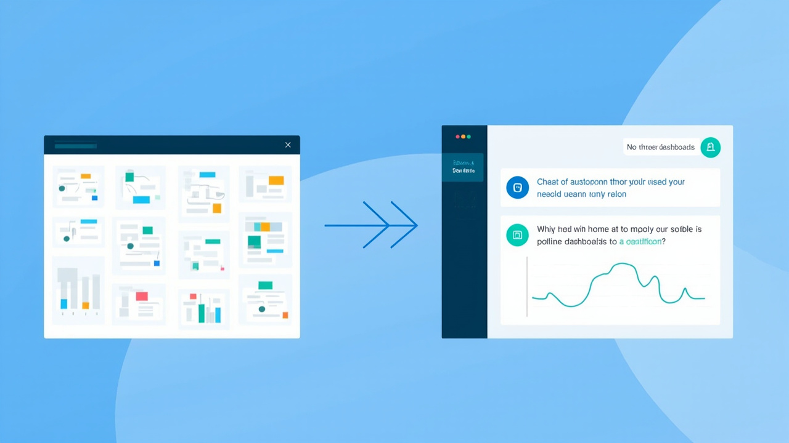

# 数据产品：从看见数据到驱动决策


> **数据不是新话题，但"数据产品"为什么在 2025-2026 重新成为热词？** 因为 AI 把数据产品从"工具"重塑为"智能工作流入口"——ChatBI、智能问数、Agent 化分析等形态正在重新定义这个赛道。本文按"痛点→概念→分类→市场→实践→趋势"的结构展开，融合三个版本的内容，给出最完整的行业认知。

---

## 目录

- [0. 引言：为什么现在还要谈数据产品](#0-引言为什么现在还要谈数据产品)
- [1. 数据产品解决什么问题](#1-数据产品解决什么问题)
- [2. 数据产品到底是什么](#2-数据产品到底是什么)
- [3. 数据产品的分类](#3-数据产品的分类)
- [4. 中文市场的头部数据产品及其布局](#4-中文市场的头部数据产品及其布局)
- [5. 数据产品使用实践：三个规模下的数据协作闭环](#5-数据产品使用实践三个规模下的数据协作闭环)
- [6. 数据产品的发展方向（2025-2026 趋势）](#6-数据产品的发展方向2025-2026-趋势)
- [7. 结语](#7-结语)
- [附录 A：参考资料](#附录-a参考资料)
- [附录 B：配图清单](#附录-b配图清单)

---

## 0. 引言：为什么现在还要谈数据产品

很多公司并不缺数据。真正的问题往往是：

- **数据散在不同系统里**，业务方看不见全局
- **看板上有很多指标，但口径说不清**
- **分析依赖人肉取数**，响应慢，也难以复用
- **更常见的是，数据分析停留在"发现问题"，没有真正进入业务动作**

数据产品要解决的不是"把数据展示出来"这么简单，而是把数据采集、加工、治理、分析、解释和应用封装成可复用的产品能力，让组织可以更稳定地理解业务、发现问题、采取行动。

可以把数据产品的发展路径理解为三步：

```text
看见数据 -> 理解数据 -> 驱动业务动作
```

低阶的数据产品帮助组织知道**发生了什么**；更成熟的数据产品帮助组织理解**为什么发生**；更进一步的数据产品会把分析结论连接到运营、推荐、营销、风控等业务系统，让数据真正参与决策和执行。

> **IDC 行业判断**：当前 85% 的企业仍在使用传统对话式 ChatBI，平均需要 3-5 轮对话才能获得满意的分析结果。企业中仅有 33% 的数据被有效分析，"数据分散、质量参差"等问题仍是制约 AI 落地的瓶颈。
> 来源：[2025 ChatBI 爆火，Aloudata Agent 重构智能数据分析决策范式 - 知乎](https://zhuanlan.zhihu.com/p/1967625018541342812) (2025-10-31)

> **Gartner 预测**：到 2026 年，35% 的企业将采用**自主式分析工具**，较 2025 年增长近 200%；采用自主式分析的企业在决策速度上提升 3 倍，运营成本降低 28%。
> 来源：[2026 年 ChatBI 技术发展趋势：从对话式到自主式 - datafocus](https://datafocus.ai/infos/2026-chatbi-technology-development-trends-from-conversational-to-autonomous) (2025-11-27)

---

## 1. 数据产品解决什么问题

数据产品首先解决的是组织里的数据协作问题。它不是某个单一工具，而是一组让数据稳定流动、被理解、被使用的机制。

### 1.1 看不见：业务状态不可见


很多业务早期最痛的问题，是不知道业务到底发生了什么。

比如：

- 今天 DAU 为什么下降了？
- 新用户注册转化率有没有异常？
- 某个渠道带来的用户质量如何？
- 某个活动到底拉动了多少收入？
- 老板每天问的核心指标能不能自动更新？

这类问题通常对应报表、看板、经营驾驶舱、实时监控等产品形态。它们的核心价值是把业务状态可视化，让业务方和管理者至少能看到同一组数字。

但"看见"只是第一步。只要业务变复杂，单纯看板很快就不够了。

| 产品形态 | 典型工具 | 解决的问题 |
|---------|---------|-----------|
| 报表 | 帆软 FineReport、Smartbi、永洪 BI | 固定格式的周期性数据展示 |
| 看板 | FineBI、Tableau、PowerBI、Quick BI | 灵活的多指标可视化 |
| 数据大屏 | DataV、RayData、FineReport 大屏模式 | 管理层和对外展示场景 |
| 经营驾驶舱 | 各云厂商方案 + 定制 BI | 整合核心指标的管理视图 |
| 实时监控 | 阿里云日志服务、Grafana、自研监控 | 业务异常的实时发现 |

> **行业数据**：帆软 FineBI 在中国 BI 市场用户覆盖率达 35%，持续保持领先（2023 CCID《中国商业智能软件市场研究报告》）。

### 1.2 看不懂：指标口径和原因不可解释


当公司有了大量看板后，新的问题会出现：每个人都在看数据，但每个人理解的数据并不一样。

常见问题包括：

- 同一个指标在不同部门口径不同
- 报表里数字变了，但不知道为什么变
- 指标背后的数据链路不透明
- 数据异常时不知道是业务问题、数据问题还是代码问题
- 分析师需要反复解释同一批指标定义

这类问题对应**指标平台、元数据平台、数据血缘、数据质量、数据地图、语义层**等产品。

| 产品形态 | 核心能力 | 价值 |
|---------|---------|------|
| 指标平台 | 统一管理指标定义、口径、负责人 | 解决"数出多门"问题 |
| 元数据平台 | 描述表/字段含义、来源、更新频率 | 让业务方"找得到、看得懂" |
| 数据血缘 | 追踪指标从源表到结果的完整链路 | 故障定位、影响面分析 |
| 数据地图 | 检索式的数据资产发现 | 降低找数门槛 |
| 语义层（Semantic Layer） | 把业务语言和数据语言对齐 | AI 时代的关键基础设施 |
| 指标字典 | 业务百科式指标说明 | 跨部门沟通的统一语言 |

**看板告诉你"数字变了"，指标和治理类产品告诉你"这个数字是什么意思、怎么算出来、是否可信、该找谁负责"。**

### 1.3 用不动：数据无法进入业务动作


更进一步的问题是：分析出了结论，但结论无法被系统执行。

例如，分析师发现某类用户下载转化率下降，但如果这群用户不能沉淀到 DMP，不能进入 AB 实验，不能被运营平台选中，不能触达，不能回收效果，那么这个分析就只能停留在报告里。

数据产品真正有价值的地方，是把分析结论变成业务系统可使用的对象：

- 把异常用户保存成人群包
- 把指标变化转成告警
- 把分析结论进入 AB 实验
- 把用户标签用于推荐和触达
- 把实验效果回收到看板和分析工具

> **核心观点**：低阶数据产品回答"发生了什么"，成熟数据产品回答"为什么发生"，高阶数据产品推动"接下来做什么"。

---

## 2. 数据产品到底是什么

可以给数据产品一个比较实用的定义：

> 数据产品是把数据采集、加工、治理、分析、解释和应用封装成可重复使用的产品能力，使业务人员、分析师、管理者或业务系统能够持续使用数据完成决策和行动。

这个定义里有几个关键词：

### 2.1 可复用

一次性 SQL、临时截图、手工 Excel 都可以解决问题，但它们不一定是数据产品。

数据产品强调复用。一个指标被定义后，可以被多个看板、多个团队、多个分析场景使用；一个人群被圈选后，可以进入运营平台、推荐系统、触达平台，而不是只停留在一次分析里。

### 2.2 可理解

数据产品不能只给数字，还要给上下文。

一个好的指标产品，应该告诉用户：

- 指标定义是什么
- 计算口径是什么
- 数据来源是哪张表
- 更新时间是什么
- 负责人是谁
- 哪些维度可以拆解
- 什么场景下不适合使用

没有上下文的数据，很容易制造误判。

### 2.3 可协作

数据产品通常不是单人工具，而是组织协作工具。

业务、产品、运营、分析、数据开发、算法、管理层都可能围绕同一组数据工作。数据产品要让这些角色在同一套指标、同一套口径、同一条链路上协作。

### 2.4 可行动

数据产品最终要服务业务行动。

一个看板如果只能展示数字，但不能帮助定位问题、沉淀人群、发起实验、执行策略、回收结果，那么它的价值是有限的。

**数据产品的终点不是图表，而是更快、更准、更稳定的业务决策。**

---

## 3. 数据产品的分类

数据产品可以按"数据价值链"来分类。这样比单纯按工具名称分类更清楚，因为不同产品解决的是数据流动链路上的不同问题。

| 层级 | 解决问题 | 典型产品 | 主要使用者 |
|---|---|---|---|
| 数据采集层 | 数据从哪里来 | 埋点平台、日志采集、数据接入、ETL/ELT | 客户端开发、后端开发、数据开发、分析师 |
| 数据生产层 | 数据如何加工 | 数据开发平台、调度平台、数仓建模、湖仓平台 | 数据开发、数据平台团队 |
| 数据治理层 | 数据是否可信 | 数据质量、元数据、血缘、权限、脱敏、数据安全 | 数据治理团队、数据开发、平台团队 |
| 数据分析层 | 数据怎么看 | BI、自助分析、报表、看板、大屏 | 业务、运营、分析师、管理层 |
| 数据资产层 | 数据如何复用 | 指标平台、标签平台、数据目录、语义层 | 分析师、数据产品、数据治理、业务团队 |
| 数据应用层 | 数据如何驱动动作 | CDP、DMP、营销自动化、推荐、风控、运营平台 | 运营、产品、增长、算法、业务系统 |
| 智能分析层 | 数据如何被 AI 使用 | ChatBI、智能问数、自动归因、分析 Agent | 业务、分析师、管理层、数据团队 |

这几类产品之间不是替代关系，而是上下游关系。

比如一个运营同学看到看板上转化率下降，背后可能已经经过了埋点采集、数据清洗、数仓建模、指标口径定义、BI 展示等多个环节。如果后续还要对异常人群做触达，就会继续进入 DMP、AB 平台、运营平台、触达平台和实验回收链路。

**数据产品真正发挥价值，往往不是单点工具被打开的那一刻，而是多个产品串成业务闭环的那一刻。**

---

## 4. 中文市场的头部数据产品及其布局

中文市场的数据产品并不是一个单一赛道，而是多个入口并存。不同厂商的差异，不只是"有没有报表"，而是它们**从哪里切入、服务谁、解决数据链路中的哪一段问题**。

整体来看，可以分成五类：云厂商系、BI/报表系、用户行为与增长分析系、数据中台/治理系、垂直业务数据产品。

### 4.1 市场玩家总览

| 类型 | 代表厂商/产品 | 主要入口 | 核心能力 | 典型使用者 | 适合场景 |
|---|---|---|---|---|---|
| **云厂商系** | 阿里云 DataWorks / MaxCompute / Quick BI、火山引擎 DataLeap / ByteHouse / DataFinder / DataWind / VeCDP、华为云 DataArts、腾讯云数据开发治理 | 云基础设施 | 数据集成、开发、调度、治理、计算、分析 | 数据平台团队、数据开发、架构师 | 中大型企业、云上数仓、统一数据平台 |
| **BI/报表系** | 帆软 FineReport/FineBI、观远数据、永洪 BI、Smartbi | 报表与分析 | 固定报表、自助分析、经营看板、数据大屏 | 业务负责人、运营、分析师、管理层 | 经营分析、管理驾驶舱、日常报表 |
| **用户行为/增长分析系** | 神策数据、GrowingIO、诸葛智能 | 用户行为数据 | 埋点、漏斗、留存、路径、分群、行为分析 | 产品、运营、增长、分析师 | App/Web 增长分析、用户行为分析、转化优化 |
| **数据中台/治理系** | 袋鼠云、数澜科技、奇点云、明略科技 | 数据资产管理 | 指标、标签、元数据、血缘、数据质量、数据服务 | 数据中台团队、数据治理团队 | 多业务线、多部门、数据资产复用 |
| **垂直业务数据产品** | 零售分析、风控系统、营销自动化、财务分析、人力分析 | 具体业务流程 | 场景化分析、策略执行、业务闭环 | 业务部门、运营、风控、财务、人力 | 某一业务场景深度数据化 |

> **ChatBI 时代新格局**：随着 AI 能力下沉，2025-2026 年市场出现了"Agent BI"新形态——IDC 评估报告显示，8 家代表厂商（北极九章、帆软、观远数据、金蝶、思迈特、腾讯云、微软、亿信华辰）中，思迈特 Smartbi 在 7 项平台技术能力维度评分排名第一。
> 来源：[思迈特在 IDC 技术评估中全面领跑 ChatBI 厂商阵营](https://k.sina.com.cn/article_7463623161_1bcddd9f902701o0t8.html) (2025-07-02)

### 4.2 2025-2026 国内 ChatBI 头部厂商横评

| 厂商 | 核心产品 | 评分/排名 | 关键能力 | 适用场景 |
|------|---------|---------|---------|---------|
| 瓴羊 Quick BI（阿里云旗下） | 智能小 Q | 连续 6 年进 Gartner ABI 魔力象限，**服务 5 万+ 企业** | 通义大模型集成，问数/解读/报告/搭建 4 大 Agent；200+ 图表 3-4.5 秒渲染；10 亿数据查询 0.3 秒 | 通用型大企业 |
| 衡石科技 HENGSHI SENSE | 指标平台 + ChatBI | Gartner 2025 国内 ChatBI TOP10 **第一（98 分）** | 指标目录+向量化数仓+领域强化学习"铁三角"；ChatBI 准确率 90%+ | 嵌入式 BI、ISV 场景 |
| 思迈特 Smartbi | Agent BI | IDC ChatBI 评估 **7 项平台能力第一** | 2019 年发布 NL 对话（专利）、2023 大模型版、2024 Agent BI 全新一代 | 金融、央国企 |
| 网易数帆 EasyMetrics | 指标平台 | 连续多年入选 IDC 大数据管理平台报告 | 指标资产化治理，集成指标体系 | 数据治理驱动的指标管理 |
| Aloudata Agent | NoETL 明细语义层+多 Agent | 业界首个公开体验版企业级数据分析智能体 | NL2MQL2SQL 技术路径；自然语言问数+归因+报告生成 | 中大型企业分析决策 |
| 璞华 ChatBI | 对话式 BI | 2025 年 4 月发布 | 大模型驱动、对话式交互、零代码、敏捷部署 | 业务人员自助分析 |
| 用友 Data Agent | 财务/业务 Data Agent | 部署后决策响应速度**提升 5 倍**、运营成本**降低 30%** | 财务垂直 Agent（OCR 票据识别 75% 效率提升、释放 60% 人力） | 财务、企业经营管理 |

> 数据来源：[2025 年必看！Agent 与 ChatBi 产品深度测评 - 网易](https://www.163.com/dy/article/KDF4U1EL0556H6GB_pdya11y.html) / [Gartner 2025 全球增强分析报告：国内 ChatBI 厂商 TOP10，衡石科技综合实力登顶 - 新浪财经](https://finance.sina.com.cn/jjxw/2025-11-17/doc-infxtefx5415311.shtml)

### 4.3 不同类型厂商的核心差异

| 对比维度 | 云厂商系 | BI/报表系 | 用户行为分析系 | 数据中台/治理系 | 垂直业务数据产品 |
|---|---|---|---|---|---|
| 切入点 | 数据基础设施 | 报表和看板 | 用户行为和增长 | 数据资产和治理 | 业务场景 |
| 离业务远近 | 中等偏远 | 中等 | 较近 | 中等偏远 | 最近 |
| 技术深度 | 高 | 中 | 中 | 高 | 视场景而定 |
| 业务理解要求 | 中 | 中 | 高 | 中 | 很高 |
| 实施复杂度 | 高 | 中 | 中 | 高 | 中到高 |
| 见效速度 | 中到慢 | 快 | 快 | 慢 | 中到快 |
| 组织依赖 | 数据平台团队 | 业务 + 数据团队 | 产品/运营/分析团队 | 数据治理/中台团队 | 具体业务团队 |
| 典型风险 | 平台重、建设周期长 | 看板多但不驱动行动 | 埋点质量决定分析质量 | 容易变成大而全工程 | 场景迁移能力弱 |
| 2025 趋势 | 大模型原生集成 | Agent BI 化 | 用户 + Agent 结合 | 指标平台 + 语义层 | Data Agent 化 |

### 4.4 各类产品的优势与局限

| 类型 | 优势 | 局限 | 选型时重点看 |
|---|---|---|---|
| 云厂商系 | 能力完整、扩展性强、适合大规模数据处理 | 建设成本高，对技术团队要求高 | 是否匹配现有云生态，数据开发治理能力是否完整 |
| BI/报表系 | 上手快、展示能力强、管理层接受度高 | 容易停留在"看数据"，不一定能推动业务动作 | 自助分析能力、权限体系、性能、移动端体验 |
| 用户行为分析系 | 贴近产品增长，适合漏斗、留存、路径分析 | 高度依赖埋点质量，离数仓治理较远 | 埋点管理、事件模型、分群能力、和运营系统打通能力 |
| 数据中台/治理系 | 解决口径、资产、质量、复用问题 | 周期长，容易变成重型项目 | 指标平台、元数据、血缘、质量监控是否真正落地 |
| 垂直业务数据产品 | 贴近业务结果，容易形成闭环 | 通用性弱，容易绑定具体流程 | 是否真的理解业务流程，能否接入现有系统 |

### 4.5 字节跳动/火山引擎：数据产品矩阵深度案例

如果把中文市场的数据产品按厂商布局来看，**字节跳动对外开放商用的数据产品主要通过火山引擎承载**。它的特点不是只提供单点 BI 或单点用户行为分析，而是把字节内部在增长分析、数据研发、实时数仓、实验平台、客户数据平台等方向沉淀的能力，拆成一组可商用的数据产品矩阵。

#### 4.5.1 火山引擎数据产品矩阵总览

| 层级 | 代表产品 | 解决的问题 | 典型使用者 | 示例功能 |
|---|---|---|---|---|
| 数据存储与分析引擎 | **ByteHouse** | 承接高并发、多场景、实时/离线分析查询 | 数据平台、数据开发、分析师 | 高 QPS 查询、复杂分析、用户画像、行为分析、向量检索、GIS 分析 |
| 数据研发与治理 | **DataLeap** | 数据如何接入、开发、调度、治理、服务化 | 数据开发、数据治理、数据平台团队 | 数据集成、数据开发、发布中心、智慧运维、数据质量、数据安全、数据服务 |
| BI 与可视化分析 | **DataWind** | 业务如何看数、做报表和分析 | 业务、运营、分析师、管理层 | 经营看板、可视化报表、自助分析、指标展示 |
| 用户行为与增长分析 | **DataFinder** | 产品/运营如何分析用户行为和增长问题 | 产品、运营、增长、分析师 | 事件分析、留存分析、转化分析、用户路径、归因分析、LTV、用户分群、用户标签 |
| 客户数据与人群运营 | **VeCDP** | 用户数据如何统一、分群、标签化并用于运营 | 运营、增长、营销、数据团队 | 客户数据整合、人群圈选、标签管理、营销人群管理 |
| 实验与策略验证 | **A/B 测试** | 策略是否真的有效，如何做对照实验 | 产品、运营、算法、增长团队 | 实验分流、实验组/对照组管理、指标回收、效果评估 |
| 营销与触达 | 增长营销平台等 | 分析结果如何进入业务动作 | 运营、营销团队 | 人群触达、营销活动编排、消息发送、效果回收 |

**这套矩阵的核心价值在于：它覆盖了从"数据生产"到"业务增长"的完整链路，而不是只解决某一个环节。**

#### 4.5.2 DataLeap：偏数据中台和数据研发治理

DataLeap 更接近数据平台团队和数据治理团队的工作台。根据火山引擎文档，DataLeap 是一站式大数据中台解决方案，覆盖实时与离线数据集成、数据开发、智能运维、数据治理、资产管理等能力。

可以把 DataLeap 理解成企业数据生产链路的"后台工厂"：

```text
业务系统数据
  -> 数据集成
  -> 数据开发 / 调度
  -> 数据质量 / 数据安全 / 治理
  -> 数据资产 / 数据服务
  -> 提供给 BI、行为分析、运营系统使用
```

举例来说，一个应用市场业务要分析"搜索页到下载的转化率"，背后首先要有稳定的数据链路：

1. 客户端和服务端事件进入数据源
2. DataLeap 的数据集成能力同步多类异构数据源
3. 数据开发任务加工出 ODS、DWD、DWS、DM 等数据层
4. 数据质量规则监控任务是否延迟、字段是否异常、分区是否缺失
5. 数据服务或数据资产能力把加工后的数据开放给看板、分析工具或业务系统

> **来源**：[火山引擎 DataLeap 文档](https://www.volcengine.com/docs/6260/65391)

#### 4.5.3 ByteHouse：偏实时数仓和高性能分析底座

ByteHouse 可以理解为火山引擎数据产品矩阵里的**分析引擎底座**。它面向高并发查询、复杂分析、用户画像、行为分析、向量检索、时空分析等场景。

它适合解决的问题是：

- 数据量大，普通数据库分析慢
- 业务看板查询并发高
- 行为分析需要快速计算留存、转化、路径
- 用户画像需要大量标签组合和人群圈选
- 业务既有结构化数据，也有向量、地理空间等更复杂的数据类型

示例场景：

```text
运营想看某个活动的实时转化情况
  -> 事件数据进入 ByteHouse
  -> 看板按渠道、版本、人群分组查询
  -> DataFinder 或 DataWind 展示趋势
  -> 运营快速判断是否需要调整投放或资源位
```

> ByteHouse 的价值不是直接替代 BI，而是让上层 BI、行为分析和业务系统有更稳定、更高性能的查询底座。
> 来源：[火山引擎 ByteHouse 产品页](https://www.volcengine.com/product/bytehouse-cloud)

#### 4.5.4 DataFinder：偏用户行为分析和增长分析

DataFinder 更贴近产品、运营、增长和分析师。它解决的是"用户在产品里发生了什么"以及"如何拆解增长问题"。

从官方文档看，DataFinder 覆盖看板、高级分析、事件分析、留存分析、转化分析、路径分析、归因分析、用户生命周期、热力图、LTV、SQL 自定义查询、用户细查、用户分群、用户标签、用户画像、埋点验证、数据治理、广告监测等能力。

它适合这类问题：

- 哪个渠道用户留存更好？
- 搜索页到详情页的转化率为什么下降？
- 新版本用户路径有没有变化？
- 某次活动带来的用户 LTV 是否更高？
- 哪些用户浏览了详情页但没有下载？

**典型使用链路**：

```text
运营在 DataFinder 看转化漏斗
  -> 发现"详情页 -> 下载"转化率下降
  -> 按版本、渠道、页面来源拆解
  -> 定位异常集中在某类新用户
  -> 保存用户分群
  -> 将人群同步给 CDP/DMP 或运营平台
```

> DataFinder 的关键不只是"做分析"，还在于它能把分析过程中的用户分群、标签、画像沉淀下来，进入后续运营动作。
> 来源：[火山引擎 DataFinder 文档](https://www.volcengine.com/docs/84129?lang=zh)

#### 4.5.5 DataWind：偏 BI、报表和管理分析

DataWind 更接近传统 BI 和经营分析场景。它解决的是"管理层、业务负责人、运营同学如何稳定看数"的问题。

| 场景 | DataWind 的作用 |
|---|---|
| 管理驾驶舱 | 汇总核心经营指标，支持管理层快速看整体状态 |
| 业务日报/周报 | 固化常用报表，减少手工取数和复制粘贴 |
| 运营看板 | 展示活动、渠道、资源位、转化链路等指标 |
| 自助分析 | 业务人员在权限范围内拖拽维度、筛选指标 |

如果说 DataFinder 更偏"用户行为分析"，DataWind 更偏"企业经营和报表分析"。两者不是互相替代，而是分析视角不同：

| 对比项 | DataWind | DataFinder |
|---|---|---|
| 主要视角 | 经营指标、报表、看板 | 用户行为、增长分析 |
| 典型问题 | 今天收入、转化、活跃整体如何 | 用户为什么转化、留存、流失 |
| 常用人群 | 管理层、业务负责人、运营、分析师 | 产品、运营、增长、分析师 |
| 常见动作 | 看数、汇报、监控 | 下钻、分群、归因、实验前分析 |

#### 4.5.6 VeCDP 与 A/B 测试：让分析进入运营动作

如果只有看板和分析工具，数据产品仍然停留在"发现问题"。要让数据进入业务动作，还需要客户数据平台、实验平台和运营触达能力。

```text
DataFinder 发现异常用户
  -> 保存用户分群
  -> VeCDP / DMP 管理人群和标签
  -> A/B 测试划分实验组和对照组
  -> 运营平台配置不同策略
  -> 触达平台执行 Push、站内信、弹窗、资源位策略
  -> 用户端上报 ab_test_id / strategy_id
  -> DataFinder / DataWind 回收实验效果
```

**举例**：

1. 运营在 DataFinder 发现"新用户搜索后未下载"的比例升高
2. 分析师下钻后发现问题集中在某个版本、某类渠道的新用户
3. 这批用户被保存为分群，并进入 VeCDP / DMP
4. 运营在 A/B 测试平台创建实验：
   - 对照组：保持原策略
   - 实验组 A：调整搜索结果排序
   - 实验组 B：增加下载引导弹窗
   - 实验组 C：更换 Push 或站内信文案
5. 运营平台读取实验分组和人群包，分别配置策略
6. 触达平台执行消息发送或页面策略下发
7. 用户端上报实验 ID、策略 ID、曝光、点击、下载、安装等事件
8. 运营回到 DataFinder 或 DataWind 看实验效果，判断是否放量或回滚

#### 4.5.7 火山引擎矩阵小结

> 火山引擎的数据产品矩阵体现了一类典型的**平台型布局**：
> - **底层**用 ByteHouse 等引擎承接高性能分析
> - **中间**用 DataLeap 负责数据研发治理和资产管理
> - **上层**用 DataWind、DataFinder 面向业务看数和增长分析
> - **连接层**通过 VeCDP、A/B 测试、增长营销平台把分析结论连接到人群运营和策略实验
>
> 它的价值不只是"提供多个数据工具"，而是把数据从生产、分析、治理到业务动作**串成闭环**。

### 4.6 按企业阶段选择数据产品

| 企业阶段 | 优先选择 | 不建议优先做 | 原因 |
|---|---|---|---|
| 早期公司 | 轻量 BI、表格、简单埋点、基础看板 | 数据中台、复杂标签平台、全量数据治理 | 早期核心是看清业务，不是建设复杂平台 |
| 成长期公司 | BI + 行为分析 + 指标体系 + DMP/AB 能力 | 过度定制化报表、没有口径治理的看板堆叠 | 成长期需要让数据从分析走向协作 |
| 多业务线公司 | 指标平台、数据治理、标签平台、统一权限 | 各业务线各自建一套口径 | 多业务线最大问题是口径不统一、资产不复用 |
| 大型集团 | 云数仓/湖仓、数据中台、数据治理、数据安全、智能问数 | 只靠单一 BI 工具解决所有问题 | 大型组织需要底层治理和跨部门协同 |

### 4.7 湖仓一体与数据基础设施市场（2022-2025）

| 维度 | 2022 实际 | 2025 预测 | 增长率 |
|---|---|---|---|
| 中国湖仓一体平台软件市场规模 | 15.2 亿元 | **近 100 亿元** | 3 年 CAGR 86% |
| 全球数据量 | — | **175 ZB** | — |
| 非结构化数据占比 | — | **超 80%** | — |

**湖仓一体市场份额（2022）**：

| 厂商 | 份额 |
|---|---|
| 科杰科技 | 11.1% |
| 华为云 | 9.5% |
| 星环科技 | 7.3% |

**关键技术趋势**：Apache Iceberg 成为湖仓一体开放表格式的**事实标准**。
> 来源：[2022 年中国湖仓一体平台市场研究报 - 爱分析](https://www.afenxi.com)

### 4.8 不同产品之间的协作关系

| 环节 | 典型产品 | 作用 |
|---|---|---|
| 数据采集 | 埋点平台、日志采集、数据接入工具 | 获取原始数据 |
| 数据加工 | DataWorks、DataLeap、调度平台、数仓工具 | 清洗、建模、生成可分析数据 |
| 数据治理 | 指标平台、元数据、血缘、数据质量 | 保证数据可信、口径一致 |
| 数据分析 | FineBI、FineReport、观远、DataFinder、DataWind | 发现问题、拆解原因 |
| 人群沉淀 | DMP、标签平台、CDP、VeCDP | 把分析结果变成可运营对象 |
| 策略实验 | A/B 测试平台 | 验证策略是否有效 |
| 业务执行 | 运营平台、触达平台、推荐/风控系统 | 把数据结论转化为业务动作 |
| 效果回收 | BI、行为分析、实验平台 | 评估策略效果，进入下一轮优化 |

**所以，数据产品选型不能只问"哪个工具最好"，而要问**：

```text
它在数据链路里解决哪一段问题？
它能不能和上下游系统协作？
它能不能让数据从分析进入业务动作？
```

---

## 5. 数据产品使用实践：三个规模下的数据协作闭环

数据产品的使用实践，不能只写"公司用了 BI""公司用了 DMP"。更真实的写法，是看这些产品如何串成协作流程。

### 5.1 小公司：轻量看数 + 人工决策

小公司不一定需要完整的数据平台。它最需要的是用最低成本看清业务。

**典型场景：注册转化率下降**

1. 运营每天看核心指标表，发现注册转化率下降。
2. 分析师用 SQL 临时取数，拆分渠道、版本、设备、地区。
3. 发现某个渠道的新用户转化明显下降。
4. 运营和产品一起看落地页、注册流程、投放素材。
5. 产品调整注册页文案或流程。
6. 运营手动调整投放策略。
7. 分析师隔天重新取数，对比调整前后效果。

| 环节 | 使用工具 | 主要动作 |
|---|---|---|
| 发现问题 | 表格、轻量 BI、日报 | 看核心指标变化 |
| 定位原因 | SQL、数据库查询 | 拆渠道、版本、地区 |
| 制定动作 | 人工讨论 | 调整页面、素材、投放 |
| 效果回收 | 表格、SQL、日报 | 对比调整前后数据 |

> **小公司的数据产品重点不是平台化，而是让核心业务状态可见，并让关键问题能被快速拆解。**

### 5.2 中等公司：BI + 行为分析 + DMP + AB + 运营平台协作

中等公司开始出现多个业务团队、多个运营动作和更复杂的用户分层。这时数据产品的重点，不再只是"看数据"，而是让数据分析进入业务执行链路。

**典型场景：应用市场发现下载转化率下降，运营希望通过策略实验提升转化。**

#### 步骤一：运营发现指标变化

运营在帆软看板或 DataFinder 中发现"曝光 -> 下载"转化率下降。看板展示整体趋势，并支持按版本、渠道、页面、资源位等维度筛选。

#### 步骤二：分析定位异常人群

分析师通过临时 SQL 取数，或在 DataFinder 中继续下钻，定位异动主要集中在哪些用户群体。

例如：
- 新用户
- 某个版本用户
- 某类渠道来源用户
- 浏览过详情页但未下载的用户

#### 步骤三：保存人群到 DMP

分析师或运营将异动人群保存为 DMP 人群包。这个动作很关键：它把一次分析结果，从"结论"变成了"可被业务系统使用的对象"。

#### 步骤四：运营创建 AB 实验

运营在 AB 平台新建实验，设置实验目标、实验周期、流量比例，并划分实验组和对照组。

例如：

- 对照组：保持原策略
- 实验组 A：调整推荐排序
- 实验组 B：增加弹窗提示
- 实验组 C：更换触达文案

#### 步骤五：运营平台配置策略

运营在运营平台选择 DMP 人群，并绑定 AB 实验。针对不同实验组配置不同策略，包括：

- 页面资源位策略
- Push 文案
- 站内信
- 弹窗
- Banner
- 推荐内容

#### 步骤六：运营平台调用触达能力

运营平台调用触达平台能力，自动完成内容发送或页面策略下发。此时数据产品已经不只是分析工具，而是进入了业务执行链路。

#### 步骤七：用户端上报实验策略 ID

用户端在曝光、点击、下载、安装、激活等关键事件中上报：

- `ab_test_id`
- `strategy_id`
- `group_id`
- `scene_id`
- `user_id`
- `event_time`

#### 步骤八：回收实验效果

运营在看板或 DataFinder 中查看实验效果，重点关注：

- 曝光率
- 点击率
- 下载转化率
- 安装率
- 激活率
- 留存
- 商业化收入影响

#### 步骤九：复盘与策略沉淀

如果实验组效果显著优于对照组，运营可以扩大流量；如果效果不明显，则回滚策略或继续拆分人群。分析师将实验结论沉淀到指标看板或复盘文档中。

**完整协作链路图**：

```text
帆软看板 / DataFinder
        ↓ 发现异常
分析师 SQL / DataFinder 下钻
        ↓ 定位人群
DMP 人群包
        ↓ 选择人群
AB 实验平台
        ↓ 分组策略
运营平台
        ↓ 调用能力
触达平台 / 推荐策略 / 页面资源位
        ↓ 用户行为
端侧埋点上报 ab_test_id / strategy_id
        ↓
看板 / DataFinder 回收效果
```

**这个案例里，每类产品承担的职责不同**：

| 产品 | 职责 |
|---|---|
| 帆软看板 / DataFinder | 发现指标异常，支持维度拆解 |
| SQL / 临时取数 | 补充复杂分析，定位异常原因 |
| DMP | 保存和管理可运营人群 |
| AB 平台 | 设计实验，区分实验组和对照组 |
| 运营平台 | 配置策略，绑定人群和实验 |
| 触达平台 | 执行 Push、站内信、弹窗等触达 |
| 端侧埋点 | 上报策略 ID、实验组 ID 和用户行为 |
| 看板 / DataFinder | 回收实验结果，支持复盘 |

> **中等公司的数据产品价值，体现在多个系统之间的协作**：BI 负责发现问题，分析工具负责定位问题，DMP 负责人群沉淀，AB 平台负责实验设计，运营平台负责策略执行，埋点和看板负责效果回收。

### 5.3 大公司：指标平台 + 数据治理 + 多系统闭环

大公司面临的问题更复杂。它不只是要解决某个业务问题，还要解决跨部门、跨业务线、跨系统的数据一致性和责任协同。

**典型场景：多个业务线发现收入指标波动，需要统一排查和治理。**

1. 管理层在经营驾驶舱发现收入指标异常。
2. 指标平台展示该指标的统一口径、负责人、血缘关系和上下游依赖。
3. 数据质量平台检查任务是否延迟、表是否缺分区、口径是否变更。
4. 分析师通过自助分析平台拆解业务线、地区、渠道、版本。
5. 数据开发查看调度链路，确认 DWD / DWS / DM 层是否正常产出。
6. 业务运营查看是否有活动、投放、价格、策略变更。
7. 如果确认是业务变化，运营平台发起策略调整。
8. 如果确认是数据问题，数据开发修复链路并回刷数据。
9. 指标平台更新异常说明，沉淀为事件记录。
10. 后续通过监控规则自动告警，避免同类问题再次人工发现。

**流程图**：

```text
经营驾驶舱
  ↓
指标平台：确认口径、负责人、血缘
  ↓
数据质量平台：检查产出、延迟、缺失
  ↓
自助分析平台：拆维度定位影响范围
  ↓
数据开发 / 业务运营分别排查
  ↓
修复数据链路或调整业务策略
  ↓
指标平台沉淀异常事件
  ↓
监控平台配置自动告警
```

> **大公司的数据产品不只是帮人看数据，而是要建立一套跨部门的问题定位和责任协同机制。**

---

## 6. 数据产品的发展方向（2025-2026 趋势）

数据产品正在从"工具"走向"智能工作流"。未来的核心变化，不只是界面更好看，而是数据产品会更主动、更接近业务动作。

### 6.1 从报表到智能问数



过去用户通过筛选器、维度、指标、图表来分析数据。未来越来越多用户会直接用自然语言提问：

```text
为什么昨天转化率下降？
哪个渠道影响最大？
这个异常是业务原因还是数据原因？
接下来应该看哪个维度？
```

这会推动 BI 从"点选式分析"变成"对话式分析"。

> **行业判断**：2025 年 ChatBI 落地的主流技术路径分两类：
> - **NL2SQL**：直接将自然语言转换为 SQL 语句，依赖大模型生成查询代码
> - **NL2DSL**：通过领域特定语言（如 MQL）作为中间层，更可控、更准确
>
> 代表方案：Aloudata Agent 采用 **NL2MQL2SQL** 三段式路径，通过"NoETL 指标语义层 + 多 Agent 协同"重构智能分析决策范式。

### 6.2 从 BI 到 Agent 化分析工作流

真实的数据分析往往不是一次查询，而是多步骤过程：

```text
发现异常 -> 拆维度 -> 查口径 -> 看血缘 -> 取明细 -> 归因 -> 写结论 -> 推动作
```

未来的数据产品可能不只是提供图表，而是由分析 Agent 自动完成部分流程，比如自动检测异常、自动拆解维度、自动生成分析报告、自动提醒负责人。

> **IDC 技术评估**：Agent BI 是下一步方向。BI 厂商需要与 Agent 相结合，允许通过 MCP、A2A、Multi-Agent 等协议规则来为用户提供更好的对话式交互体验，真正串联 Work Flow 与 Data Flow。思迈特是国内最早将 AI Agent 深度应用于 BI 领域的厂商之一（2019 年发布自然语言对话并获国家专利，2023 大模型版，2024 Agent BI 全新一代）。

### 6.3 从指标平台到语义层

AI 要可靠理解企业数据，前提是企业的数据语义足够清楚。

未来企业会更重视：

- 指标定义
- 维度定义
- 口径规则
- 数据血缘
- 可用场景
- 权限边界
- 业务解释

**语义层会成为连接数据、人和 AI 的关键基础设施。**

> **行业数据**：衡石科技 2025 提出的"指标目录 + 向量化数仓 + 领域强化学习"铁三角体系将 ChatBI 准确率提升至 90% 以上——核心是先用指标目录统一口径，AI 才能在可信的基础上回答业务问题。

**语义层对 ChatBI 准确率的影响**：

| 路径 | 准确率 | 维护成本 | 适用场景 |
|---|---|---|---|
| 纯 NL2SQL | 60-75% | 低 | 简单查询 |
| NL2SQL + 元数据 | 75-85% | 中 | 中等复杂度 |
| NL2MQL2SQL（语义层中转） | **85-95%** | 高 | 复杂业务查询 |
| 衡石"指标目录+向量化+领域强化学习"铁三角 | **90%+** | 高 | 嵌入式 BI、ISV |

### 6.4 从分析结果到业务动作

数据产品会越来越多连接业务执行系统。

例如：

- 指标异常自动触发告警
- 异常人群自动进入运营策略池
- AB 实验自动生成效果报告
- 用户标签自动影响推荐策略
- 风控规则根据数据反馈动态调整

| 业务动作 | 数据产品连接方式 | 2025 行业案例 |
|---|---|---|
| 营销触达 | CDP / 营销自动化 | 璞华 ChatBI + 营销平台联动 |
| 推荐策略 | 推荐系统 + AB 实验 | 字节火山引擎数智平台 |
| 风控规则 | 规则引擎 + 实时特征 | 金融行业 Data Agent |
| 运营实验 | AB 平台 + 人群运营 | 思迈特 Agent BI 闭环 |
| 自动告警 | 指标监控 + 告警通道 | 阿里云 DataWorks 监控 |
| 自动报告 | 智能报告 + ChatBI | 瓴羊 Quick BI 报告 Agent |
| 财务自动化 | 财务 Data Agent | **用友：票据处理效率提升 75%、释放 60% 人力** |

> **来源**：[ChatBI 驱动 Data Agent 构建企业新一代竞争壁垒 - 用友案例](https://caifuhao.eastmoney.com/news/20250630095034646561010) (2025-06-30)

**未来的数据产品不会只停在"看见问题"，而会更强调"推动问题被处理"。**

### 6.5 从工具采购到数据能力建设

企业不会只问"买哪个 BI 工具"，而会问：

```text
我们有没有统一的指标口径？
我们有没有稳定的数据生产链路？
业务能不能自助分析？
分析结果能不能进入业务系统？
数据异常能不能及时发现和定位？
AI 能不能可靠理解我们的企业数据？
```

**数据产品的竞争力，会越来越从单点功能，转向组织级数据能力。**

### 6.6 数据产品经理岗位趋势（2025）

| 公司类型 | 岗位举例 | 经验要求 | 薪资范围 | 核心技能 |
|---|---|---|---|---|
| 中大型互联网 | 大数据平台产品经理 | 5-10 年 | 13-18K·14薪 | 平台规划、PRD 编写、跨部门协作 |
| 数据服务商 | 数据产品经理（北京数见） | 5-10 年 | **25-50K·14薪** | 实时数据融合、计算产品设计 |
| 上市互联网 | 大数据产品经理（盛天网络） | 3-5 年 | 13-18K·14薪 | BI 平台迭代、业财一体 |
| 创业公司 | 运营类数据产品经理（礼博士） | 5-10 年 | 20-30K·14薪 | 大模型 + 运营场景结合 |
| 入门级 | 数据产品经理助理 | 经验不限 | 4-8K | 表格分析、SQL 基础 |

> **数据来源**：[BOSS 直聘大数据产品经理招聘](https://www.zhipin.com/zhaopin/d0621fb26a7b6dde0XR72ts~/) / [智联招聘](http://www.zhaopin.com/jobdetail/CC120171040J40721841411.htm) / [企查查 - 数据产品经理](https://m.qcc.com/jobdetail/5caa8d835e1e4e86eaf419318dfa5f46.html)

**2025 数据产品经理核心能力矩阵**：

| 能力模块 | 关键技能 | 重要性 |
|---|---|---|
| 业务理解 | 行业 Know-how、用户旅程分析 | ⭐⭐⭐⭐⭐ |
| 数据架构 | 数仓分层、指标体系、湖仓一体 | ⭐⭐⭐⭐⭐ |
| AI/Agent | LLM 应用、Prompt 工程、Agent 编排 | ⭐⭐⭐⭐ |
| 工具栈 | BI、指标平台、标签、AB 平台 | ⭐⭐⭐⭐ |
| 协作 | 跨团队 PRD、推动落地 | ⭐⭐⭐⭐ |
| 治理 | 口径管理、数据质量、安全合规 | ⭐⭐⭐ |

---

## 7. 结语


回到开头那个问题：为什么现在还要谈数据产品？

**数据产品的价值，不在于让企业拥有更多图表，而在于让组织更快看见问题、更准确理解问题、更稳定地采取行动。**

如果说早期数据产品解决的是"有没有数据可看"，那么成熟的数据产品解决的是"数据能不能被信任、被复用、被协作、被执行"。

最终，数据产品要把数据从一种**资源**，变成一种**组织能力**。

> 而 2025-2026 年的特别之处在于：**AI Agent 正在把这件事的边际成本再降一个数量级**——业务人员用自然语言就能完成以前需要分析师 + 工程团队协作数天的工作。这是数据产品经理们必须面对的新现实，也是这篇文章希望帮你建立的认知锚点。

---

## 附录 A：参考资料

### 行业报告与媒体文章

1. [2025 ChatBI 爆火，Aloudata Agent 重构智能数据分析决策范式 - 知乎](https://zhuanlan.zhihu.com/p/1967625018541342812) (2025-10-31)
2. [2025 年必看！Agent 与 ChatBi 产品深度测评 - 网易](https://www.163.com/dy/article/KDF4U1EL0556H6GB_pdya11y.html) (2025-11-03)
3. [2026 年 ChatBI 技术发展趋势：从对话式到自主式 - datafocus](https://datafocus.ai/infos/2026-chatbi-technology-development-trends-from-conversational-to-autonomous) (2025-11-27)
4. [Gartner 2025 全球增强分析报告：国内 ChatBI 厂商 TOP10，衡石科技综合实力登顶 - 新浪财经](https://finance.sina.com.cn/jjxw/2025-11-17/doc-infxtefx5415311.shtml) (2025-11-17)
5. [思迈特在 IDC 技术评估中全面领跑 ChatBI 厂商阵营 - 新浪](https://k.sina.com.cn/article_7463623161_1bcddd9f902701o0t8.html) (2025-07-02)
6. [璞华发布数据分析产品 ChatBI：用"对话"赋能业务人员自助分析 - 网易](https://www.163.com/dy/article/JTRE6N2C0538AE6G.html) (2025-04-23)
7. [ChatBI 驱动 Data Agent 构建企业新一代竞争壁垒 - 用友案例](https://caifuhao.eastmoney.com/news/20250630095034646561010) (2025-06-30)
8. [2025 年分析 Agent 产品推荐，ChatBi 产品选型指南 - 博客园](https://www.cnblogs.com/bsoo/p/19283376) (2025-11-28)
9. [2022 年中国湖仓一体平台市场研究报 - 爱分析](https://www.afenxi.com)
10. [2025 年企业湖仓架构新趋势：实时数据处理引领变革 - IDC 预测](https://www.idc.com)

### 火山引擎官方文档

11. [火山引擎 DataFinder 文档 - 增长分析](https://www.volcengine.com/docs/84129?lang=zh)
12. [火山引擎 DataLeap 文档 - 一站式大数据中台](https://www.volcengine.com/docs/6260/65391)
13. [火山引擎 ByteHouse 产品页 - 实时数仓/复杂分析](https://www.volcengine.com/product/bytehouse-cloud)

### 招聘与岗位数据

14. [BOSS 直聘 - 大数据产品经理招聘](https://www.zhipin.com/zhaopin/d0621fb26a7b6dde0XR72ts~/)
15. [智联招聘 - 数据产品经理（中车信息）](http://www.zhaopin.com/jobdetail/CC120171040J40721841411.htm)
16. [企查查 - 数据产品经理（上海启高）](https://m.qcc.com/jobdetail/5caa8d835e1e4e86eaf419318dfa5f46.html)

### 厂商资料

17. [帆软 FineBI 官网](https://www.fanruan.com/finebi/)
18. [阿里云 DataWorks 产品文档](https://help.aliyun.com/document_detail/137663.html)
19. [2026 年 BI 指标管理平台 Top5 权威榜单发布 - 衡石科技](https://www.hengshitech.com)
20. [精选 10 款指标管理系统，2025 年助力绩效提升 - 网易数帆](https://sf.163.com)

### 学术与研究

21. *DataLab: A Unified Platform for LLM-Powered Business Intelligence* (arXiv)
22. *IDC PeerScape: Practices for Agent-Based Business Intelligence* (2025)

---

## 附录 B：配图清单

| 图片 | 文件 | 说明 |
|---|---|---|
| 封面 | `images/cover.png` | 数据流转全景（齿轮+数据源+决策图标） |
| 1.1 节 | `images/fig-1-1-blind-eye.png` | 看得见的眼睛 vs 模糊的数据 |
| 1.2 节 | `images/fig-1-2-metric-chaos.png` | 多手指向同一数字，气泡不同 |
| 1.3 节 | `images/fig-1-3-analysis-island.png` | 分析师在孤岛上看远方的业务系统 |
| 6.1 节 | `images/fig-6-1-chatbi-transition.png` | 传统看板 → ChatBI 界面 |
| 结语 | `images/fig-conclusion-spotlight.png` | 聚光灯从数据看板照射到业务按钮 |

> **配图说明**：所有配图均由 AI（MiniMax image-01）生成。文字渲染为 AI 图的固有限制，但视觉概念传达准确。

---

## 文档元信息

- **合并来源**：
  1. `data-product-article.md`（用户原版，22.2KB，简洁骨架）
  2. `数据产品-成文.md`（联网数据增强版，38.9KB，6 张配图 + 35+ 引用）
  3. `data-product-volcengine-supplement.md`（火山引擎数据产品矩阵补充，6.3KB）
- **合并后大小**：~75 KB
- **合并日期**：2026-06-11
- **保留原文件**：是（用户原版 + 补充版均未删除）
