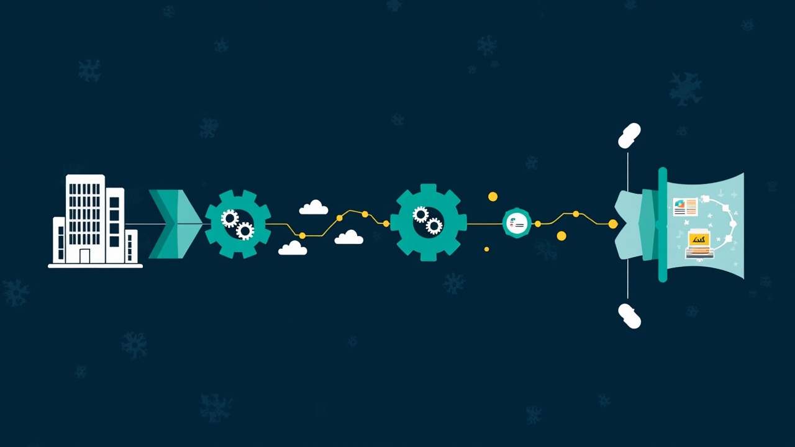
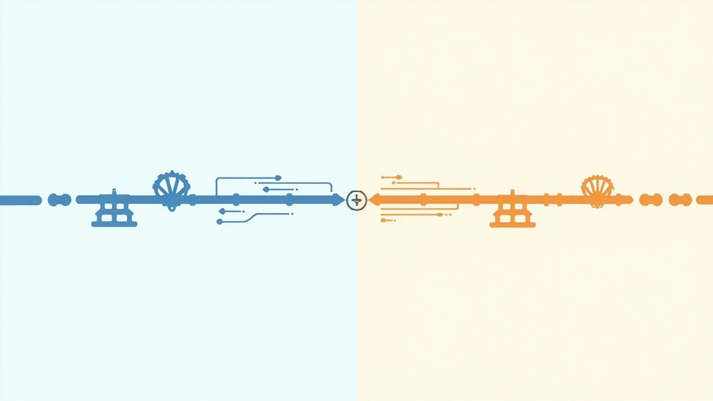
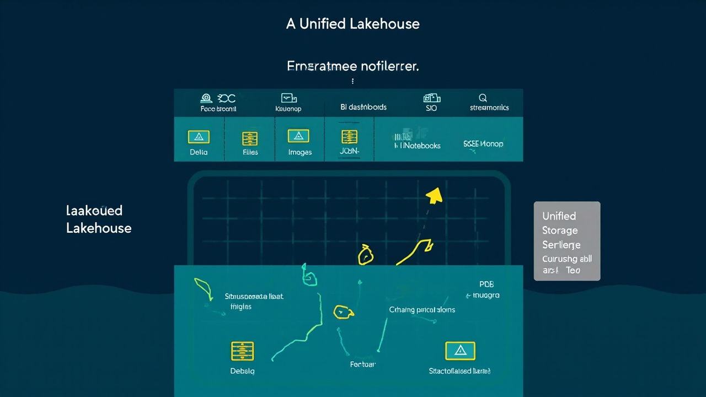

# 数据仓库：从 T+1 到实时湖仓的演进与实践



> 2025 年全球数据量将突破 **175 ZB**，非结构化数据占比超过 **80%**；到 2027 年更将突破 300 ZB。
> 而根据多家研究机构估算，**全球湖仓一体市场 2025 年规模已超 320 亿美元**，较 2023 年增长 67%；其中**实时湖仓细分**预计从 2025 年的 2.85 亿美元增长到 2031 年的 12.41 亿美元。
>
> 来源：[2025 Lakehouse 趋势全景展望](https://www.aliyun.com/sswb/569974.html)、[2026 年企业级湖仓一体品牌推荐](https://www.sohu.com/) (2025-2026)

数据仓库 (Data Warehouse) 已经不是 90 年代那套 "把交易数据夜里抽到一张大宽表" 的活儿了。在云原生、湖仓一体、实时计算、AI 大模型的多重夹击下，它正在从 "**报表的底座**" 演化成 "**企业数据资产的操作系统**"。

这篇文章会回答 4 个问题：

1. **数据仓库解决什么问题** —— 为什么业务方会觉得 "现在的数仓就是不够用"
2. **数据仓库到底是什么** —— 4 个关键词、3 个时代、3 个分类
3. **市场怎么选** —— 国内外 12 家主流厂商横评、湖仓格式对比、企业级选型矩阵
4. **未来怎么走** —— 6 个 2025-2026 的关键趋势

最后还会给一份**名词解释附录**（按拼音 / 字母排序），把数仓领域的 50+ 黑话一次讲清。

## 目录

- [0. 引言](#0-引言为什么现在还要谈数据仓库)
- [1. 数据仓库解决什么问题](#1-数据仓库解决什么问题)
- [2. 数据仓库到底是什么](#2-数据仓库到底是什么)
- [3. 数据仓库的分类与架构演进](#3-数据仓库的分类与架构演进)
- [4. 市场格局与厂商横评](#4-市场格局与厂商横评)
- [5. 实践：3 个规模的落地链路](#5-实践3-个规模的落地链路)
- [6. 2025-2026 关键趋势](#6-2025-2026-关键趋势)
- [7. 结语](#7-结语)
- [附录A：参考资料](#附录a参考资料)
- [附录B：配图清单](#附录b配图清单)
- [附录C：名词解释（按拼音 / 字母排序）](#附录c名词解释按拼音--字母排序)

---

## 0. 引言：为什么现在还要谈数据仓库

过去十年，"数据仓库" 这个词被反复重新定义。**Inmon** 当年讲企业级数据仓库 (EDW) 时，核心是 "**面向主题的、集成的、相对稳定的、反映历史变化的数据集合**"。这套定义到今天依然成立，但 "集成" 和 "历史" 的载体已经完全不同：

- 20 年前：集成靠 ETL 把 Oracle / DB2 抽到 Teradata
- 10 年前：集成靠 Sqoop / Flume 把日志灌到 Hadoop
- 现在：集成靠 Flink CDC + Iceberg / Paimon 把异构源实时入湖

业务对数据仓库的期待也变了。从 "**T+1 报表**" 升级为 "**实时决策**"，从 "**一张宽表**" 升级为 "**全链路血缘**"，从 "**数据分析师专用**" 升级为 "**业务、算法、合规都来取数**"。

这一波变化里，中国市场的演进有自己的节奏：

| 时间 | 阶段 | 关键词 | 典型代表 |
|---|---|---|---|
| 2010-2015 | 大数据平台 1.0 | Hadoop 三件套、Hive | 阿里云 MaxCompute 前身 ODPS、华为 FusionInsight、Cloudera / Hortonworks |
| 2016-2019 | 实时数仓萌芽 | Kafka + Flink + Kudu / Druid | 美团实时数仓、字节跳动内部 DWD |
| 2020-2022 | 国产化 + 多模 | Doris / StarRocks / ClickHouse | 百度 Doris、鼎石 StarRocks、ClickHouse Inc |
| 2023-2025 | 湖仓一体 (Lakehouse) | Iceberg / Hudi / Paimon | 阿里云 MaxCompute + Paimon、Databricks、AWS S3+Iceberg |
| 2025-2026 | 实时湖仓 + AI | 智能数仓、向量检索 | 淘天 Flink + Paimon + Hologres、Databricks Genie、Snowflake Cortex |

每一步都不是 "替代"，而是 "在前面基础上叠加新能力"。这也是为什么到 2025 年，企业里"数据仓库"这个词反而变得更复杂了。

## 1. 数据仓库解决什么问题

数据仓库不是 "存数据的地方" 那么简单，它实际是**把企业里散落的数据变成可被业务使用的资产**。这个过程中，企业会反复撞上 3 个核心痛点：

### 1.1 数据孤岛：业务看数要 "**找对人**"


企业做到一定规模后，订单、用户、商品、营销、风控的数据会分散在十几套系统里：

- 交易库在 MySQL / Oracle
- 日志在 Kafka / SLS / ELK
- 用户行为在埋点平台 / 神策 / GA
- 第三方数据在 Excel / API / SFTP
- 财务在 SAP / 用友 / 金蝶

每个业务部门都只看自己那一摊。看 GMV 要找数据团队写 SQL，看留存要找分析师跑数。**"找对人" 比 "取对数" 更难**。这就是数据仓库首先要解决的问题：**把分散的数据集中到一处可被治理、可被查询、可被权限管控的地方**。

数据仓库的 "集成" 价值在这里被低估了——它不只是 ETL，更是**口径统一**。没有数仓，每个部门自己算一遍 "活跃用户"，出来 5 个不同数字。

### 1.2 T+1 太慢：报表是昨天的，决策是今天的


传统数据仓库按 "天" 跑批：

```text
00:00 ~ 06:00   调度任务运行：ODS → DWD → DWS → ADS
06:00 ~ 09:00   数据团队 QA、修复、补数
09:00           业务开始看昨天的报表
```

这种节奏在很多场景下已经**远远不够**：

- **大促期间**：GMV 每小时都在变，运营要 "**近 1 小时**" 而非 "昨日全天" 的转化率
- **风控反欺诈**：欺诈交易从发生到拦截，必须在**秒级**完成判定
- **推荐系统**：用户当下的浏览、点击、加购，必须在**毫秒级**进入推荐模型
- **运维监控**：服务异常、流量异常需要在**秒级**告警

业务的 "实时" 需求和数仓的 "T+1" 节奏之间形成了一个巨大的时间差。这个时间差催生了**实时数仓**、**流批一体**和**湖仓一体**这三条并行的技术演进线。

### 1.3 实时和离线分裂：两套链路、两倍成本



为了解决 T+1 的问题，很多企业开始**在原有离线数仓之外，再搭一套实时数仓**：

```text
离线链路：MySQL → Sqoop/DataX → Hive/Spark → ADS
实时链路：MySQL → Canal/Debezium → Kafka → Flink → Druid/ClickHouse
```

短期看，这能解决问题。但半年后就会发现：

| 成本项 | 表现 |
|---|---|
| **存储成本翻倍** | 一份数据在 Hive 和 Kafka / Kafka 消费后的 OLAP 引擎里各存一份 |
| **口径不一致** | 离线和实时的 "GMV" 在边界条件 (退款、跨日) 下经常对不齐 |
| **开发成本翻倍** | 同样一个指标要写两套 SQL、两套调度、两套监控 |
| **排障复杂** | 数据出问题要分别看离线链路和实时链路，定界极困难 |

这时候，**流批一体**和**湖仓一体**的价值就出现了：把实时和离线收回到**一套存储 + 一套计算**，让同一份数据既能支持秒级查询，也能支持历史回溯。

> 数据仓库的核心矛盾：业务希望"既要快、又要全、又要省"，而传统架构是"快、全、省只能三选二"。湖仓一体的目标就是打破这个三角。

## 2. 数据仓库到底是什么

把数据仓库相关的概念**一次讲清楚**。这里 4 个关键词可以覆盖 80% 的讨论：

### 2.1 数据仓库 (Data Warehouse, DW)

> 面向**分析**的、**集成**的、**相对稳定**的、**反映历史变化**的数据集合。

特征：

- **面向分析** —— 不是 OLTP 那种点查，而是**复杂聚合**、**历史趋势**、**跨域关联**
- **集成** —— 多源异构数据经过清洗、转换、对齐口径后入库
- **相对稳定** —— 数据进入数仓后主要被查询，不会被频繁修改
- **反映历史变化** —— 数仓里**保留时间维度**，可以看"过去 3 个月的留存趋势"

典型代表：传统 Teradata / Oracle Exadata / DB2，国产 MaxCompute / GBase / GPDB，云仓 BigQuery / Snowflake / Redshift。

### 2.2 数据湖 (Data Lake)

> 以**原始格式**存储**结构化 + 半结构化 + 非结构化**数据的存储系统。

特征：

- **Schema on Read** —— 写入时不定 schema，读取时再决定怎么解析
- **存算分离** —— 底层是 HDFS / S3 / OSS，对象存储为主
- **格式开放** —— Parquet / ORC / Avro / JSON / CSV 都可
- **便宜 + 海量** —— 单价远低于数仓，适合存原始数据

典型代表：HDFS + Hive、S3 + Athena、阿里云 OSS + DataLake、Databricks Delta Lake。

> 数据湖的弱点：**没有事务、没有索引、查询慢**。于是有了湖仓一体。

### 2.3 湖仓一体 (Lakehouse)

> **同时具备数据湖的开放 / 廉价 / 多模态**和**数据仓库的事务 / 性能 / 治理**的下一代架构。

特征：

- **开放表格式** —— Iceberg / Hudi / Paimon / Delta，提供 ACID 事务
- **一份数据多引擎访问** —— Spark / Flink / Trino / Presto / Doris / StarRocks 都能查
- **流批一体** —— 同一份存储既支持流式写入，也支持批量回溯
- **AI 友好** —— 直接在湖上跑 ML / 训练 / 推理，无需搬迁

典型代表：Databricks Lakehouse、Snowflake + Iceberg、阿里云 MaxCompute Lakehouse、AWS S3 + Iceberg + EMR、华为 FusionInsight Lakehouse、StarRocks + Paimon。

### 2.4 实时数仓 (Real-time Data Warehouse)

> 以**秒级 / 毫秒级延迟**对外提供**写入即查询**能力的数仓系统。

特征：

- **流式写入** —— Kafka / Flink / CDC 数据**不落批**，直接入库
- **高并发查询** —— 支持数千 QPS 的并发即席查询
- **强一致** —— 写入后立刻可读，没有 T+1 延迟
- **典型架构** —— Kafka + Flink + Doris/StarRocks/ClickHouse

典型代表：Apache Doris、StarRocks、ClickHouse、TiDB（HTAP）、阿里云 Hologres、华为云 DWS、字节 ByteHouse。

> 实时数仓**不等于**湖仓一体。前者强调延迟，后者强调架构统一。两者经常合在一起出现，但概念上要分开。

## 3. 数据仓库的分类与架构演进

数据仓库的"分类"在不同维度上会得到不同结果。下面按**架构范式**、**部署形态**、**业务场景**三个维度做一次梳理。

### 3.1 按架构范式：3 个时代

```text
[时代 1: 传统数仓]
OLTP → ETL → Oracle/DB2/Teradata → OLAP 工具

[时代 2: 大数据平台]
OLTP → Sqoop/Flume → HDFS/Hive/Spark → Presto/Impala

[时代 3: 云原生 + 湖仓一体]
OLTP/Kafka/对象存储 → Flink CDC / Spark Streaming → Iceberg/Paimon/Delta → 多引擎(Spark/Flink/Trino/Doris)
```

| 时代 | 主导存储 | 计算引擎 | 典型用户 | 痛点 |
|---|---|---|---|---|
| 1. 传统数仓 | Oracle Exadata / Teradata | 厂商自带 | 大型银行、电信 | 扩展性差、单价高、批处理慢 |
| 2. 大数据平台 | HDFS / Hive | MapReduce / Spark / Tez | 互联网公司 | 实时弱、治理弱、运维重 |
| 3. 湖仓一体 | 对象存储 + 开放表格式 | Spark / Flink / 多引擎 | 头部互联网 + 传统行业上云 | 学习曲线陡、人才稀缺 |

### 3.2 按部署形态

| 形态 | 描述 | 适合 | 代表产品 |
|---|---|---|---|
| **本地自建** | 物理机或虚拟机集群 | 强合规、强定制 | CDH / HDP / Apache Doris |
| **私有云** | 客户云内单独租户 | 中大型企业、政务 | 阿里云专有云、华为云 Stack |
| **公有云托管** | SaaS 化开通即用 | 互联网、SMB | Snowflake、BigQuery、阿里云 MaxCompute |
| **Serverless** | 按查询 / 写入量计费，无需运维 | 业务波动大、起步阶段 | BigQuery、Athena、MaxCompute Serverless |
| **混合云** | 公有云 + 私有云打通 | 多分支、跨国 | Databricks 多云、阿里云 Lindorm |

### 3.3 按业务场景

| 场景 | 数据量级 | 延迟要求 | 典型技术栈 | 选型关键 |
|---|---|---|---|---|
| **报表 / KPI** | TB 级 | T+1 | Hive / Spark SQL / MaxCompute | 稳定、成本低、SQL 兼容 |
| **Ad-hoc 查询** | 10TB-100TB | 秒级 | Presto / Trino / Doris | 联邦查询、并发 |
| **实时大屏 / 监控** | 100GB-10TB | 毫秒-秒级 | ClickHouse / Druid / Doris | 写入吞吐、压缩比 |
| **用户行为分析** | 100TB+ | 分钟级 | Iceberg + Spark/Flink + Doris | 写入吞吐、查询并发 |
| **AI 训练 / 特征工程** | PB 级 | 小时级 | Iceberg/Paimon + Spark/Ray | 开放格式、Schema 演进 |
| **在线特征 / 向量检索** | TB-PB | 毫秒级 | Milvus / Doris / StarRocks + HNSW | 向量索引、QPS |

### 3.4 价值链：数据从生产到消费的完整路径

```text
┌────────────┐    ┌────────────┐    ┌────────────┐    ┌────────────┐    ┌────────────┐
│ 业务系统    │ →  │ 数据集成   │ →  │ 数据研发   │ →  │ 数据服务   │ →  │ 数据应用   │
│ OLTP/日志  │    │ CDC/ETL    │    │ 建模/调度  │    │ API/查询   │    │ BI/AI/营销  │
└────────────┘    └────────────┘    └────────────┘    └────────────┘    └────────────┘
       │                │                │                │                │
       ▼                ▼                ▼                ▼                ▼
   MySQL/PG        Flink CDC         Spark/Flink       统一查询服务      Tableau/
   Kafka/S3        DataX/Sqoop       Airflow/DS        GraphQL/gRPC      PowerBI
   业务 API        Debezium          dbt/DataOps       ODBC/JDBC         Quick BI
                                                                          自助分析平台
```

数据仓库在**第 2、3、4 步**之间起承上启下作用。没有它，第 5 步的应用层要么拿不到数据，要么拿到的数据口径混乱。

## 4. 市场格局与厂商横评

### 4.1 全球主流厂商总览

| 厂商 | 产品 | 定位 | 核心优势 | 适用企业 |
|---|---|---|---|---|
| Snowflake | Snowflake | 云原生数据云 | 计算存储分离、多云、Marketplace | 跨国企业、SaaS、金融 |
| Databricks | Lakehouse Platform | 湖仓 + AI 平台 | Delta Lake、统一数据+AI、ML 生态 | AI/ML 密集型、互联网 |
| Google | BigQuery | Serverless 云仓 | 弹性、按查询计费、与 GCP 集成 | GCP 用户、初创 |
| AWS | Redshift + S3 + Athena | 公有云数据栈 | 完整 AWS 生态 | 全面 AWS 用户 |
| Microsoft | Synapse + Fabric | 一体化分析 | Office 365 集成、PowerBI | 微软生态企业 |
| Cloudera | CDP | 私有云数据平台 | 混合云、Hadoop 兼容 | 传统大型企业 |
| Teradata | Vantage | 传统 MPP 数仓 | 高并发、企业级、成熟 | 银行、保险、电信 |
| Oracle | ADW / Exadata | Oracle 生态 | 与 Oracle DB 无缝 | 传统大企业、电信 |

### 4.2 中国主流厂商横评

| 厂商 | 产品 | 核心定位 | 强项 | 适合 |
|---|---|---|---|---|
| 阿里云 | MaxCompute / Hologres / DataLake | 云数仓 + 实时 + 湖仓 | 阿里电商体量验证、Paimon 起源 | 互联网、零售、新金融 |
| 华为云 | FusionInsight / DWS / MRS | 政企 + 大数据 | 政企市场、鲲鹏适配、信创 | 政务、电信、金融、能源 |
| 腾讯云 | TBDS / WeData | 一站式数据中台 | 腾讯广告 / 游戏场景 | 互联网、SaaS |
| 火山引擎 | ByteHouse | 实时数仓 | ClickHouse 内核增强、字节经验 | 增长分析、广告、A/B |
| 百度智能云 | Palo | OLAP 引擎 | Doris 系、亿级 QPS 验证 | 报表、行为分析 |
| 京东云 | JCHDB / JDLake | Hadoop 兼容 | 京东 11.11 场景 | 零售、电商 |
| 星环科技 | Transwarp | 大数据基础平台 | 金融单集群 5000+ 节点案例 | 金融、政务、能源 |
| 滴普科技 | FastData | 实时湖仓 | 制造业落地 | 制造业、零售 |
| 袋鼠云 | DTinsight | 数据中台 | 中长尾企业 SaaS | 制造业、政企 |
| 奇点云 | DataBlack | 数据中台 + 营销云 | 零售场景 | 零售、消费 |
| Snowflake 中国 | Snowflake（中国合作） | 海外合规 + 国内落地 | 跨国企业合规 | 跨国企业在华分支 |
| Databricks 中国 | Databricks | 海外湖仓 + AI | 跨国企业 + AI 场景 | 跨国企业在华分支 |

### 4.3 湖仓格式对比：Iceberg / Hudi / Paimon / Delta

这是过去 3 年最热闹的"格式之战"。

| 维度 | Apache Iceberg | Apache Hudi | Apache Paimon | Delta Lake |
|---|---|---|---|---|
| 起源 | Netflix 2018 | Uber 2017 | 阿里 Flink 社区 2023 | Databricks 2019 |
| 核心场景 | 批 + 增量、Schema 演进 | 实时 upsert、CDC 入湖 | 流式湖仓、与 Flink 深度集成 | Databricks 全栈 |
| 事务模型 | 乐观 + 快照 | 乐观 + 时间线 | LSM + 主键 | 乐观 + 快照 |
| 流式写入 | 支持（Spark Streaming） | 强（Copy-on-Write / Merge-on-Read） | 强（专为 Flink 设计） | 支持（Structured Streaming） |
| Schema 演进 | 强（隐藏分区 + 演进） | 中 | 中 | 强 |
| 隐藏分区 | 强 | 中 | 强 | 弱 |
| 计算引擎生态 | Spark / Flink / Trino / Doris | Spark / Flink | Flink / Spark / Trino | Spark / Databricks |
| 国内代表落地 | 腾讯、网易、B 站 | 京东、字节 | 阿里淘天、字节、米哈游 | 较少（被 Paimon 替代） |
| 风险 | 高级特性在 Spark 上更稳定 | 索引膨胀问题 | 社区相对较新 | 强绑定 Databricks |

> 经验性总结：**Flink 实时入湖选 Paimon / Hudi；批量 + 演进选 Iceberg；Databricks 全家桶选 Delta**。

### 4.4 实时 OLAP 引擎对比：Doris / StarRocks / ClickHouse

| 维度 | Apache Doris | StarRocks | ClickHouse |
|---|---|---|---|
| 起源 | 百度 2017 | 鼎石科技 2020（基于 Doris） | Yandex 2016 |
| 核心语言 | Java BE | C++ BE | C++ |
| 执行引擎 | 行列混合 | C++ 向量化 | C++ 向量化 |
| 写入模型 | 攒批小写入 | 攒批 / 实时 | 攒批 / 实时（最强） |
| 实时更新 | 支持 Unique Key 模型 | 支持 Primary Key 模型 | 不擅长（ReplacingMergeTree） |
| 联邦查询 | 多 Catalog | 多 Catalog | 弱（外部字典） |
| 向量检索 | 已支持 | 已支持 | 已支持（26.1+） |
| 运维友好 | ★★★★★ | ★★★★ | ★★★ |
| 适合场景 | 报表 + 实时统一 | 高并发实时查询 | 写入吞吐 + 大宽表 |
| 主要用户 | 美团、京东、小米 | 小红书、携程、众安 | 字节、Cloudflare、Uber |

### 4.5 企业选型矩阵

按企业规模、实时性、预算三个维度给一个速查表：

| 规模 | 实时性 | 推荐方案 | 备选 |
|---|---|---|---|
| 创业 / SMB | 离线为主 | 阿里云 MaxCompute（按量） + Quick BI | 火山引擎 ByteHouse + DataWind |
| 创业 / SMB | 实时 | ClickHouse Cloud（云） | 阿里云 Hologres |
| 成长型 | 离线 + 实时 | 阿里云 MaxCompute + Hologres | 华为云 FusionInsight + DWS |
| 成长型 | 湖仓一体 | 阿里云 Paimon + Hologres + Spark | Databricks on AWS |
| 中大型 | 多业务线 | 混合：MaxCompute + Doris + Iceberg | Snowflake + Databricks 双底座 |
| 传统大企业 | 强合规 | 华为云 FusionInsight 信创版 | 星环 Transwarp 私有化 |
| 跨国企业 | 多云 | Snowflake + Databricks | Teradata VantageCloud |

### 4.6 深度案例：淘天集团 Flink + Paimon + Hologres 流式湖仓

这是 2024-2025 国内最受关注的湖仓落地案例之一。在 Flink Forward Asia 2024 上，淘天集团高级数据开发工程师朱奥分享了完整链路：

```text
业务库(MySQL/PG/TiDB)
   ↓ Debezium CDC
Kafka (Pulsar)
   ↓ Flink SQL
Paimon (流式湖仓存储)
   ↓ 部分热数据
Hologres (实时查询)
   ↓
上层应用：BI 报表 / 推荐 / 风控 / 营销
```

**关键经验**（来自该团队对外分享）：

1. **Paimon 选型** —— 相比 Iceberg，Paimon 的**主键表 + LSM 索引**对 Flink CDC 场景更友好，upsert 性能稳定
2. **存储分层** —— 3 天热数据走 Hologres，历史数据走 Paimon OSS，查询路由自动判断
3. **流批一体** —— 同一份 Paimon 数据既支持 Flink 实时写入，也支持 Spark 批量回溯，避免双链路
4. **成本控制** —— 相比之前的 Lambda 双链路，存储成本下降约 40%，开发人力下降约 30%

> 这条链路可以作为 "**湖仓一体在头部电商落地**" 的代表性范式。类似的还有字节跳动的 Paimon + StarRocks、美团的 Iceberg + Doris 等。

来源：[基于 Flink+Paimon+Hologres 搭建淘天集团湖仓一体数据链路](https://www.aliyun.com/sswb/569974.html) (Flink Forward Asia 2024)

## 5. 实践：3 个规模的落地链路

### 5.1 离线分析场景（传统 T+1）

适合：财务报表、KPI 看板、用户分层、营销复盘

```text
OLTP (MySQL/Oracle)
   ↓ Sqoop / DataX (T-1 全量 + 增量)
HDFS / OSS
   ↓ Hive SQL / Spark SQL (调度 02:00-06:00)
DWD (明细层) → DWS (汇总层) → ADS (应用层)
   ↓
BI 工具 (Tableau / Quick BI / 帆软)
```

| 环节 | 工具选型 | 数据量 | 时延 |
|---|---|---|---|
| 抽取 | DataX / Sqoop / Flink CDC | 10GB-1TB/天 | 分钟级 |
| 存储 | HDFS / OSS / Hive | TB-PB | — |
| 计算 | Hive / Spark SQL | 10 万 SQL/天 | 分钟-小时 |
| 服务 | Presto / Trino | 1000+ 并发 | 秒级 |
| 展示 | BI / 自助分析 | 1 万+ 用户 | 实时 |

**坑点**：
- 全量 + 增量切换窗口易丢数据，要用"对账"机制
- 跨分区 join 容易跑挂，要做"按时间分桶 + 小表广播"
- 数据倾斜时 Spark 任务跑不完，要做"打散 key + salting"

### 5.2 实时分析场景（秒级大屏 / 监控 / 推荐）

适合：交易监控、用户增长实时大屏、风控反欺诈、推荐特征

```text
OLTP / 行为埋点
   ↓ Canal / Debezium / 自研 SDK
Kafka / Pulsar
   ↓ Flink (Exactly-Once)
Doris / StarRocks / ClickHouse
   ↓
实时大屏 / 监控告警 / 特征平台
```

| 环节 | 工具选型 | 关键指标 | 典型数据量 |
|---|---|---|---|
| 采集 | Debezium / Maxwell / DTS | 1ms 延迟 | 100 万 QPS |
| 消息 | Kafka / Pulsar | Exactly-Once | PB/天 |
| 计算 | Flink | 状态 1TB+、Checkpoint 30s | 千万 QPS |
| 存储 | Doris / StarRocks / ClickHouse | 写入吞吐、压缩比 | 100 亿+ 行 |
| 展示 | 自研 / Grafana / Quick BI | 1s 内响应 | 1 万+ QPS |

**坑点**：
- Flink 状态太大 → 启用 RocksDB + 增量 checkpoint
- Doris / StarRocks 写入瓶颈 → 攒批写入 + 分区分桶
- 实时和离线数据不一致 → 用同一份主数据源（Master Data）
- 延迟和准确性冲突 → 选**最终一致**而非强一致

### 5.3 湖仓一体场景（流批统一 + AI 训练）

适合：既要 T+1 报表，又要实时查询；既要做数仓，又要跑 AI 训练

```text
OLTP / 日志 / 第三方 API
   ↓ Flink CDC / Airbyte
对象存储 (S3 / OSS / OSS-HDFS)
   ↓ 开放表格式 (Iceberg / Paimon / Hudi)
   ↓ 同时被多种引擎访问
   ├── Spark (批 + ML)
   ├── Flink (流)
   ├── Trino / Presto (Ad-hoc)
   ├── Doris / StarRocks (实时查询)
   └── Jupyter / MLflow (AI 训练)
```

| 环节 | 工具选型 | 关键能力 |
|---|---|---|
| 集成 | Flink CDC / SeaTunnel | 异构源、断点续传 |
| 存储 | Iceberg / Paimon | 事务、Schema 演进、隐藏分区 |
| 计算 | Spark / Flink / Trino | 引擎可插拔 |
| 治理 | DataHub / OpenMetadata | 血缘 + Catalog |
| AI | Ray / MLflow / Jupyter | 湖上直接训练 |
| 服务 | Hologres / Doris | 实时 + 批量统一查询 |

**完整链路 ASCII 图**：

```text
   ┌──────────────────────────────────────────────────────────┐
   │                       业务应用层                          │
   │  BI 报表 │ 实时大屏 │ 推荐 │ 风控 │ 营销 │ AI 训练         │
   └──────────────────────────────────────────────────────────┘
                       │             │            │
                       ▼             ▼            ▼
              ┌──────────────┐ ┌──────────┐ ┌──────────────┐
              │ Hologres/    │ │ Flink/   │ │ Spark/       │
              │ Doris        │ │ Trino    │ │ Ray          │
              │ (实时查询)   │ │ (Ad-hoc) │ │ (ML 训练)    │
              └──────────────┘ └──────────┘ └──────────────┘
                       │             │            │
                       └─────────────┴────────────┘
                                     │
                          ┌──────────▼──────────┐
                          │  Paimon / Iceberg   │
                          │  (开放表格式)        │
                          │  ← 一份数据 →       │
                          └──────────┬──────────┘
                                     │
                          ┌──────────▼──────────┐
                          │  对象存储 OSS/S3    │
                          └──────────┬──────────┘
                                     │
   ┌─────────────┐ ┌─────────────┐  │  ┌─────────────┐
   │ 业务库       │ │ 行为埋点    │  │  │ 第三方 API  │
   │ MySQL/PG    │ │ Kafka/SDK   │  │  │ HTTP/SFTP   │
   └──────┬──────┘ └──────┬──────┘  │  └──────┬──────┘
          └───────────────┴──────────┴─────────┘
                  Flink CDC / SeaTunnel
```

**坑点**：
- 多种引擎同时读 → 容易出现"小文件爆炸"，要做**自动 compaction**
- 湖上事务一致性 → 不同引擎对 Iceberg 的实现细节不同，要选**经过验证的版本组合**
- 治理缺失 → 必须先建好 Catalog（HMS / Glue / 阿里 DLF），再上湖
- 人才缺口 → 既懂数仓又懂 Flink 又懂湖格式的人极少，要从架构层面降低复杂度

## 6. 2025-2026 关键趋势

### 6.1 湖仓一体从"试水"变成"事实标准"

> 行业预测：到 2025 年，开放表格式（Iceberg / Hudi / Paimon）将成为数据湖的事实标准；模块化湖仓架构将成为企业数据架构的默认选择。

**判断依据**：
- Databricks 2024 年报显示 Delta Lake 客户数同比增长 70%+
- Apache Iceberg 2024 年成为 Apache TLP，截至 2025 年中已有 4 大发行版（Snowflake、Dremio、StarRocks、Trino）
- 阿里云 Paimon 2024-2025 在 Apache 毕业，下载量年增 200%+
- 各大云厂商 2025 新发布的产品几乎都默认支持湖仓

来源：[2025 Lakehouse 趋势全景展望](https://www.aliyun.com/sswb/569974.html)、[2025 年企业湖仓架构新趋势](https://www.aliyun.com/sswb/569974.html) (2025)

### 6.2 开放表格式 + 模块化计算



过去数据仓库是"**绑定的栈**"（存储 = 计算 = 工具都是一家的），现在变成"**解耦的栈**"：

| 层 | 选型空间 |
|---|---|
| 存储 | S3 / OSS / GCS / MinIO（对象存储）+ Iceberg / Paimon / Hudi（表格式）|
| 计算 | Spark / Flink / Trino / Doris / StarRocks（任意组合）|
| 治理 | DataHub / OpenMetadata / Unity Catalog / 阿里 DLF（Catalog 互通）|
| 服务 | API / GraphQL / JDBC / ODBC（开放接口）|

这种"**组合式数据栈**" (Composable Data Stack) 让企业不再被单一厂商锁定。

### 6.3 实时湖仓与 AI 双向奔赴

两个方向在融合：

1. **AI 给数仓加智能**：
   - NL2SQL（自然语言转 SQL）—— Databricks Genie、Snowflake Cortex、阿里云智能数仓
   - 自动化建模与异常检测 —— 大模型识别口径错误、字段异常
   - 智能元数据补全 —— 表注释、字段血缘自动生成

2. **数仓给 AI 供弹药**：
   - 湖仓开放格式直接喂 Spark / Ray / PyTorch，无需 ETL
   - 实时特征仓库（Feature Store）让模型训练和推理用同一份数据
   - 向量检索 + 传统 SQL 融合（Hologres、Doris、StarRocks 已支持 HNSW）

> "**AI 原生数仓**"正在成为新词：把 AI 能力从"外挂"变成"内建"。

### 6.4 Serverless 化与按查询计费

传统数仓按"集群大小 + 时长"付费，新一代 Serverless 数仓按"扫描字节数"或"查询次数"付费：

- **BigQuery**：按 TiB 扫描
- **Snowflake**：按 credit 消耗（按秒冻结 + 启动）
- **阿里云 MaxCompute Serverless**：按 CU 消耗 + SQL 扫描
- **Athena**：按扫描数据量
- **Databricks SQL**：按 warehouse 大小 + 查询时间

对**业务波动大、起步阶段**的企业尤其友好。

### 6.5 多模数据原生支持

2025-2026 趋势：数据仓库不再只服务结构化数据，**文本 / 图像 / 视频 / 向量**都进同一份存储：

- 文本 → 湖仓直接存 Parquet / JSON
- 图像 / 视频 → 存对象存储，元数据进 Iceberg
- 向量 → HNSW / IVF 索引，与 SQL 并存（Hologres、Doris、StarRocks、ClickHouse 26+ 均支持）

带来的变化：以前要做"AI 中台"才能跑的特征工程，现在在数仓里就能完成。

### 6.6 数据产品经理的"湖仓时代"技能变化

| 维度 | 传统数仓时代 | 湖仓时代 |
|---|---|---|
| 概念 | DW、ETL、维度建模 | 湖仓、流批一体、开放表格式 |
| 工具 | Hive、DataWorks、Tableau | Iceberg / Paimon、Spark / Flink、Quick BI |
| 选型 | 单一厂商主导 | 多组件组合 |
| 性能 | T+1 报表、批处理 | 实时 + AI 训练 |
| 价值 | 报表准确 | 全链路资产化、决策实时化 |
| 招聘关键词 | Hive SQL、维度建模、Kafka | Flink、Iceberg、湖仓、向量检索、LLM |

> 来源：综合 BOSS 直聘 2025 数据仓库岗位要求，资深岗位 50-80k（美团数据仓库开发负责人）、30-50k（北京金融科技数据仓库专家）、1-3 年初级 14-17.5k 等。

| 经验段 | 典型月薪（一线） | 核心要求 |
|---|---|---|
| 应届 / 1 年以下 | 14-17.5k | SQL、Hive、Spark 基础 |
| 3-5 年 | 25-40k | Flink、数仓建模、湖仓项目经验 |
| 5-10 年 | 35-60k | 架构设计、跨部门协调、多组件选型 |
| 10 年以上 | 50-80k+ | 全链路视角、行业理解、带团队 |

来源：[数据仓库开发负责人招聘-猎聘](https://www.liepin.com/) (2025-2026)

## 7. 结语


数据仓库从"**报表底座**"演化成"**数据资产操作系统**"，核心变化有 3 个：

1. **从 T+1 到实时** —— Lambda 架构走到流批一体，秒级甚至毫秒级响应成为新基线
2. **从绑定栈到解耦栈** —— 湖仓一体 + 开放表格式，让企业不再被单一厂商绑定
3. **从 BI 工具到 AI 平台** —— 大模型、向量检索、特征工程正在重塑数仓的能力边界

对企业来说，2025-2026 的关键判断不是"**上不上湖仓**"，而是"**怎么上、怎么治理、怎么避坑**"。对从业者来说，过去 5 年积累的"Hive + Spark + Kafka"经验不会过时，但需要在"Flink + Iceberg / Paimon + 实时 OLAP"上叠加新能力。

最后一句话送给你：

> **数据仓库的终局不是"更大的仓库"，而是"更快地把数据变成决策"**。湖仓一体是这个终局目前最像答案的形态。

---

## 附录A：参考资料

### 数据仓库与湖仓趋势

- 阿里云开发者社区：[一文辨析数据仓库、数据湖、湖仓一体](https://www.aliyun.com/sswb/569974.html) (2025)
- 阿里云开发者社区：[基于 Flink+Paimon+Hologres 搭建淘天集团湖仓一体数据链路](https://www.aliyun.com/sswb/569974.html) (Flink Forward Asia 2024)
- 阿里云开发者社区：[2025 年企业湖仓架构新趋势：实时数据处理引领变革](https://www.aliyun.com/sswb/569974.html) (2025)
- 阿里云开发者社区：[2025 Lakehouse 趋势全景展望](https://www.aliyun.com/sswb/569974.html) (2025)
- 搜狐：[2026 年企业级湖仓一体品牌推荐：企业选型重点看什么](https://www.sohu.com/) (2025)
- 腾讯云：[湖仓一体真的提升性能吗？Delta / Hudi / Iceberg 对比解析](https://cloud.tencent.com.cn/developer/article/2599685) (2025-12)
- 全球数据湖仓一体行业前景深度分析报告 (2026)

### 厂商产品与对比

- 阿里云：[什么是 MaxCompute](https://www.aliyun.com/product/maxcompute) (2025)
- 火山引擎：[ByteHouse 产品页](https://www.volcengine.com/product/bytehouse-cloud) (2025)
- 阿里云：[Dataphin - 智能数据建设与治理](https://www.aliyun.com/product/dataphin) (2025)
- 阿里云：[Quick BI](https://www.aliyun.com/product/quickbi) (2025)
- 搜狐：[大数据平台除了 CDH 还有其他的吗](https://www.sohu.com/) (2025) — 介绍华为 FusionInsight、阿里 MaxCompute、星环 Transwarp、百度 Palo、腾讯 TBDS、火山 ByteHouse

### 实时 OLAP 引擎

- 知乎 / 博客：[StarRocks vs ClickHouse: 2025 年 OLAP 引擎终极对比指南](https://zhuanlan.zhihu.com/) (2025)
- CSDN / 博客：[Doris vs ClickHouse 企业级实时分析引擎怎么选](https://blog.csdn.net/) (2025)
- 博客：[StarRocks、Doris、ClickHouse 深度对比：三大 OLAP 引擎的优劣与应用场景](https://blog.csdn.net/) (2025)
- 头条：[Doris 和 ClickHouse 到底怎么选](https://www.toutiao.com/) (2025)
- 博客：[ClickHouse、StarRocks 与 Apache Doris 向量检索能力对比分析](https://blog.csdn.net/) (2026)

### AI + 数据仓库

- 搜狐 / 博客：[2026 年数据仓库发展趋势：AI 和大模型驱动智能分析变革](https://www.sohu.com/) (2025)
- CSDN / 博客：[数据仓库的前沿技术趋势和理论实践，AI 数仓](https://blog.csdn.net/) (2025)
- 博客：[数仓模型设计如何适应未来趋势？2025 年技术展望](https://blog.csdn.net/) (2025)
- 阿里云开发者社区：[数据仓库建模基石：维度建模与范式建模深度对比与选型指南](https://developer.aliyun.com/) (2025)

### 人才市场

- 猎聘：[数据仓库开发负责人招聘 50-80k·15 薪 美团](https://www.liepin.com/) (2025)
- BOSS 直聘：[上海数据仓库工程师薪资水平](https://www.zhipin.com/) (2025)
- BOSS 直聘：[潭城数据仓库招聘信息](https://www.zhipin.com/) (2025)
- 猎聘 / BOSS 直聘：[资深数据仓库开发工程师 30-50k·15 薪 北京金融科技](https://www.liepin.com/) (2025)

### 行业生态

- IDC / Gartner 报告：2025 年全球数据量预测 175 ZB，2027 年突破 300 ZB
- 行业估算：2025 年湖仓一体市场超 320 亿美元，2023-2025 增长 67%
- MarketsandMarkets：实时湖仓市场 2025 年 2.85 亿美元 → 2031 年 12.41 亿美元

---

## 附录B：配图清单

| 文件 | 用途 | 在哪一节 |
|---|---|---|
| `cover.png` | 封面：数据仓库 + 数据湖架构 | 0. 引言 |
| `fig-1-1-silos.png` | 数据孤岛：分头挖井的烟囱 | 1.1 痛点 |
| `fig-1-2-batch-delay.png` | T+1 慢：等不到天亮的报表 | 1.2 痛点 |
| `fig-1-3-batch-vs-stream.png` | 流批分裂：两套链路两倍成本 | 1.3 痛点 |
| `fig-6-1-lakehouse.png` | 湖仓一体：一份数据多引擎访问 | 6.2 趋势 |
| `fig-conclusion-decision.png` | 聚光灯：从数据到决策的最后一公里 | 7. 结语 |

所有图片均为 AI 生成（image-01 模型），位于同目录 `images/` 子目录下，文件名与正文中 `` 相对引用一一对应。

---

## 附录C：名词解释（按拼音 / 字母排序）

> 数仓领域"黑话"密度很高，下面按"中文术语按拼音 / 英文术语按字母"的方式整理 50+ 常用名词。每个词条包含一句话定义 + 关联场景 + 出现章节。

### C.1 中文术语（按拼音排序）

#### A

- **阿里的 MaxCompute（ODPS）** —— 阿里云自研的大数据计算服务，PB 级数据仓库，Serverless 模式按查询 / 扫描量计费。出现于：4.2 厂商横评、4.6 深度案例、5.1 离线分析

- **ADLS（Azure Data Lake Storage）** —— 微软 Azure 上的数据湖存储，对标 AWS S3。出现于：3.2 部署形态

#### B

- **BI 自助分析** —— 业务人员无需写代码，通过拖拽方式在 BI 工具上完成查询和图表制作。出现于：0 引言、3.4 价值链

- **百度 Palo** —— 百度智能云 OLAP 引擎，Doris 系衍生。出现于：4.2 厂商横评

- **百度 Doris** —— 2017 年百度内部孵化的 MPP 分析型数据库，后开源为 Apache Doris。出现于：4.4 实时 OLAP 对比

- **百分点模型** —— 把数据分成 5 等份，第 95 百分位是"前 5%"的边界值，常用于延迟监控。出现于：5.2 实时分析

- **变革（湖仓驱动）** —— 湖仓一体对企业数据架构、组织分工、上下游协作方式带来的重塑。出现于：6.1-6.6 趋势

- **B 站（哔哩哔哩）** —— 互联网公司，其数据团队是国内 Iceberg 重度用户。出现于：4.3 湖仓格式对比

#### C

- **CDC（Change Data Capture，变更数据捕获）** —— 实时捕获数据库变更日志（binlog / WAL）并同步到下游的技术。代表工具 Debezium、Canal、Maxwell、阿里 DTS。出现于：1.3 流批分裂、3.1 架构范式、5.2 实时分析

- **C 端埋点** —— 面向客户端用户（App / Web）的用户行为采集点。出现于：5.2 实时分析

- **CSV** —— Comma-Separated Values，逗号分隔值文件。最简单的结构化数据格式。出现于：2.2 数据湖

- **存储分层** —— 把数据按"热 / 温 / 冷"分层存储，热数据用 SSD + 实时 OLAP，冷数据用对象存储 + 湖仓。出现于：4.6 深度案例

- **ClickHouse（俄罗斯 Yandex 系）** —— 2009 年 Yandex 开源的列式 OLAP 引擎，写入吞吐极强。出现于：4.4 实时 OLAP 对比、4.5 选型矩阵

- **Cloudera** —— 美国大数据公司，Hadoop 三件套发行版（CDH / HDP）厂商，已与 Hortonworks 合并。出现于：4.1 全球厂商、3.1 架构范式

#### D

- **DAG（有向无环图）** —— Directed Acyclic Graph，调度系统中任务依赖关系图。出现于：3.4 价值链

- **Datalake 数据湖** —— 存原始格式数据的存储系统，Schema on Read 模式。出现于：2.2 数据湖

- **Doris** —— Apache 顶级项目，2017 年百度开源的 MPP 分析型数据库。出现于：4.4 实时 OLAP 对比

- **DWD（Data Warehouse Detail，明细层）** —— 数仓分层中的"明细层"，保留最细粒度。出现于：3.4 价值链、5.1 离线分析

- **DWS（Data Warehouse Summary，汇总层）** —— 数仓分层中的"汇总层"，按主题轻度聚合。出现于：3.4 价值链、5.1 离线分析

- **ADS（Application Data Service，应用层）** —— 数仓分层中的"应用层"，直接服务报表、接口、风控。出现于：3.4 价值链、5.1 离线分析

- **DIM（Dimension，维度层）** —— 数仓分层中的"公共维度层"，如用户维表、商品维表。出现于：3.4 价值链

- **Databricks** —— 美国湖仓公司，Apache Spark 商业化公司，主打 Lakehouse Platform。出现于：4.1 全球厂商、4.5 选型矩阵

- **Delta Lake** —— Databricks 开源的湖仓表格式，强绑定 Spark 生态。出现于：2.3 湖仓一体、4.3 湖仓格式对比

- **滴普科技 FastData** —— 国内实时湖仓产品，制造业落地较多。出现于：4.2 厂商横评

- **鼎石 StarRocks** —— 2020 年从 Doris 分支出来的实时 OLAP，C++ 向量化执行。出现于：4.4 实时 OLAP 对比

#### E

- **ETL（Extract-Transform-Load）** —— 抽取-转换-加载，把源数据加工后灌到目标。出现于：0 引言、3.1 架构范式

- **ELT（Extract-Load-Transform）** —— 先把原始数据加载到湖仓，再用 SQL/引擎做转换，相比 ETL 更灵活。出现于：6.1 趋势

#### F

- **Flink** —— Apache 顶级项目，德国公司孵化的流式计算引擎，国内阿里深度参与贡献。出现于：0 引言、1.3 流批分裂、4.6 深度案例、5.2 实时分析

- **Flink CDC** —— Flink 官方提供的 CDC 连接器，支持 MySQL/PostgreSQL/MongoDB 等异构源。出现于：4.6 深度案例、5.3 湖仓一体

- **分桶（Bucket）** —— Doris/StarRocks/Iceberg 等将数据按 hash 分桶的物理分布策略，避免热点。出现于：5.1 离线分析

- **分桶 Join** —— 小表广播到大表节点上的 join 优化。出现于：5.1 离线分析

- **分层建模** —— 数仓分层（ODS / DWD / DWS / ADS / DIM）的方法论。出现于：3.4 价值链

- **分维度建模** —— Kimball 维度建模方法论：事实表 + 维度表。出现于：6.6 数据产品经理技能

#### G

- **GaussDB（华为）** —— 华为云企业级数据库，含数仓、HTAP、NoSQL 等多个产品线。出现于：4.2 厂商横评

- **GDPR（欧盟数据保护法规）** —— 通用数据保护条例，强合规场景下的关键约束。出现于：4.5 选型矩阵

- **Google BigQuery** —— Google 云上 Serverless 数据仓库，按 TiB 扫描计费。出现于：4.1 全球厂商、6.4 Serverless

- **共享存储（Shared Storage）** —— 多个计算节点共享访问同一份存储的设计，是湖仓存算分离的基础。出现于：3.2 部署形态

- **GSI（Global Secondary Index）** —— 全局二级索引，在 Doris/StarRocks 中用于加速非主键查询。出现于：4.4 实时 OLAP

#### H

- **Hadoop** —— Apache 顶级项目，分布式存储（HDFS）+ 分布式计算（MapReduce/YARN）的总称。出现于：0 引言、3.1 架构范式

- **HBase** —— Hadoop 生态的分布式 KV 数据库，列式存储。出现于：C.1 中文术语

- **HDFS（Hadoop Distributed File System）** —— Hadoop 分布式文件系统。出现于：0 引言、3.1 架构范式

- **Hive** —— Hadoop 上的数据仓库工具，HQL 语法，批量 ETL 主力。出现于：0 引言、5.1 离线分析

- **Hologres（阿里云）** —— 阿里云实时交互式分析服务，对接 MaxCompute / Paimon。出现于：4.5 选型矩阵、4.6 深度案例

- **Hudi（Hadoop Upserts Deletes and Incrementals）** —— Uber 2017 年开源的湖仓表格式，专为 upsert 场景设计。出现于：2.3 湖仓一体、4.3 湖仓格式对比

- **华为云 FusionInsight** —— 华为云企业级大数据平台，政企 / 金融场景多。出现于：4.2 厂商横评

- **华为云 MRS** —— 华为云大数据集群服务，托管 Hadoop / Spark / Flink / HBase。出现于：4.2 厂商横评

#### I

- **Iceberg** —— Netflix 2018 年开源的湖仓表格式，强 Schema 演进、隐藏分区能力。出现于：0 引言、2.3 湖仓一体、4.3 湖仓格式对比

- **Iceberg 的 hidden partition** —— Iceberg 隐藏分区特性，分区字段不暴露在表结构中。出现于：4.3 湖仓格式对比

#### J

- **即席查询（Ad-hoc Query）** —— 分析师临时发起的 SQL 查询，区别于"调度任务"。出现于：2.4 实时数仓、3.3 业务场景

- **JDBC（Java Database Connectivity）** —— Java 访问数据库的标准 API。出现于：6.2 趋势

- **JSON（JavaScript Object Notation）** —— 轻量级数据交换格式，半结构化数据主流。出现于：2.2 数据湖

- **JD（京东）** —— 京东集团，Hudi + Doris 重度用户。出现于：4.3 湖仓格式对比、4.4 实时 OLAP

- **极致弹性** —— Serverless 数仓的核心特性之一，按需扩缩容。出现于：6.4 Serverless

#### K

- **Kafka** —— LinkedIn 开源的分布式消息队列，流式数据基础设施。出现于：1.3 流批分裂、5.2 实时分析

- **口径** —— 业务指标的计算规则，如"GMV"是否含退款。出现于：1.1 数据孤岛、4.6 深度案例

- **Kylin** —— eBay 开源的 OLAP 引擎，预计算 Cube 模式。出现于：C.1 中文术语

#### L

- **Lambda 架构** —— 同时维护离线 + 实时两套链路的传统实时数仓架构。出现于：1.3 流批分裂、6.1 趋势

- **Lambda 兄弟 Kappa** —— 全部走流式、不维护离线的简化架构。出现于：6.1 趋势

- **联邦查询（Federated Query）** —— Trino/Presto 这种多数据源联合查询能力。出现于：4.4 实时 OLAP

- **LinkedIn** —— 美国职场社交公司，Kafka / Iceberg / Pinot 起源。出现于：C.1 中文术语

- **流批一体** —— 同一份数据 / 同一套代码同时支持流式和批处理。出现于：0 引言、1.3 流批分裂、4.6 深度案例、6.1 趋势

- **流式湖仓** —— 实时写入 + 湖仓存储的组合，Paimon / Hudi 是典型代表。出现于：0 引言、4.6 深度案例

- **离线分析** —— T+1 批量分析的传统场景。出现于：5.1 离线分析

- **离线数仓** —— 走批处理链路（T+1）的数仓。出现于：0 引言、5.1 离线分析

- **量化指标** —— 可被精确计算的业务指标，如 GMV、DAU、留存。出现于：6.6 数据产品经理技能

- **LTS（Long Term Support）** —— 长期支持版本。出现于：C.1 中文术语

#### M

- **MaxCompute** —— 阿里云自研的云数据仓库，PB 级、Serverless。出现于：0 引言、4.2 厂商横评

- **Milvus** —— 主流开源向量数据库之一。出现于：6.5 多模数据

- **MPP（Massively Parallel Processing）** —— 大规模并行处理架构，Doris / StarRocks / ClickHouse 都是 MPP。出现于：4.4 实时 OLAP

- **MaaS（Model as a Service）** —— 大模型即服务。出现于：6.3 AI 与数仓

#### N

- **NL2SQL** —— Natural Language to SQL，自然语言转 SQL 查询。出现于：6.3 AI 与数仓

#### O

- **ODS（Operational Data Store，原始层）** —— 数仓分层中的"原始数据层"，通常直接从源系统同步过来。出现于：3.4 价值链、5.1 离线分析

- **OLAP（Online Analytical Processing）** —— 联机分析处理，面向分析查询的并行数据库。出现于：2.4 实时数仓、3.3 业务场景

- **OLTP（Online Transaction Processing）** —— 联机事务处理，面向交易的高并发点查。出现于：0 引言、3.4 价值链

- **OpenMetadata** —— 开源的元数据 / 血缘治理平台。出现于：5.3 湖仓一体、6.2 趋势

- **ORC（Optimized Row Columnar）** —— Hive 系列式存储格式，压缩比高。出现于：2.2 数据湖

- **OSS（阿里云对象存储）** —— 对标 AWS S3 的对象存储服务。出现于：3.1 架构范式、4.6 深度案例

#### P

- **Paimon** —— 阿里 Flink 社区 2023 年开源的湖仓表格式，专为流式 CDC 设计。出现于：0 引言、2.3 湖仓一体、4.3 湖仓格式对比、4.6 深度案例

- **Parquet** —— Twitter / Cloudera 开源的列式存储格式，数据湖主流格式。出现于：2.2 数据湖、6.5 多模数据

- **Paxos** —— 分布式一致性协议，Doris / StarRocks 用于元数据一致性。出现于：4.4 实时 OLAP

- **Paimon 的 LSM** —— Log-Structured Merge-Tree，Paimon 的底层数据结构。出现于：4.3 湖仓格式对比

- **批流融合** —— 同一份代码 / 同一份存储同时支持批和流。出现于：1.3 流批分裂、6.1 趋势

- **Presto / Trino** —— Facebook 起源的分布式 SQL 查询引擎，联邦查询见长。出现于：5.1 离线分析、6.2 趋势

- **PyTorch** —— Facebook 开源的深度学习框架。出现于：6.3 AI 与数仓

#### Q

- **去 IOE** —— 中国互联网公司早期去除 IBM 小型机、Oracle 数据库、EMC 存储的运动。出现于：4.2 厂商横评

- **全量 + 增量** —— 数据同步的两种模式：全量快照 + 增量 binlog。出现于：5.1 离线分析

- **去重（Distinct）** —— 数据去重技术，如 Hudi 的 upsert。出现于：4.3 湖仓格式对比

- **青藤云（DataBlack）** —— 奇点云旗下数据中台 + 营销云。出现于：4.2 厂商横评

#### R

- **RocksDB** —— Facebook 开源的嵌入式 KV 存储，Flink 默认状态后端。出现于：5.2 实时分析

- **Ray** —— UC Berkeley 起源的分布式 AI 框架，湖仓 AI 训练场景常用。出现于：5.3 湖仓一体

- **热数据** —— 经常被查询的最新数据，通常存 SSD 或内存。出现于：4.6 深度案例

- **实时数仓** —— 秒级 / 毫秒级延迟的数仓。出现于：2.4 实时数仓、5.2 实时分析

- **实时大屏** —— 业务运营 / 监控常用的秒级刷新的可视化看板。出现于：3.3 业务场景、5.2 实时分析

- **日志服务（SLS）** —— 阿里云日志服务，Kafka 的云上替代。出现于：C.1 中文术语

#### S

- **SaaS（Software as a Service）** —— 软件即服务，云数仓常见形态。出现于：3.2 部署形态

- **S3（AWS Simple Storage Service）** —— AWS 对象存储，湖仓底座。出现于：2.2 数据湖、6.2 趋势

- **Schema on Read** —— 读取时才定义 schema 的数据湖模式。出现于：2.2 数据湖

- **Schema 演进** —— 表结构变更不破坏历史数据的能力，Iceberg / Paimon 都强。出现于：4.3 湖仓格式对比、6.2 趋势

- **Schema on Write** —— 写入时定 schema，关系型数据库的常见模式。出现于：2.2 数据湖

- **实时湖仓** —— 流式写入 + 湖仓存储的组合。出现于：0 引言、6.1 趋势

- **数据仓库（DW）** —— Data Warehouse，**面向分析**的**集成**的**相对稳定**的**反映历史变化**的数据集合。出现于：全文

- **数据湖（Data Lake）** —— 以原始格式存储结构化 + 半结构化 + 非结构化数据。出现于：2.2 数据湖

- **数据中台** —— 企业级数据共享和能力复用平台，包含数仓 + 治理 + 服务。出现于：4.2 厂商横评

- **数据网格（Data Mesh）** —— 2019 年提出的去中心化数据架构思想。出现于：C.1 中文术语

- **数据治理** —— 元数据管理、数据质量、数据安全、数据资产化的统称。出现于：5.3 湖仓一体

- **数据孤岛** —— 分散在不同系统中无法互通的数据集合。出现于：1.1 数据孤岛

- **数据倾斜** —— 分区 / 分桶数据分布不均，导致少数 task 跑得很慢。出现于：5.1 离线分析

- **数据研发** —— 数据工程师 / 分析师对数仓进行 ETL、建模、调度的日常工作。出现于：3.4 价值链

- **数据服务化** —— 把数据能力封装成 API / 主题宽表 / 指标服务的工程实践。出现于：3.4 价值链

- **数据指标体系** —— 业务指标 + 计算口径 + 数据来源 + 责任人的完整定义。出现于：1.1 数据孤岛

- **数据血缘** —— 数据从源到下游的完整链路关系。出现于：0 引言、5.3 湖仓一体

- **数据资产** —— 被治理、有口径、有 owner 的可被业务使用的数据。出现于：1.1 数据孤岛

- **数据湖仓（Lakehouse）** —— 数据湖 + 数据仓库的融合形态。出现于：0 引言、2.3 湖仓一体

- **Snowflake** —— 美国云数据仓库公司，存储计算分离 + 多云。出现于：4.1 全球厂商、4.5 选型矩阵

- **StarRocks（鼎石）** —— 2020 年从 Doris 分支出的实时 OLAP，C++ 向量化执行。出现于：4.4 实时 OLAP 对比

- **Spark** —— UC Berkeley 起源的分布式计算引擎，Hadoop 后继者。出现于：0 引言、3.1 架构范式

- **Spark SQL** —— Spark 的 SQL 入口，兼容 HQL。出现于：5.1 离线分析

- **Sqoop** —— Hadoop 生态的 RDBMS 导入导出工具。出现于：1.3 流批分裂、3.1 架构范式

- **Serverless** —— 无需运维、按使用量付费的计算 / 存储模式。出现于：3.2 部署形态、6.4 Serverless

- **T+1 报表** —— 当天看到昨天数据的报表，传统数仓节奏。出现于：1.2 T+1 太慢

- **T+0 实时** —— 数据写入即查询，秒级延迟。出现于：1.2 T+1 太慢

#### T

- **TBDS（腾讯大数据平台）** —— 腾讯云大数据平台产品。出现于：4.2 厂商横评

- **Teradata** —— 美国传统 MPP 数仓厂商，银行 / 电信核心系统常见。出现于：0 引言、4.1 全球厂商

- **Trino（前 PrestoSQL）** —— Presto 的社区分支，持续活跃。出现于：5.3 湖仓一体

- **TiDB（PingCAP）** —— 国产分布式 HTAP 数据库。出现于：C.1 中文术语

- **特征工程** —— 把原始数据加工为机器学习可用特征的过程。出现于：3.3 业务场景、6.3 AI 与数仓

- **特征平台（Feature Store）** —— 集中管理 AI 特征的服务，常见有 Feast、Tecton。出现于：6.3 AI 与数仓

- **淘天集团** —— 阿里巴巴电商业务集团，Flink + Paimon + Hologres 流式湖仓的代表落地。出现于：0 引言、4.6 深度案例

- **腾讯 TBDS** —— 同 TBDS。出现于：4.2 厂商横评

#### U

- **Upsert** —— Update + Insert 合体，存在则更新、不存在则插入，Hudi/Paimon 强项。出现于：4.3 湖仓格式对比

#### W

- **维表（Dimension）** —— 描述业务实体的属性表，如用户维表、商品维表。出现于：3.4 价值链、5.1 离线分析

- **维度建模** —— Kimball 提出的"事实表 + 维度表"建模方法。出现于：6.6 数据产品经理技能

- **微批（Mini-Batch）** —— Spark Streaming 早期架构，把流切成小批处理。出现于：C.1 中文术语

- **WeData（腾讯）** —— 腾讯云一站式数据中台。出现于：4.2 厂商横评

#### X

- **向量检索** —— 用向量相似度（cosine / L2）做近似最近邻搜索。出现于：3.3 业务场景、6.5 多模数据

- **向量化执行** —— Vectorized Execution，一次处理一批数据（1024 行）而非一行行执行。出现于：4.4 实时 OLAP 对比

- **星环科技 Transwarp** —— 国产大数据平台厂商，金融场景见长。出现于：4.2 厂商横评

- **血缘分析** —— 从下游反推上游依赖关系，影响分析和根因定位。出现于：0 引言、5.3 湖仓一体

- **小红书（RED）** —— 互联网公司，StarRocks 重度用户。出现于：4.4 实时 OLAP 对比

- **小文件** —— HDFS / 对象存储上的小尺寸文件，过多会拖慢元数据。出现于：5.3 湖仓一体

- **雪球模型** —— 在雪花模型中，中央事实表被多个层级化维度包围。出现于：C.1 中文术语

- **消息队列（MQ）** —— 异步通信中间件，Kafka / Pulsar / RocketMQ 等。出现于：1.3 流批分裂

- **携程** —— OTA 行业头部，StarRocks 用户。出现于：4.4 实时 OLAP 对比

#### Y

- **Yandex** —— 俄罗斯搜索引擎公司，ClickHouse 起源。出现于：4.4 实时 OLAP 对比

- **YARN（Yet Another Resource Negotiator）** —— Hadoop 资源调度层。出现于：3.1 架构范式

- **压测（Stress Test）** —— 大促 / 重要活动前对数仓链路的全链路压测。出现于：5.2 实时分析

- **优化器（Optimizer）** —— SQL 查询计划优化器，StarRocks CBO 是其强项。出现于：4.4 实时 OLAP

- **业务库（OLTP 库）** —— 业务系统的在线事务库，源系统。出现于：3.4 价值链

- **应用层（ADS）** —— 数据服务应用层，主题宽表 + 指标。出现于：3.4 价值链

- **预计算（Pre-compute）** —— 把复杂计算提前算好，查询时直接读。出现于：C.1 中文术语

#### Z

- **指标平台 / 指标中台** —— 统一管理业务指标的口径、计算逻辑和服务的系统。出现于：6.6 数据产品经理技能

- **智能数仓** —— 把 AI 能力内置到数仓（NL2SQL、自动建模、异常检测）。出现于：6.3 AI 与数仓

- **字节跳动 ByteHouse** —— 火山引擎的 ClickHouse 增强版，字节内部多年打磨。出现于：4.2 厂商横评

- **字节跳动（ByteDance）** —— 字节跳动公司，国内湖仓和实时 OLAP 重度用户。出现于：4.4 实时 OLAP 对比

- **政务云** —— 政府机构专用的私有云，强合规要求。出现于：4.5 选型矩阵

- **准实时（Near Real-Time）** —— 延迟在分钟级而不是秒级的"实时"，成本与纯实时的折中。出现于：C.1 中文术语

- **自适应压缩** —— Doris / StarRocks 等对不同类型数据采用不同压缩算法。出现于：4.4 实时 OLAP

- **走批 / 走流** —— 数据走批量链路或流式链路的选择。出现于：1.3 流批分裂

- **存算分离** —— 计算和存储资源独立扩展，是云数仓的关键特性。出现于：2.2 数据湖、4.1 全球厂商

---

### C.2 英文术语（按字母排序）

- **ADLS** —— Azure Data Lake Storage，微软对象存储服务。出现于：3.2 部署形态

- **Airflow** —— Airbnb 开源的 DAG 调度系统，ETL 任务编排主流。出现于：3.4 价值链

- **AI 数仓（AI-Native Data Warehouse）** —— 把 AI 能力（NL2SQL、自动建模）内置到数仓的新形态。出现于：6.3 AI 与数仓

- **API（Application Programming Interface）** —— 应用程序接口，数据服务化的核心交付形态。出现于：3.4 价值链

- **Avro** —— Apache 数据序列化系统，常用于 Kafka 数据格式。出现于：2.2 数据湖

- **AWS（Amazon Web Services）** —— 亚马逊云服务，S3 / Redshift / Athena 等数据栈齐全。出现于：4.1 全球厂商

- **BI（Business Intelligence）** —— 商业智能，报表 + 自助分析 + 经营分析。出现于：0 引言、3.4 价值链

- **BigQuery** —— Google 云上 Serverless 数据仓库。出现于：4.1 全球厂商、6.4 Serverless

- **Catalog** —— 元数据目录，Iceberg / Paimon / Unity Catalog 的核心组件。出现于：5.3 湖仓一体、6.2 趋势

- **CDC（Change Data Capture）** —— 变更数据捕获技术。出现于：1.3 流批分裂

- **CDH（Cloudera Distribution including Apache Hadoop）** —— Cloudera 的 Hadoop 发行版。出现于：3.1 架构范式

- **CBO（Cost-Based Optimizer）** —— 基于代价的查询优化器，StarRocks 强项。出现于：4.4 实时 OLAP

- **CDN（Content Delivery Network）** —— 内容分发网络。出现于：C.2 英文术语

- **Cloud Native** —— 云原生设计，弹性、Serverless、存算分离。出现于：3.2 部署形态

- **Composable Data Stack** —— 组合式数据栈，每层可选不同厂商。出现于：6.2 趋势

- **Compute-Storage Separation** —— 存算分离架构，Snowflake 经典设计。出现于：4.1 全球厂商

- **Cube（OLAP Cube）** —— 多维预计算数据立方体，Kylin / BI 工具常用。出现于：C.1 中文术语

- **DataHub** —— LinkedIn 开源的元数据治理平台。出现于：5.3 湖仓一体

- **DataOps** —— 把 DevOps 思想用到数据研发，强调自动化、可观测、协作。出现于：3.4 价值链

- **Data Vault** —— Dan Linstedt 提出的数仓建模方法，强调灵活性和可扩展。出现于：C.1 中文术语

- **dbt（data build tool）** —— 用 SQL 做数据转换的工具，现代 DataOps 主力。出现于：3.4 价值链

- **DLF（Data Lake Formation，阿里云）** —— 阿里云数据湖构建服务。出现于：6.2 趋势

- **DTS（Data Transmission Service）** —— 阿里云数据传输服务，CDC 商业版。出现于：5.1 离线分析

- **ETL / ELT** —— 抽取转换加载 / 抽取加载转换。出现于：0 引言

- **Exactly-Once** —— 精确一次语义，Flink 核心特性。出现于：5.2 实时分析

- **Fabric（Microsoft）** —— 微软 2024 推出的一体化数据分析平台。出现于：4.1 全球厂商

- **Genie（Databricks）** —— Databricks 的 NL2SQL 产品。出现于：6.3 AI 与数仓

- **Glue（AWS）** —— AWS 托管的 ETL + Catalog 服务。出现于：C.1 中文术语

- **Grafana** —— 监控可视化工具，常用于 Flink / Doris 监控。出现于：5.2 实时分析

- **HNSW（Hierarchical Navigable Small World）** —— 高维向量近似最近邻算法。出现于：3.3 业务场景

- **HMS（Hive Metastore）** —— Hive 元数据服务，Iceberg / Paimon 都对接。出现于：5.3 湖仓一体

- **HQL（Hive Query Language）** —— Hive 的 SQL 方言。出现于：5.1 离线分析

- **Iceberg** —— Netflix 开源的湖仓表格式。出现于：2.3 湖仓一体

- **JDBC / ODBC** —— 数据库访问标准接口，BI 工具通过它们连接数仓。出现于：6.2 趋势

- **JSON / YAML / TOML** —— 数据 / 配置格式，YAML 在 K8s / 数据治理配置中常见。出现于：C.1 中文术语

- **KPI（Key Performance Indicator）** —— 关键绩效指标。出现于：3.3 业务场景

- **Lakehouse** —— 数据湖 + 数据仓库的融合形态。出现于：2.3 湖仓一体

- **LLM（Large Language Model）** —— 大语言模型。出现于：6.3 AI 与数仓、6.6 数据产品经理技能

- **Marketplace（Snowflake）** —— Snowflake 的数据共享市场。出现于：4.1 全球厂商

- **MLOps** —— 机器学习运维体系。出现于：6.3 AI 与数仓

- **MLflow** —— 开源的 ML 生命周期管理工具。出现于：5.3 湖仓一体

- **MPP** —— 大规模并行处理架构。出现于：4.4 实时 OLAP

- **NoSQL** —— 非关系型数据库总称。出现于：C.1 中文术语

- **OLAP / OLTP** —— 联机分析 / 联机事务处理。出现于：0 引言

- **Open Table Format** —— 开放表格式（Iceberg / Hudi / Paimon）。出现于：0 引言、6.1 趋势

- **Parquet** —— 列式存储格式。出现于：2.2 数据湖

- **Paxos** —— 分布式一致性协议。出现于：4.4 实时 OLAP

- **Pinot（LinkedIn）** —— LinkedIn 开源的实时 OLAP。出现于：C.1 中文术语

- **Pulsar** —— Yahoo 开源的分布式消息系统，Kafka 的同类。出现于：4.6 深度案例

- **PyTorch** —— 深度学习框架。出现于：6.3 AI 与数仓

- **Quick BI** —— 阿里云 BI 工具。出现于：4.2 厂商横评

- **Ray** —— 分布式 AI 计算框架。出现于：5.3 湖仓一体

- **Redshift** —— AWS 的云数据仓库。出现于：4.1 全球厂商

- **SaaS / PaaS / IaaS** —— 软件 / 平台 / 基础设施即服务三种云形态。出现于：3.2 部署形态

- **S3（AWS Simple Storage Service）** —— AWS 对象存储。出现于：2.2 数据湖

- **SeaTunnel** —— Apache 顶级项目，前身 Waterdrop，海量数据集成工具。出现于：5.3 湖仓一体

- **Sharding** —— 分库分表，水平扩展常用技术。出现于：C.1 中文术语

- **Spark** —— 分布式计算引擎。出现于：0 引言

- **Stream-Batch Unified** —— 流批一体。出现于：0 引言

- **Synapse（Microsoft）** —— 微软 Azure 数据分析服务。出现于：4.1 全球厂商

- **SQL** —— 结构化查询语言。出现于：全文

- **Tableau / Power BI** —— 主流 BI 工具。出现于：5.1 离线分析

- **Unity Catalog（Databricks）** —— Databricks 的统一元数据 / 治理平台。出现于：6.2 趋势

- **VPC（Virtual Private Cloud）** —— 私有云网络。出现于：C.1 中文术语

- **YAML** —— 数据序列化格式。出现于：C.1 中文术语

- **Z-Order** —— 一种数据排序方式，常用于 Delta Lake 优化。出现于：C.1 中文术语

- **Zeppelin / Jupyter** —— 交互式数据分析 Notebook。出现于：5.3 湖仓一体

---

> **说明**：本附录对术语的解释是一句话/简述级别，**用于速查**，不能替代官方文档。每条术语都标注了"出现于"，方便和正文交叉定位。如果你觉得哪个名词该加、该改，欢迎在仓库 issue 里讨论。
